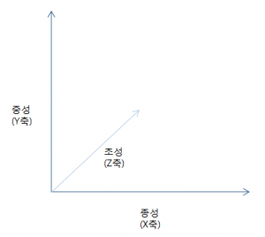
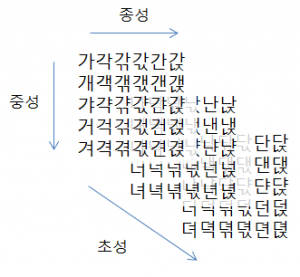

# 한글 가상키보드 만들기

한글 가상키보드를 만들기위해 간단하게 유니코드 한글에 대해서 공부해보자.

## 유니코드 한글

유니코드에서 한글은

```
1100 ~ 11FF (256)     한글 자모
3130 ~ 318F (96)      호환용 한글 자모
AC00 ~ D7AF (11184)   한글 음절
```

이렇게 구성되어있다.

참고: [http://ko.wikipedia.org/wiki/%EC%9C%A0%EB%8B%88%EC%BD%94%EB%93%9C\_%EB%B2%94%EC%9C%84\_%EB%AA%A9%EB%A1%9D](http://ko.wikipedia.org/wiki/%EC%9C%A0%EB%8B%88%EC%BD%94%EB%93%9C_%EB%B2%94%EC%9C%84_%EB%AA%A9%EB%A1%9D)

**한글자모**는 초성 중성 종성에 해당되는 자음 모음들이 나열되어있다. 초성용'ㄱ'과 종성용'ㄱ'이 다르게 있으며 모양도 살짝 다르다. (..필요없을거 같다..)

**호환용 한글 자모**는 ㄱㄴㄷㄹㅁ..ㅏㅑㅓㅕ.. 이런식의 자음, 모음이 문자로 쓰일때의 문자들이 나열되어있다.

**한글 음절** 이부분이 일반적으로 유니코드 한글이라고 불리는 부분이겠다. 표현될수 있는 모든한글이 나열되어있다. 총 11184자.

**한글 음절**은 특정하게 규칙적으로 나열되어있고 그 규칙은 이렇다.

19개의 초성(ㄱㄴㄷㄹ..), 21개의 중성(ㅏㅑㅐ...), 28개의 종성(ㄱㄴㄷㄹ..)이 3차원 배열로 나열되어있다.

종성이 x축

중성이 y축

초성이 z축

이렇게 3차원배열로 구성 되어있다.

3차원 배열이니 각각을 곱하면 전체 개수를 구할 수 있겠다.

19 x 21 x 28 = 11172 총 11172자가 조합 될 수 있겠다. (응? 12자가 비...지만 신경쓰지 말자.)

[](http://note.heyo.me/wp-content/uploads/2013/11/hangul1.png)

[](http://note.heyo.me/wp-content/uploads/2013/11/hangul2.png)

초성별로 저런식으로 한판이 계속 쌓인다고 이해하면 된다.

3차원배열을 왼쪽에서 오른쪽으로 위에서 아래로 쭉 뽑아서 1차원배열로 나열한거다.

설명은 복잡한데 공식을 보면 쉽게 이해가 갈거다.

```
1차원배열위치 = ((z * y길이) + y) * x길이 + x

x=>종성
y=>중성
z=>초성

한글음절위치 = ((초성 * 21) + 중성) * 28 + 종성
```

**한글 음절**이 AC00 부터 시작하니 여기서 구한 **한글음절위치** 에 0xAC00 를 더하면 조합한 한글의 유니코드값을 구할 수 있다.

초성,중성,종성의 나열된 문자순은 아래와같다.

```
 //초성 19자
var indexI = [
      'ㄱ', 'ㄲ', 'ㄴ', 'ㄷ', 'ㄸ', 
      'ㄹ', 'ㅁ', 'ㅂ', 'ㅃ', 'ㅅ', 
      'ㅆ', 'ㅇ', 'ㅈ', 'ㅉ', 'ㅊ', 
      'ㅋ', 'ㅌ', 'ㅍ', 'ㅎ']

// 중성 21자
var indexM = [
      'ㅏ', 'ㅐ', 'ㅑ', 'ㅒ', 'ㅓ', 
      'ㅔ', 'ㅕ', 'ㅖ', 'ㅗ', 'ㅘ', 
      'ㅙ', 'ㅚ', 'ㅛ', 'ㅜ', 'ㅝ', 
      'ㅞ', 'ㅟ', 'ㅠ', 'ㅡ', 'ㅢ', 
      'ㅣ' ];

// 중성 28자
var indexT = [
      '', 'ㄱ', 'ㄲ', 'ㄳ', 'ㄴ', 
      'ㄵ', 'ㄶ', 'ㄷ', 'ㄹ', 'ㄺ', 
      'ㄻ', 'ㄼ', 'ㄽ', 'ㄾ', 'ㄿ', 
      'ㅀ', 'ㅁ', 'ㅂ', 'ㅄ', 'ㅅ', 
      'ㅆ', 'ㅇ', 'ㅈ', 'ㅊ', 'ㅋ', 
      'ㅌ', 'ㅍ', 'ㅎ']; 
```

자바스크립트 배열로 표현했는데 신경쓰지말고 일단 나열된 순서만 보자.

이제 예를 들어 '송' 이라는 문자의 유니코드를 구해보자.

먼저 초성 'ㅅ' 은 10번째에 있다. => index 9

그다음 중성 'ㅗ' 는 9번째에 있다. => index 8

마지막 종성 'ㅇ' 은 22번째에 있다. => index 21

공식에 넣어서 구해보면

```
((9 * 21) + 8) * 28 + 21 = 5537
```

5537 이 나온다. 여기에 0xAC00을 더해주면

C1A1(10진수 49569) 이 '송'에 대한 유니코드이다.

이 원리만 알면 한글 가상키보드를 만들 수 있다.

## 한글 초성 중성 종성 분해

위에서 유니코드를 구하는 공식을 반대로 적용하면 초성, 중성, 종성을 분해할 수도 있다.

먼저 구하고자하는 문자의 유니코드에 0xAC00을 뺀다.

```
0xC1A1(송) - 0xAC00 = 15A1 (10진수 5537)

초성위치 = (5537 / 28) / 21 = 9
중성위치 = (5537 / 28) % 21 = 8
종성위치 = 5537 % 28 = 21

초성배열[9] => 'ㅅ'
중성배열[8] => 'ㅗ'
종성배열[21] => 'ㅇ'
```
