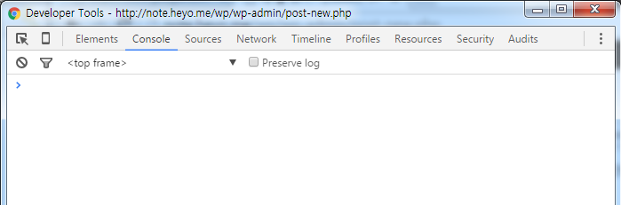
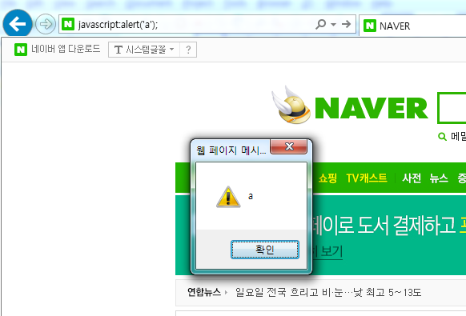
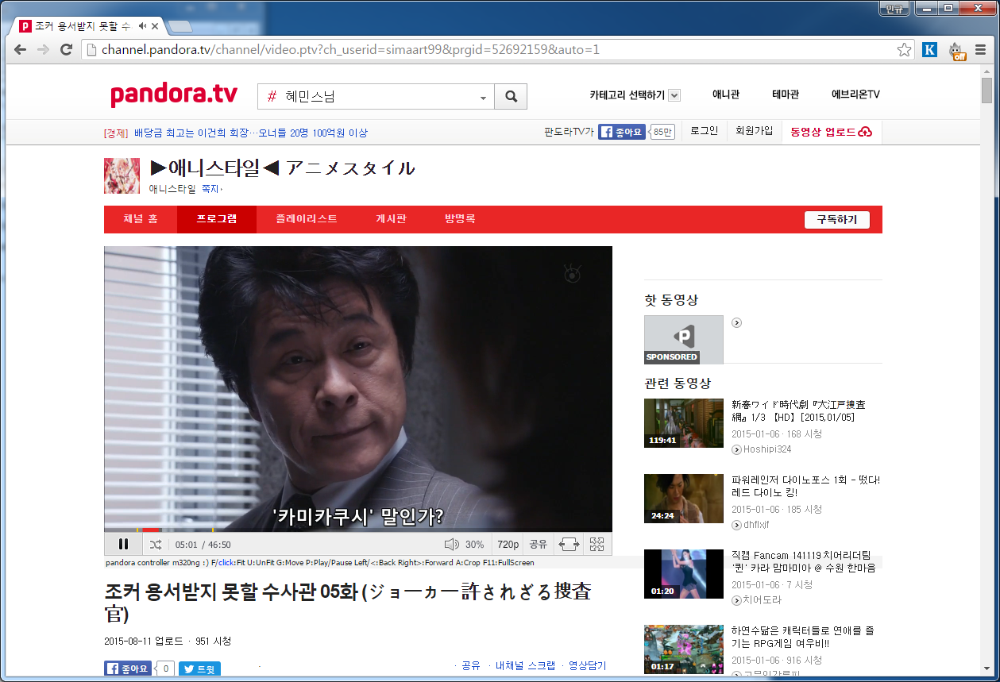
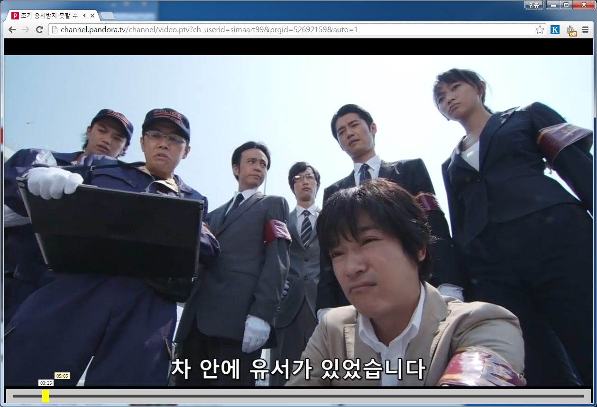

최근에 판도라TV([http://pandora.tv](http://pandora.tv))라는 곳을 알게되었다.

좋은 영상(드라마..ㅋ)이 많은데 플레이어로 보기 다소 불편한감이 있어서 수정을 해보려고한다.

swf가 디컴파일이 쉬운만큼 flash player를 수정해볼까했는데 이건 시간이 많이 걸릴거 같아서 나중에 해보도록하고

일단 javascript으로 swf flash player에 구현된 기능을 최대한 활용하여 모자란 부분을 구현해보도록하겠다.

마침 script injection으로 뭔가 해보고 싶기도했고..

음. 구현할 주요 기능은 화살표로 앞뒤 5초씩 이동하기와 현재 창크기에 맞게 크게보기 정도다.

창크기에 맞게 크게보기는 어떻게든 구현가능하지만..

앞뒤 5초씩은 player에서 함수로 구현된 뭐라도 없으면 불가능하다.

마침 소스를 훑어보니 이어보기로 쓰이는 skipPlayer라는 함수를 제공하고 있다. 초단위로 특정위치부터 영상을 재생하는 함수다. 현재의 시간을 구해오지 못하면 +5초로 이동하는건 힘들어보인다.

혹시나 더 편한게 없나 swf를 디컴파일해서 훑어봤는데 외부함수로는 단촐하게 skipPlayer, playPlayer, pausePlayer 이렇게 세개가 있다.. ㅋㅋㅋ..

어쩔수 없이 skipPlayer를 이용해서 구현해봐야겠다.

현재초는 javascript로 직접 초를 새어서 구현하고 이걸 바탕으로 +5를 더해서 영상을 이동시키면 될거같다.

하지만 이럴경우 flash player내부의 타임라인으로 특정위치로 이동하는경우 안맞게된다.

flash player내부의 타임라인으로 이동하지 못하도록 타임라인까지 구현하면 되겠다..

ㅋㅋㅋ 이때부터 뭔가 꼬여감이 느껴졌다..

일단 저렇게 구현하기로 하고

내가 구현한 javascript를 실행할수 있도록 injection하는 방법을 알아보도록하자.

일단 가장 간단한 방법은 console을 이용하는것이다. F12의 개발자모드의 console을 이용하면 쉽게 본인의 스크립트를 실행할 수 있다.

[](http://note.heyo.me/wp-content/uploads/2016/02/chrome-console.png)

그외에도 주소창에 javascript:\[스크립트\]; 로 스크립트를 실행하는 방법도 있지만.. 언젠가의 패치로 간단한 스크립트외에는 막히도록 패치되었다. 참고로 패치전에는 이걸로 재밌는 일을 많이 할수 있었다.

[](http://note.heyo.me/wp-content/uploads/2016/02/javascript.png)

일단 개발시에는 console로 작업하면되겠고.. 문제는 실제 이용할때다. 매번 본인이 작성한 javascript를 console로 입력할순 없으니 말이다.

여러가지 방법이 있겠지만 그냥 난 hosts변경으로 판도라TV에서 사용하는 script중 적당한것을 골라서 특정 도메인을 내 서버로 실행되게 하는 방법을 쓰도록했다.

hosts파일 변경법

```bash
notepad C:\Windows\System32\drivers\etc\hosts
```

<script src="http://prism.pandora.tv/pandora/channel/channel_middle?channel=simaart99"></script>

이것을 이용하도록 했다.

hosts에서 prism.pandora.tv를 내 서버의 아이피로 연결하였다.

```
115.71.236.109  prism.pandora.tv
```

서버내에서는 간단하게 node.js express로 웹서버를 구현했다.

/pandora/channel/channel_middle로 접근했을때만 내 스크립트를 출력하고 그외에 파일은 원래의 prism.pandora.tv로 연결하면 되겠다.

이제 준비가 되었으니 스크립트를 짜보도록하자.

```js
if (!window.pandoraInj) {
    window.pandoraInj = true;
    jQuery(document).ready(function() {
        cookieSet.SetCookie('extSet', '');

        /* Player Remake
        ------------------------------------------------------------ *
        if (window.getStartVodSuccessOld) {
            getStartVodSuccess = window.getStartVodSuccessOld;
        }
        if (window.timeTickTimer) {
            clearInterval(window.timeTickTimer);
        }
        window.timeTickTime = 0;
        window.timeTickStart = function() {
            jQuery(document.body).append($('<textarea id="keyboard-rcvr-dummy" class="static-inject"></textarea>'));
            $('#keyboard-rcvr-dummy').hide();

            window.timeTickTimer = setInterval(function() {
                window.timeTickTime++;
                window.timelineRender();
                //document.body.focus();
                //jQuery(document.body).focus();
                $('#keyboard-rcvr-dummy').focus();
            }, 1000);
        }
        window.timeSync = function(time) {
            window.timeTickTime -= 5;
            document.flvPlayer.skipPlayer(window.timeTickTime);
        }
        window.cropBug = function(time) {
            if (!time) time = 20;
            if (window.cropBugTimer) {
                clearInterval(window.cropBugTimer);
                window.cropBugTimer = null;
            }
            var offset = jQuery('#divPlayer').offset();
            var width = jQuery('#divPlayer').width();
            var height = jQuery('#divPlayer').height();
            window.cropBugTimerCount = 0;
            window.cropBugTimer = setInterval(function() {
                if (++window.cropBugTimerCount > time) {
                    clearInterval(window.cropBugTimer);
                    window.cropBugTimer = null;
                    return;
                }
                jQuery('#divPlayer').css({
                    top:(offset.top - (window.cropBugTimerCount%2)) + 'px',
                    width:width+'px',
                    height:(height+(window.cropBugTimerCount%2)) + 'px'
                });
            },100);
        }
        window.isPlay = false;
        window.onkeydown = function(e) {
            if (e.keyCode==39 || e.keyCode==190) {
                window.timeTickTime+=5;
                window.timelineRender();
                document.flvPlayer.skipPlayer(window.timeTickTime);
                window.cropBug();
                return false;
            } else if (e.keyCode==37 || e.keyCode==188) {
                window.timeTickTime-=10;
                window.timelineRender();
                document.flvPlayer.skipPlayer(window.timeTickTime);
                window.cropBug();
                return false;
            } else if (e.keyCode==80) { ///P
                if (window.isPlay) {
                    document.flvPlayer.pausePlayer();
                } else {
                    document.flvPlayer.playPlayer();
                }
                window.isPlay = !window.isPlay;
                return false;
            } else if (e.keyCode==65) { ///A
                window.cropBug(2);
                return false;
            } else if (e.keyCode==32) { //Space
                document.flvPlayer.playPlayer();
                return false;
            } else if (e.keyCode==13 || e.keyCode==70) { //Enter,F
                jQuery('html,body').css({
                    'overflow':'hidden',
                    'overflowY':'hidden'
                });
                jQuery('body>*').each(function() {
                    if (jQuery(this).is('.static-inject')) return;
                    try {
                        jQuery(this).hide();
                    } catch(e) {}
                });
                $('#keyboard-rcvr-dummy').show();
                jQuery('#divPlayer').css({
                    left:0,
                    top:0,
                    width:jQuery(window).width()+'px',
                    height:(jQuery(window).height()+30)+'px'
                });
                window.conroller.hide();
                window.settingConroller();
                return false;
            } else if (e.keyCode==71) { //G
                console.log('window.conroller:'+window.conroller.is(':visible'));
                if (window.conroller.is(':visible')) {
                    window.conroller.hide();
                } else {
                    window.conroller.show();
                    window.timelineRender();
                }
                return false;
            } else if (e.keyCode==85) { //U
                jQuery('html,body').css({
                    'overflow':'auto',
                    'overflowY':'auto'
                });
                jQuery('body>*').each(function() {
                    if (jQuery(this).is('.static-inject')) return;
                    try {
                        jQuery(this).show();
                    } catch(e) {}
                });
                $('#keyboard-rcvr-dummy').hide();

                var box = $('#player-box');
                jQuery('#divPlayer').css({
                    left:box.offset().left + 'px',
                    top:box.offset().top + 'px',
                    width:box.width()+'px',
                    height:box.height()+'px'
                });
                window.conroller.hide();
                window.settingConroller();
                return false;
            } else if (e.keyCode==49) { //1
                window.maxTime = 3600;
                window.timelineRender();
            } else if (e.keyCode==50) { //2
                window.maxTime = 7200;
                window.timelineRender();
            } else if (e.keyCode==51) { //3
                window.maxTime = 10800;
                window.timelineRender();
            } else {
                console.log(e.keyCode);
            }
        }

        var realPlayer = jQuery('#divPlayer');
        realPlayer.attr('id', 'player-box');

        var injPlayer = jQuery('<div>Player</div>');
        injPlayer.attr('id', 'divPlayer');
        injPlayer.css({
            position:'absolute',
            'z-index':1000
        });
        jQuery(document.body).append(injPlayer);
        injPlayer.addClass('static-inject');

        var offset = realPlayer.offset();
        injPlayer.css({
            left:offset.left+'px',
            top:offset.top+'px',
            width:realPlayer.width()+'px',
            height:realPlayer.height()+'px'
        });

        window.getStartVodSuccessOld = getStartVodSuccess;
        getStartVodSuccess = function() {
            var test = jQuery('<div>pandora controller m320ng :) F/<a href="#" style="font:10px tahoma; color:blue;">click</a>:Fit U:UnFit G:Move P:Play/Pause Left/<:Back Right/>:Forward A:Crop F11:FullScreen</div>');
            test.css({
                padding:'2px',
                background:'#f4f4f4',
                font:'10px tahoma',
            });
            realPlayer.after(test);

            $('a', test).click(function() {
                jQuery('html,body').css({
                    'overflow':'hidden',
                    'overflowY':'hidden'
                });
                try {
                    jQuery('body>*:not(.static-inject)').hide();
                } catch (e) {}
                $('#keyboard-rcvr-dummy').show();
                jQuery('#divPlayer').css({
                    left:0,
                    top:0,
                    width:jQuery(window).width()+'px',
                    height:(jQuery(window).height()+30)+'px'
                });
                window.settingConroller();
                return false;
            });

            var offset = realPlayer.offset();
            injPlayer.css({
                left:offset.left+'px',
                top:offset.top+'px',
                width:realPlayer.width()+'px',
                height:realPlayer.height()+'px'
            });

            window.getStartVodSuccessOld();

            setTimeout(function() {
                getStartVodSuccess = window.getStartVodSuccessOld;
                window.getStartVodSuccessOld = null;

                window.timeTickStart();
                window.settingConroller();

                //document.flvPlayer.pausePlayer();
                //document.flvPlayer.playPlayer();
            }, 0);
        }

        /* Control Panel
        ------------------------------------------------------------ *
        window.maxTime = 3600; // default 1hour
        if (window.conroller) {
            window.conroller.remove();
            window.conroller = null;
        }
        if (!window.conroller) {
            var el = jQuery([
                '<div id="controller-pannel">',
                    '<div id="controller-timeline"></div>',
                    '<div id="controller-dot"></div>',
                    '<div id="controller-label"></div>',
                    '<div id="controller-track"></div>',
                '</div>'
            ].join(''));
            jQuery(document.body).append(el);
            window.conroller = el;
            window.conroller.hide();
        }
        window.timeFormat = function(s) {
            var sec = s % 60;
            var min = Math.floor(s / 60);
            if (min < 10) min = '0' + min;
            if (sec < 10) sec = '0' + sec;
            return min + ':' + sec;
        }
        window.timelineRender = function() {
            var time = window.timeFormat(window.timeTickTime);

            var endTime = window.maxTime;

            var timeline = jQuery('#controller-timeline');
            var width = timeline.width();

            var label = jQuery('#controller-label');
            var dot = jQuery('#controller-dot');
            label.html(time);

            var x = Math.floor((width * window.timeTickTime) / endTime);

            label.css('left', timeline.position().left + (x - (label.width()>>1)) + 'px');

            dot.css('left', timeline.position().left + (x - (dot.width()>>1)) + 'px');
        }
        window.settingConroller = function() {
            var offset = jQuery('#divPlayer').offset();
            var w_width = jQuery('#divPlayer').width();
            var w_height = jQuery('#divPlayer').height();
            if (w_height > jQuery(window).height()) {
                w_height = jQuery(window).height();
            } else {
                w_height -= 30;
            }
            var pad = 5;
            var width = w_width - (pad * 2);
            var height = 30;
            window.conroller.css({
                'z-index':'2000',
                position:'absolute',
                top:(offset.top + w_height - height) + 'px',
                left:(offset.left + pad) + 'px',
                width:width + 'px',
                height:height + 'px',
                background:'#c8c8c8'
            });

            pad = 15;
            width = width - (pad * 2);

            var timeline = jQuery('#controller-timeline');
            timeline.css({
                position:'absolute',
                top:'12px',
                left:pad + 'px',
                width:width + 'px',
                height:'6px',
                background:'#444'
            });

            var dot = jQuery('#controller-dot');
            dot.css({
                position:'absolute',
                left:(pad-7)+'px',
                top:'2px',
                width:'14px',
                height:'26px',
                background:'#ffff00'
            });

            var label = jQuery('#controller-label');
            label.css({
                position:'absolute',
                top:'-20px',
                left:'5px',
                width:'30px',
                display:'inline-block',
                'line-height':'9px',
                padding:'1px',
                'text-align':'center',
                font:'9px tahoma',
                background:'#fff'
            });
            label.html('00:00');

            var track = jQuery('#controller-track');
            track.css({
                position:'absolute',
                top:'-35px',
                left:'5px',
                width:'30px',
                display:'inline-block',
                'line-height':'9px',
                padding:'1px',
                'text-align':'center',
                font:'9px tahoma',
                background:'#fff4cc'
            });
            track.html('00:00');
        }

        window.conroller.click(function(e) {
            if (track.data('sec')) {
                window.timeTickTime = track.data('sec');
                window.timelineRender();
                document.flvPlayer.skipPlayer(window.timeTickTime);
                window.cropBug();

                setTimeout(function() {
                    window.conroller.hide();
                }, 1000);
            }
            return false;
        });

        var timeline = jQuery('#controller-timeline');
        var track = jQuery('#controller-track');
        window.conroller.mousemove(function(e) {
            if (window.conrollerTimeout) clearTimeout(window.conrollerTimeout);

            var x = e.pageX - window.conroller.position().left - timeline.position().left;
            var width = timeline.width();
            if (x < 0) {
                x = 0;
            } else if (x > width) {
                x = width;
            }
            track.css('left', (x ) + 'px');

            var sec = Math.floor((x * window.maxTime) / width);
            var time = window.timeFormat(sec);
            track.data('sec', sec);
            track.html(time);
            return false;
        });

        window.conroller.mouseout(function(e) {
            window.conrollerTimeout = setTimeout(function() {
                window.conroller.hide();
            }, 1000);
        });

        jQuery('#divPlayer').mousemove(function(e) {
            var offset = jQuery('#divPlayer').offset();
            var width = jQuery('#divPlayer').width();
            var height = jQuery('#divPlayer').height();

            if (e.pageY > height - 75 - offset.top) {
                window.conroller.show();
                window.timelineRender();
            }
        });
        jQuery(window).click(function(e) {
            window.conroller.hide();
        });
    });
}
```

꽤 길다.

처음 구상할때는 100줄내외에 간단하게 구현될줄 알았는데 생각과 달리 타임라인이나 이런것들이 추가되면서 상당히 길어졌다.

아래는 실행된 모습이다.

[](http://note.heyo.me/wp-content/uploads/2016/02/player1.png)

방향키와 {'<>'}키로 5초 앞으로가기 뒤로가기가 실행된다.

F나 Enter를 누르면 현재창에 맞게 커진다. 타임라인을 구현했다.

[](http://note.heyo.me/wp-content/uploads/2016/02/fit-player.png)

전체소스

git clone http://git.heyo.me/pandora-tv.git
