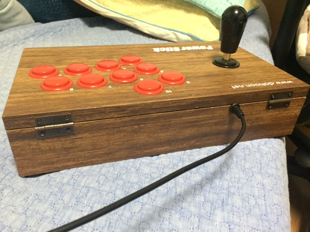
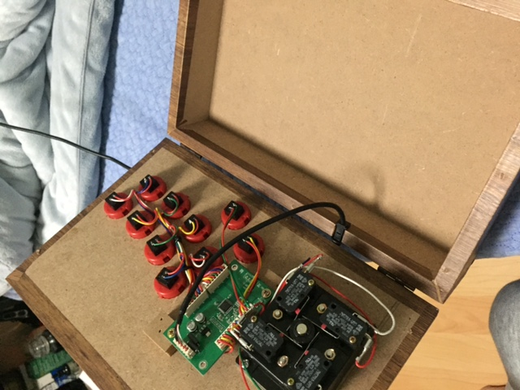
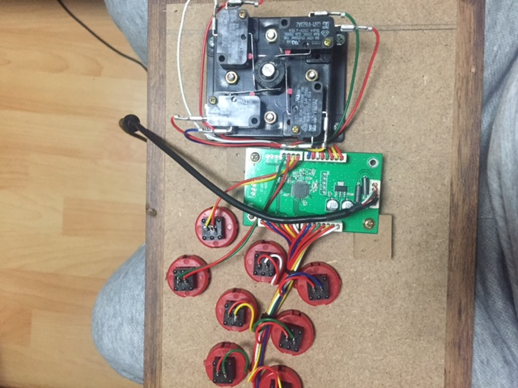
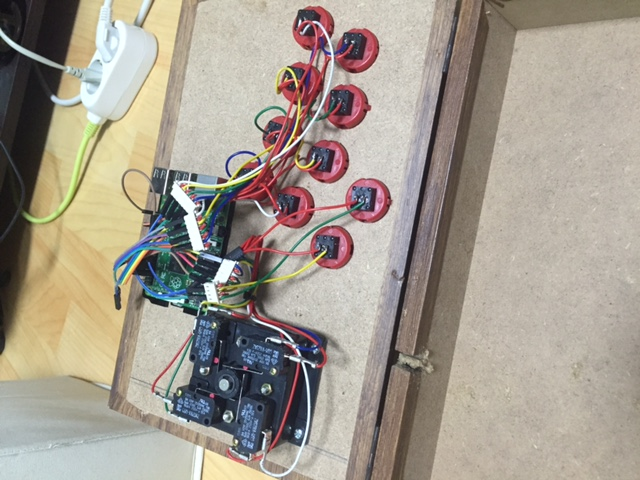
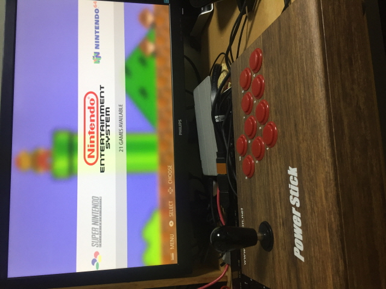
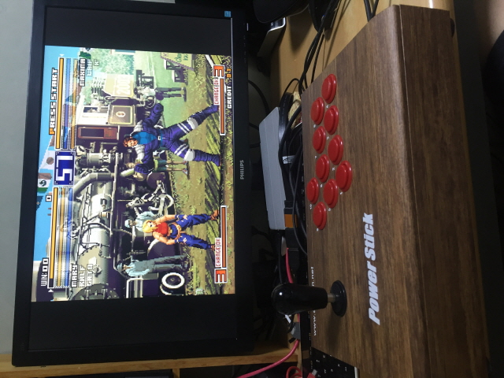
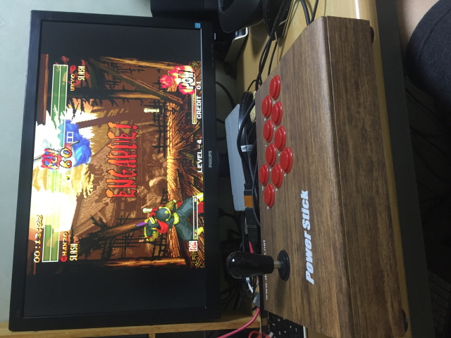

PC에서 마메 돌리려고산 오락실 조이스틱 다훈전자 dhu-3300을 개조해봤다.

단독으로 구동할수 있도록 라즈베리파이2를 연결하여 안에 넣었다.

라즈베리파이에는 recalbox(retropie)를 설치했고 gpio로 연결했다.

해놓고보니 큰 의미는 없는거 같다. 그냥 컴퓨터안켜도 되는 장점? ..ㅋ

추후에 미니LCD달아서 정말 간단히 할수 있도록 만들면 의미를 찾을수도?!

## 개조 과정

먼저 쉽게 열고 닫을 수 있도록 경첩달고..

내부모습.

이 USB보드를 뺀다.

라즈베리파이2를 넣고 선연결을 한다. 선 나가는 홈도 좀더 팠다. HDMI,USB 선두개가 나가야하므로..

구동모습, 잘돌아간다.

킹오파2000

사쇼4

마메말고도 다양한 에물이 있는거 같지만 테스트는 안해봤다. 플스1도 된다던데.. 언제 한번 테스트해봐야겠다.

GPIO 참고: [https://github.com/recalbox/mk\_arcade\_joystick\_rpi](https://github.com/recalbox/mk_arcade_joystick_rpi)
