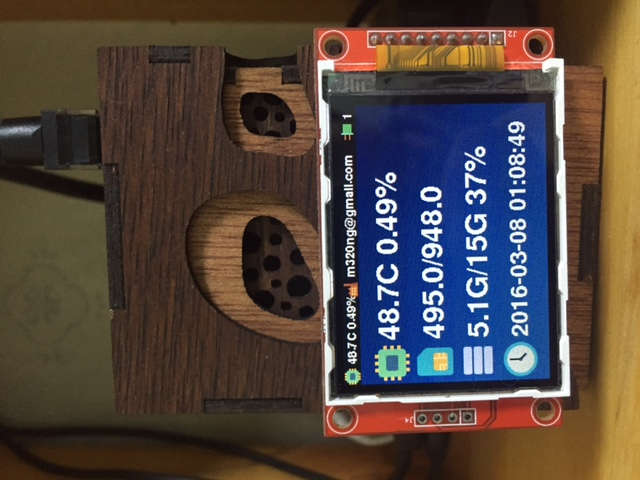
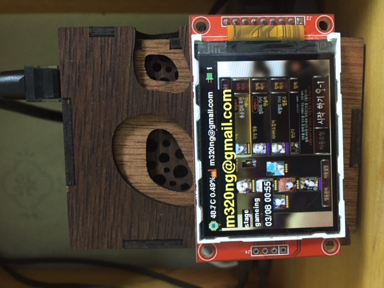
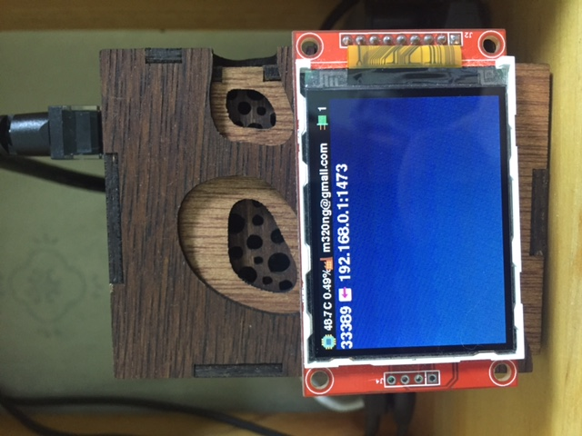

라즈베리파이에 모니터링화면을 추가하였다.

lcd는 대륙발 2.2인치 spi lcd로 옛날 언젠가 아두이노에 쓸려고 사놨던걸 사용했다.

저가 lcd임에도 성능은 나쁘지 않은거 같다. (검색해보니 현재 $4정도)

예전에는 드라이버 설치하는데 컴파일해야했던거 같은데 최신 라즈베리파이에는 드라이버가 포함되어있어서 설치도 간편해졌다.

모니터링 프로그램은 python으로 구현했다. 출력은 python로 바로 출력하진 않고 frame buffer에 출력하게 구현햇다.

시스템 현황/세나 현황/터널링 현황 이렇게 10초마다 3화면이 전환된다. 상단바에는 전체의 간략한 정보를 보여준다.

지금은 그냥 10초마다 화면전환이되는데 추후에 로터리 스위치 달아서 전환해보려고한다. 라즈베리파이에 gpio도 겸사겸사 써보고..

[](http://note.heyo.me/wp-content/uploads/2016/03/IMG_1252.jpg)

[](http://note.heyo.me/wp-content/uploads/2016/03/IMG_1253.jpg)

[](http://note.heyo.me/wp-content/uploads/2016/03/IMG_1254.jpg)

화면 렌더링은 pygame을 이용했다. python은 처음 써봐서 소스가 지저분하지만.. 애초에 소스자체는 단순하다. 주로 대부분 콘솔이나 url로 정보를 가져와서 그걸 화면에 뿌려주는것 뿐이다.

전체 소스

```
    #-*- coding: utf-8 -*-
    import pygame
    import os
    import time
    from time import strftime
    import datetime
    import httplib
    import urllib
    import json
    from pprint import pprint

    os.environ["SDL_FBDEV"] = "/dev/fb1"

    DISPLAY_LINE = 20

    BLACK = (0, 0, 0)
    WHITE = (255, 255, 255)
    GREEN = (0, 255, 0)
    YELLOW = (255, 255, 0)
    RED = (255, 0, 0)

    # Return CPU temperature as a character string
    def getCPUtemperature():
        res = os.popen('vcgencmd measure_temp').readline()
        return(res.replace("temp=","").replace("'C\n",""))

    # Return RAM information (unit=kb) in a list
    # Index 0: total RAM
    # Index 1: used RAM
    # Index 2: free RAM
    def getRAMinfo():
        p = os.popen('free')
        i = 0
        while 1:
            i = i + 1
            line = p.readline()
            if i==2:
                return(line.split()[1:4])

    # Return % of CPU used by user as a character string
    def getCPUuse():
        return(str(os.popen("mpstat | awk '$3==\"all\" {print $4}'").readline().strip()))

    def getTunneling():
        lines = [[str(i) for i in line.strip().split(' ')] for line in os.popen("netstat -ant | awk '$6==\"ESTABLISHED\" && $4 ~ /.+:3.+$/ {print $4,$5}'").readlines()]
        return(["%s <- %s" % (port[port.index(':')+1:],access) for port,access in lines])

    # Index 0: total
    # Index 1: used
    # Index 2: avail
    # Index 3: used percent
    def getDiskInfo():
        return([str(i) for i in os.popen("df -h | awk '$6==\"/\" {print $2,$3,$4,$5}'").readline().strip().split(' ')])

    def loadImage(image_name):  
        try:
            image = pygame.image.load(image_name)    
        except pygame.error as message:   
            print("Cannot load image: " + image_name)
            image = back_image
        return image

    def displayTime():
        font = pygame.font.Font(None, 50)
        now = time.localtime()

        for setting in [("%H:%M:%S",60),("%d %b",10)] :
             timeformat,y = setting
             currentTimeLine = strftime(timeformat, now)
             text = font.render(currentTimeLine, 0, (0,250,150))
             screen.blit(text,(20,y))

    def drawText(text, x, y, size, color):
        font = pygame.font.Font(None, size)
        text = font.render(text, 0, color)
        textpos = text.get_rect()
        textpos.x = x
        textpos.y = y
        screen.blit(text, textpos)

    def drawHeaderText(text, x, y, color):
        text = headerFont.render(text, 0, color)
        textpos = text.get_rect()
        textpos.x = x + 2
        textpos.y = y + 2
        screen.blit(text, textpos)

    def displayText(text, size, line, color, clear):
        font = pygame.font.Font(None, size)
        text = font.render(text, 0, color)
        textpos = text.get_rect()
        textpos.y = 5 + line
        textpos.x = 5 
        if clear:
            pygame.draw.rect(screen, BLACK, textpos, 0)
        screen.blit(text, textpos)

    def displayLine(text, size, color, clear):
        global DISPLAY_LINE
        font = pygame.font.Font(None, size)
        text = font.render(text, 0, color)
        textpos = text.get_rect()
        textpos.y = 5 + DISPLAY_LINE
        textpos.x = 5 
        if clear:
            pygame.draw.rect(screen, BLACK, textpos, 0)
        screen.blit(text, textpos)
        DISPLAY_LINE += size

    def clearLine():
        global DISPLAY_LINE
        DISPLAY_LINE = 20

    def drawBack():
        #screen.fill(BLACK)
        screen.blit(back_image, back_image.get_rect())

    def drawHeader():
        pygame.draw.rect(screen, BLACK, (0,0,320,20), 0)

        imgrect = icon_electronics.get_rect()
        imgrect.x += 0
        screen.blit(icon_electronics, imgrect)
        drawHeaderText(CPU_temp + "C " + CPU_usage + "%", 22, 0, WHITE)

        imgrect = icon_factory.get_rect()
        imgrect.x += 100
        screen.blit(icon_factory, imgrect)
        drawHeaderText(sena_account, 122, 0, WHITE)

        if len(tunnel) > 0:
            imgrect = icon_code_on.get_rect()
            imgrect.x += 280
            screen.blit(icon_code_on, imgrect)
            drawHeaderText(str(len(tunnel)), 302, 0, WHITE)
        else:
            imgrect = icon_code.get_rect()
            imgrect.x += 280
            screen.blit(icon_code, imgrect)
            drawHeaderText(str(len(tunnel)), 302, 0, (128,128,128))


    pygame.init()
    pygame.mouse.set_visible(0)

    size = (320, 240)
    screen = pygame.display.set_mode(size)

    headerFont = pygame.font.Font(None, 21)

    # default image
    icon_code = pygame.image.load("icon_code.png")
    icon_code_on = pygame.image.load("icon_code_on.png")
    icon_electronics = pygame.image.load("icon_electronics.png")
    icon_electronics_red = pygame.image.load("icon_electronics_red.png")
    icon_electronics_yel = pygame.image.load("icon_electronics_yel.png")
    icon_factory = pygame.image.load("icon_factory.png")
    icon_factory_off = pygame.image.load("icon_factory_off.png")

    back_image = pygame.image.load("back_image.png")

    # main image
    main_cpu = pygame.image.load("image/electronics.png")
    main_ram = pygame.image.load("image/sim_card.png")
    main_disk = pygame.image.load("image/database.png")
    main_clock = pygame.image.load("image/clock.png")

    # tunneling
    icon_connect = pygame.image.load("image/icon_connect.png")

    # sena
    sena_image = back_image
    sena_account = ""
    sena_game_mode = ""
    sena_see = ""

    tunnel = []

    done = False

    while not done:
        for event in pygame.event.get():
            if event.type == pygame.QUIT:
                done = True

        """
        화면1 : 시스템 현황
        """
        drawBack()

        main_x = 0
        main_y = 32

        imgrect = main_cpu.get_rect()
        imgrect.x = main_x
        imgrect.y = main_y
        screen.blit(main_cpu, imgrect)

        main_y += 50
        imgrect = main_ram.get_rect()
        imgrect.x = main_x
        imgrect.y = main_y
        screen.blit(main_ram, imgrect)

        main_y += 50
        imgrect = main_disk.get_rect()
        imgrect.x = main_x
        imgrect.y = main_y
        screen.blit(main_disk, imgrect)

        main_y += 50
        imgrect = main_clock.get_rect()
        imgrect.x = main_x
        imgrect.y = main_y
        screen.blit(main_clock, imgrect)

        # CPU informatiom
        CPU_temp = getCPUtemperature()
        CPU_usage = getCPUuse()
        drawText(CPU_temp + "C " + CPU_usage + "%", 50, 34, 50, WHITE)

        # RAM information
        # Output is in kb, here I convert it in Mb for readability
        RAM_stats = getRAMinfo()
        RAM_total = round(int(RAM_stats[0]) / 1000,1)
        RAM_used = round(int(RAM_stats[1]) / 1000,1)
        RAM_free = round(int(RAM_stats[2]) / 1000,1)

        drawText(str(RAM_used) + "/" + str(RAM_total), 50, 86, 50, WHITE)

        disk_info = getDiskInfo()
        disk_total = disk_info[0]
        disk_used = disk_info[1]
        disk_avail = disk_info[2]
        disk_percent = disk_info[3]
        drawText(disk_used + "/" + disk_total + " " + disk_percent, 50, 138, 50, WHITE)

        drawText(datetime.datetime.now().strftime("%Y-%m-%d %H:%M:%S"), 50, 190, 40, WHITE)

        drawHeader()
        pygame.display.flip()
        clearLine()
        time.sleep(10) 

        """
        화면2 : 세나오토 현황
        """
        state = {}
        try:
            urllib.urlretrieve ("http://xxx.xxxx.com/state", "sena.json")
            with open('sena.json') as data_file:    
                state = json.load(data_file)
        except Exception as e:
            print e
        #pprint(state)

        try:
            urllib.urlretrieve ("http://xxx.xxxx.com/resize_screen", "sena.png")
            sena_image = loadImage("sena.png")
        except Exception as e:
            print e

        sena_image = pygame.transform.rotate(sena_image, 90)
        #image = pygame.transform.scale(image, size)
        imagerect = sena_image.get_rect()
        screen.fill(BLACK)
        #drawBack()
        screen.blit(sena_image, imagerect)
        try:
            sena_account = state['current_user']['account']
            sena_game_mode = state['game_mode']
            sena_see = state['current_see']

            displayLine(sena_account, 40, YELLOW, True)
            displayLine(sena_game_mode, 20, WHITE, True)
            displayLine(sena_see, 20, WHITE, True)
            displayLine(datetime.datetime.fromtimestamp(int(state['current_user']['logined'])/1000).strftime("%m/%d %H:%M"), 25, WHITE, True)
        except Exception as e:
            print e
            pass
        drawHeader()
        pygame.display.flip()
        clearLine()
        time.sleep(10)

        """
        화면3 : 터널링 현황
        """
        tunnel = getTunneling()
        if len(tunnel) > 0:
            drawBack()
            for idx,tun in enumerate(tunnel):
                (port, outside) = tun.split('<-')
                port_line = 22
                screen.blit(icon_connect, (60, port_line+1, 20, 20))
                drawText(port.strip(), 0, port_line, 30, WHITE)
                drawText(outside.strip(), 85, port_line, 30, WHITE)
                port_line += 30
            drawHeader()
            pygame.display.flip()
            clearLine()
            time.sleep(10)

    pygame.quit()
```

python은 처음 써봤는데 상당히 괜찮은 언어같다. 프로그램을 짠후에 python책을 따로 자세히 읽어봤는데 더더욱 좋아졌다.

간편함으로는 javascript 그 이상이고 객체지향의 짜임새도 상당하다. 쉽고간편한 배열류 다루기, 다양한 수식표현, lambda, yield 등도 지원한다. 거기다 라이브러리도 방대하다.

몇년전 남들이 좋다좋다할때는 그러려니했는데.. ㅋ
