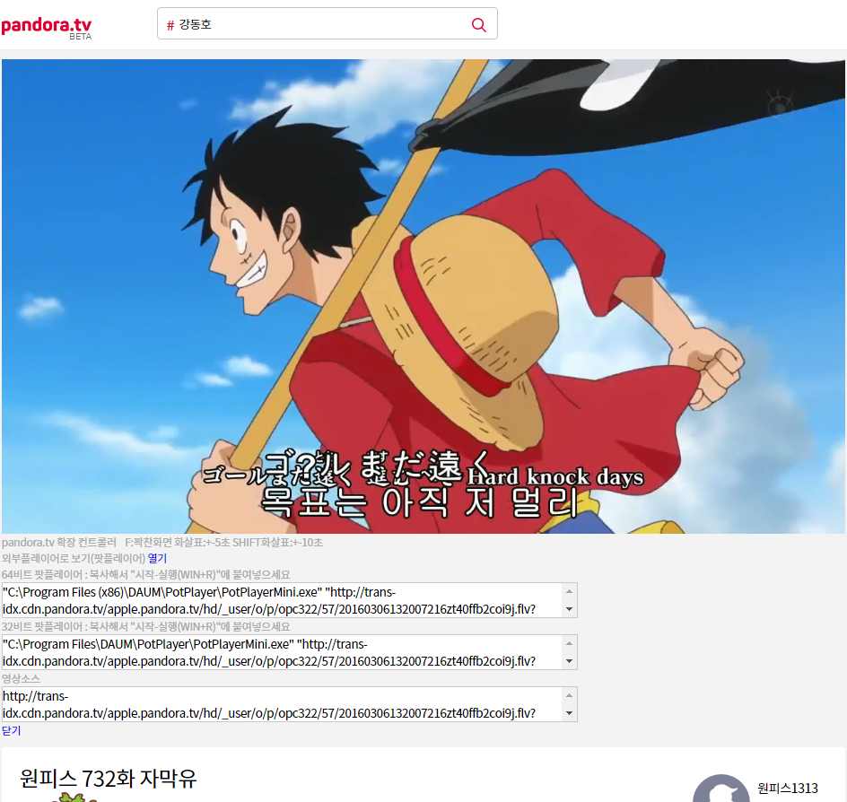

판도라TV를 어렵게(?) 끄적거린이후.. 곧이어 바로 얼마전에 판도라TV베타([http://beta.pandora.tv](http://beta.pandora.tv))가 출시되었다 -\_-;;

거기다 HTML5기반으로 video태그로 구현된거라 다루기가 훨씬 쉬워졌다.. 앞으로 +=10초가 아주 부드럽게 동작한다.

근데 판도라TV에선 여전히 저 기능이 없던데 왜 그런건지는 모르겠다. 이전글과 똑같이 script injection으로 수정해봤다.

이번에는 영상소스도 가져올 수 있으니 외부플레이어로 볼수있게도 추가해봤다. 아무렴 좋아졌다곤하나 팟플레이어로 보는 것보단 못하니깐..

소스만 달라졌을뿐 구현방법은 똑같다.

앞으로 뒤로 탐색 & 창에 꽉채우기

[](http://note.heyo.me/wp-content/uploads/2016/03/p1.png)

외부플레이어 명령어

[](http://note.heyo.me/wp-content/uploads/2016/03/p2.png)

소스

```js
;(function () {
  var reform = function () {
    jQuery('.top_ban').hide()
    jQuery('#subCategory1List').width('200px')
  }

  var video = null
  var isFull = false

  var loadInjVideo = function () {
    var html = [
      '<div id="inj-controller" style="color:#aaa;">',
      '<div>',
      '<span>pandora.tv 확장 컨트롤러</span>',
      '<span>&nbsp;&nbsp;&nbsp;&nbsp;</span>',
      '<span>F:꽉찬화면 화살표:+-5초 SHIFT화살표:+-10초</span>',
      '</div>',
      '<div>외부플레이어로 보기(팟플레이어) <a href="#ext-player-open">열기</a></div>',
      '<div id="ext-player-text" style="display:none;">',
      '<div>64비트 팟플레이어 : 복사해서 "시작-실행(WIN+R)"에 붙여넣으세요</div>',
      '<textarea class="x64" style="display:block; width:640px; border:1px solid #c8c8c8;"></textarea>',
      '<div>32비트 팟플레이어 : 복사해서 "시작-실행(WIN+R)"에 붙여넣으세요</div>',
      '<textarea class="x86" style="display:block; width:640px; border:1px solid #c8c8c8"></textarea>',
      '<div>영상소스</div>',
      '<textarea class="src" style="display:block; width:640px; border:1px solid #c8c8c8"></textarea>',
      '<a href="#ext-player-close">닫기</a>',
      '</div>',
      '</div>',
    ].join('')

    jQuery('#mPlayArea').after(html)

    jQuery('#inj-controller a[href="#ext-player-open"]').click(function (e) {
      jQuery('#ext-player-text').show()
      return false
    })
    jQuery('#inj-controller a[href="#ext-player-close"]').click(function (e) {
      jQuery('#ext-player-text').hide()
      return false
    })
    jQuery('#ext-player-text textarea').click(function (e) {
      jQuery(this).select()
    })

    video = jQuery('#qVideo').get(0)
    container = jQuery('body>.container')

    jQuery(window).keydown(function (e) {
      if (jQuery(e.target).is('input,textarea')) {
        return
      }

      if (0) {
      } else if (e.keyCode == 39 || e.keyCode == 190) {
        if (e.shiftKey) {
          video.currentTime += 10
        } else {
          video.currentTime += 5
        }
        return false
      } else if (e.keyCode == 37 || e.keyCode == 188) {
        if (e.shiftKey) {
          video.currentTime -= 10
        } else {
          video.currentTime -= 5
        }
        return false
      } else if (e.keyCode == 80) {
        ///P
        if (video.paused) {
          video.play()
        } else {
          video.pause()
        }
        return false
      } else if (e.keyCode == 32) {
        //Space
        if (video.paused) {
          video.play()
        } else {
          video.pause()
        }
        return false
      } else if (!e.ctrlKey && e.keyCode == 70) {
        //F
        if (isFull) {
          container.css('min-height', container.data('min-height'))
          container.removeClass('inj-container')
          container.addClass('container')
          jQuery('body>.hide-item').each(function () {
            try {
              jQuery(this).show()
            } catch (e) {}
          })
          jQuery('.container>.hide-item').each(function () {
            try {
              jQuery(this).show()
            } catch (e) {}
          })
          jQuery('body').css({
            background: '#f3f3f3',
            overflowY: '',
          })
        } else {
          jQuery('body>*:visible').each(function () {
            if (jQuery(this).is('.container')) return
            try {
              jQuery(this).addClass('hide-item')
              jQuery(this).hide()
            } catch (e) {}
          })
          jQuery('.container>*:visible').each(function () {
            if (jQuery(this).is('#mPlayArea')) return
            try {
              jQuery(this).addClass('hide-item')
              jQuery(this).hide()
            } catch (e) {}
          })
          container.data('min-height', container.css('min-height'))
          container.css('min-height', '')
          container.addClass('inj-container')
          container.removeClass('container')
          jQuery('body').css({
            background: '#000',
            overflowY: 'hidden',
          })
        }
        isFull = !isFull
      }
    })

    var getSrcTimer = setInterval(function () {
      if (video.src != '') {
        clearInterval(getSrcTimer)
        getSrcTimer = null

        var cmdX64 =
          '"C:\\Program Files (x86)\\DAUM\\PotPlayer\\PotPlayerMini.exe" "' + video.src + '"'
        var cmdX86 = '"C:\\Program Files\\DAUM\\PotPlayer\\PotPlayerMini.exe" "' + video.src + '"'

        jQuery('#ext-player-text .x86').val(cmdX86)
        jQuery('#ext-player-text .x64').val(cmdX64)
        jQuery('#ext-player-text .src').val(video.src)
      }
    }, 500)
  }

  reform()
  var loadInjTimer = setInterval(function () {
    if (jQuery('#qVideo').length) {
      clearInterval(loadInjTimer)
      loadInjTimer = null
      loadInjVideo()
    }
  }, 500)
})()
```

전체소스

git clone http://git.heyo.me/pandora-tv.git

간단히 테스트해보려면 hosts파일에 추가해본다.

```
115.71.236.109  prism.pandora.tv
115.71.236.109  imgcdnprt.pandora.tv
```
