예전부터 3d프린터에 관심있었는데

서핑하다 엄청 할인한다길래 싼맛에 덜컥 구입했다.

근데 지금보니 맨날 할인함

기어베스트([gearbest.com](http://gearbest.com)) 에서 $155.99 에 구입했다.

중국발 제품이고 diy 제품으로 가격이 싼대신 직접조립해야한다고 한다.

3d프린터에대한 지식은 전무하며 prusa i3를 많이들 구입하길래

언간하면 어느정도 출력은 되겠지..하는 안이한생각으로 구입했다.

기어베스트는 처음 이용했는데 주문때 한글 주소도 따로 받고 꽤 신경을 쓴느낌이다.

배송은 무료배송이고 생각보다 굉장히 빠르게 도착했다. 한 7~8일정도 걸린거같다.

중국은 aliexpress의 30일배송만 겪다보니 정말 빠르게 느껴졌다.

물건도착했다.

[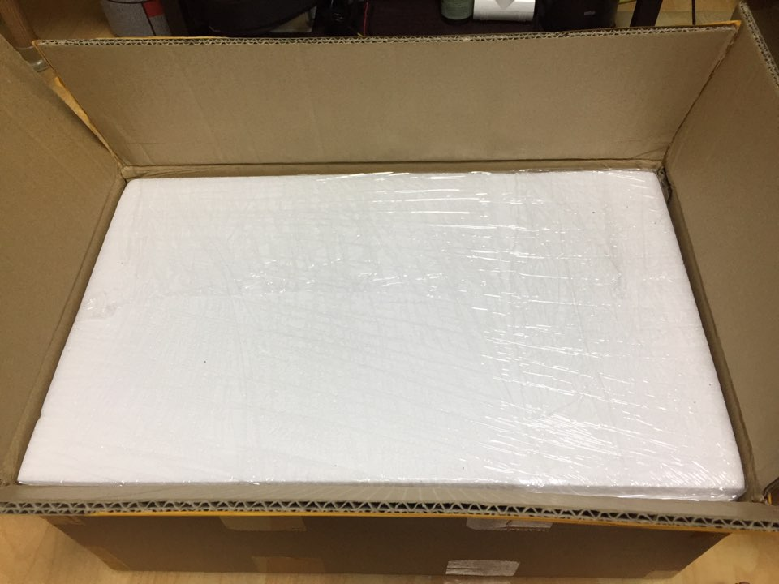](http://note.heyo.me/wp-content/uploads/2016/12/KakaoTalk_20161202_231552721.jpg)

나름 튼튼해보이는 포장이다.

[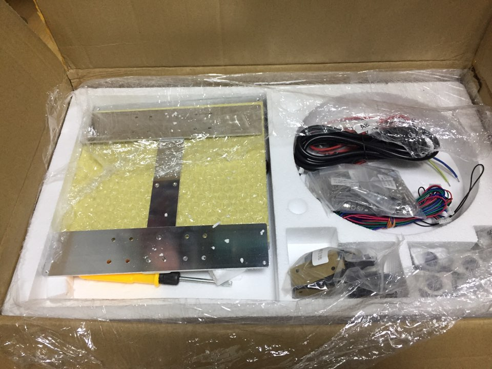](http://note.heyo.me/wp-content/uploads/2016/12/KakaoTalk_20161202_231553434.jpg)

부품들이 보이고..

[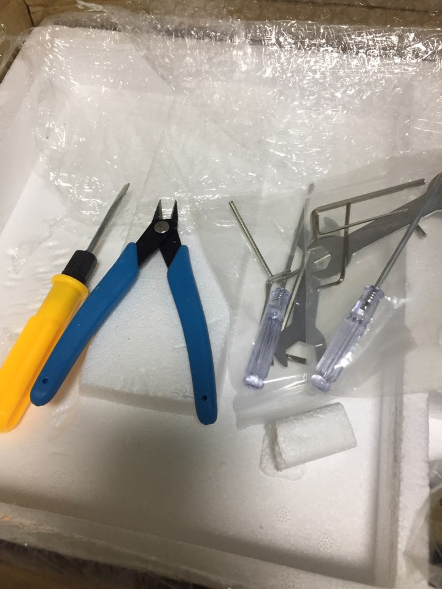](http://note.heyo.me/wp-content/uploads/2016/12/KakaoTalk_20161202_231554061.jpg)

간단한 조립공구도 들어있고..

[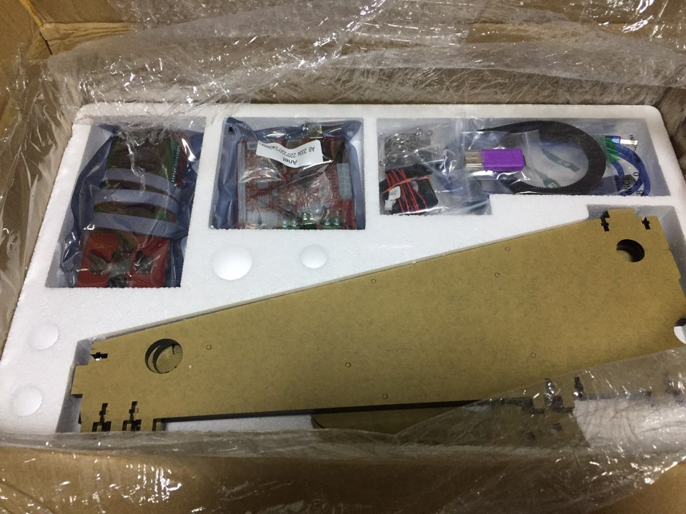](http://note.heyo.me/wp-content/uploads/2016/12/KakaoTalk_20161202_231554801.jpg)

[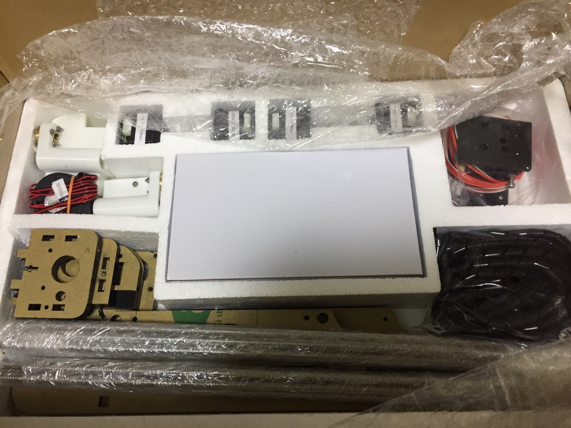](http://note.heyo.me/wp-content/uploads/2016/12/KakaoTalk_20161202_231555351.jpg)

이것저것 부품들이 스티로폼 층층히 포장되어있다.

[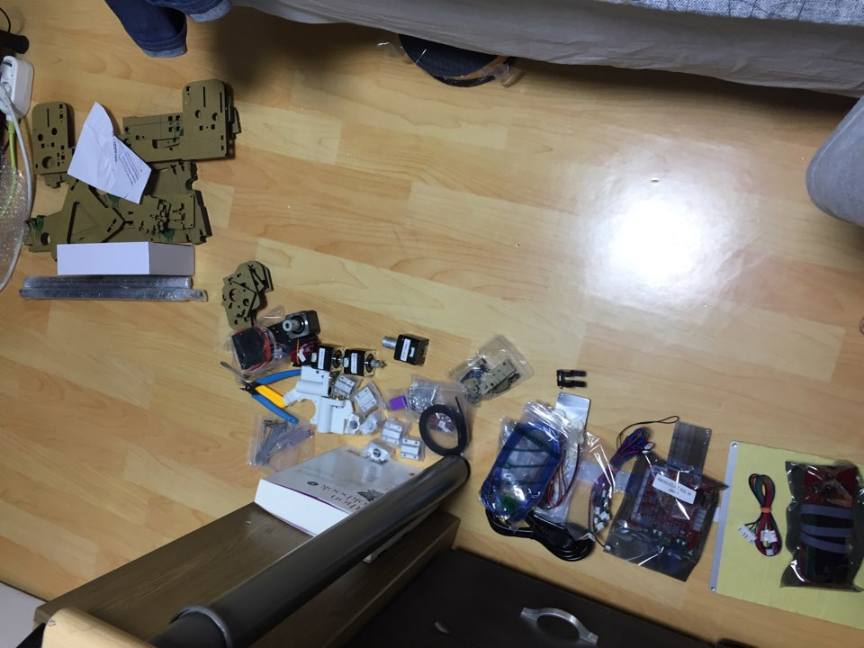](http://note.heyo.me/wp-content/uploads/2016/12/KakaoTalk_20161202_231555800.jpg)

전부 나열해봤다.

부품은 생각보다 별로 없었다. 아크릴빼면 봉몇개랑 모터몇개.

이 좁은데서 다 조립했다.

중간 조립과정 생략함 (사진을 안찍음;;)

[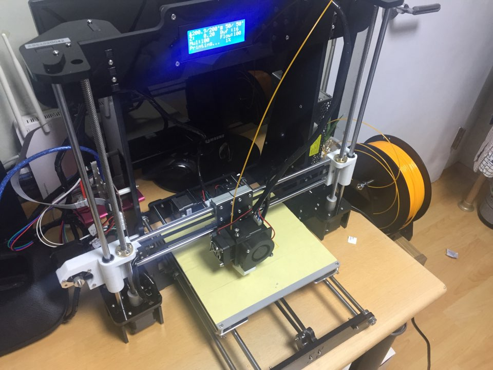](http://note.heyo.me/wp-content/uploads/2016/12/KakaoTalk_20161202_231556210.jpg)

뚝딱 완성.

은.. 8시간걸린듯

설명서는 따로 동봉되어있지 않고

구입한 홈페이지에서는 다른 버전의 제품 조립기가 들어있었다.

유투브에서 따로 찾아서 조립했다.

조립은 생각보다(?) 어렵진 않았는데..

다만 아크릴 종이띄는게 정말(정말정말) 힘들었고

그냥 안띠는걸 추천

아크릴 커팅이 은근히 허술한부분이 있어서 그거 칼질해서 띄어내는게 힘들었다.

이건또 나중에 조립할때도 은근히 아귀가 안맞는부분이 있어서

조립한거 다시 분해해서 안맞는부분을 정리해야했다.

**조립하기전에 미리 아귀가 맞는지 체크 필수.**

**3d프린터로 출력된 부품도 있는데 이것도 마찬가지 조립하기전에 봉이 잘들어가는지 꼭 체크해야한다.**

내가 조립한거보면 누구나 조립가능한거 같으니 diy라서 망설이는분들은 망설일필요없을거 같음.

[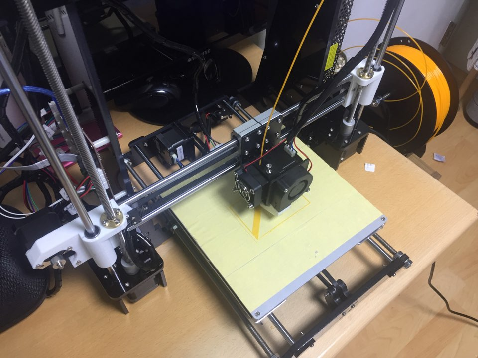](http://note.heyo.me/wp-content/uploads/2016/12/KakaoTalk_20161202_231556660.jpg)

조립했으니 이제 샘플 출력.

기본 부품에 포함되어있는 마이크로sd카드에 몇가지 샘플이 들어있다.

box라고 있길래 인쇄함.

[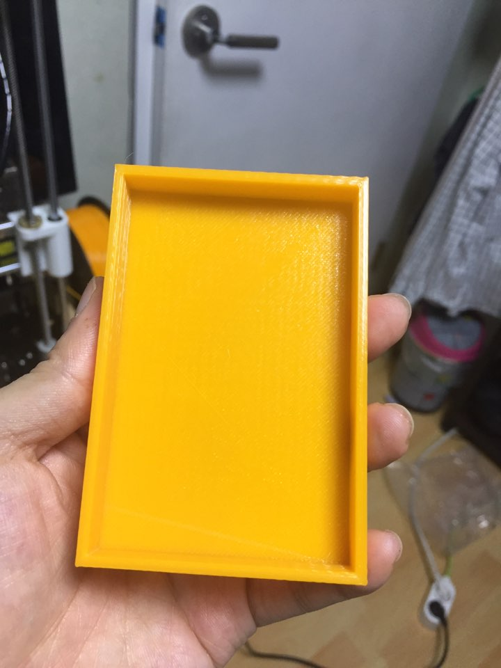](http://note.heyo.me/wp-content/uploads/2016/12/KakaoTalk_20161202_231557252.jpg)

테스트용 간단한 box일줄알았는데 생각보다 거대한게 출력되서 당황했..

지만 일단 뭐라도 나와줘서 안도했다.

조립하면서도 긴가민가하며 조립했는데..

[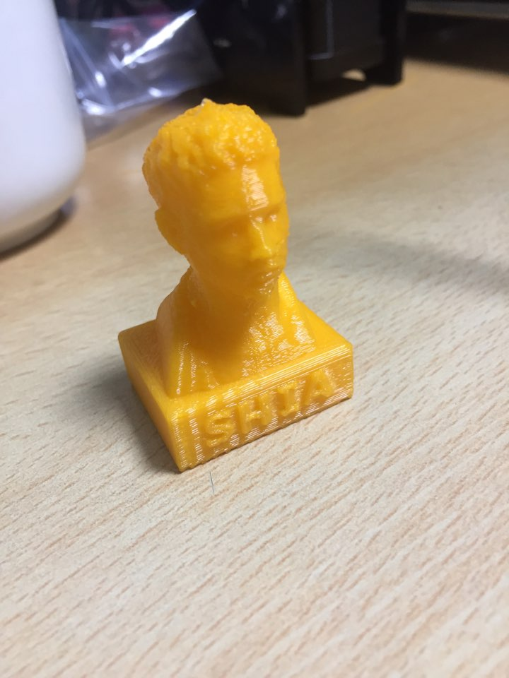](http://note.heyo.me/wp-content/uploads/2016/12/KakaoTalk_20161202_231557531.jpg)

두번째 테스트로 사람 머리를 출력해봄.

사실 파일명이 영어라 뭐가 나올지 모르고 그냥 골라본게 이거.

[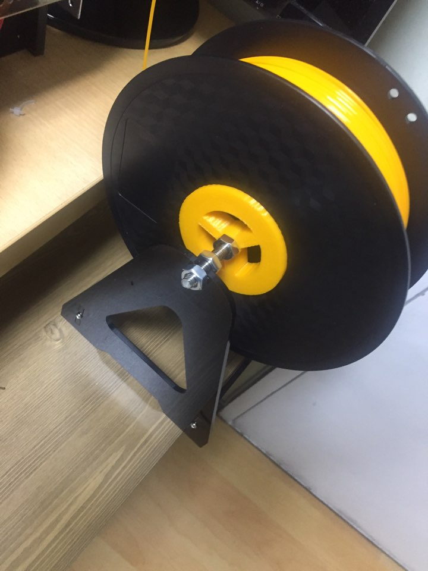](http://note.heyo.me/wp-content/uploads/2016/12/KakaoTalk_20161202_231558252.jpg)

필라멘트 거치대가 잘돌수있게 홀더를 출력해서 부착했다.

이거 출력하기 전까진 불안해서 내가 손으로 필라멘트 돌림.

[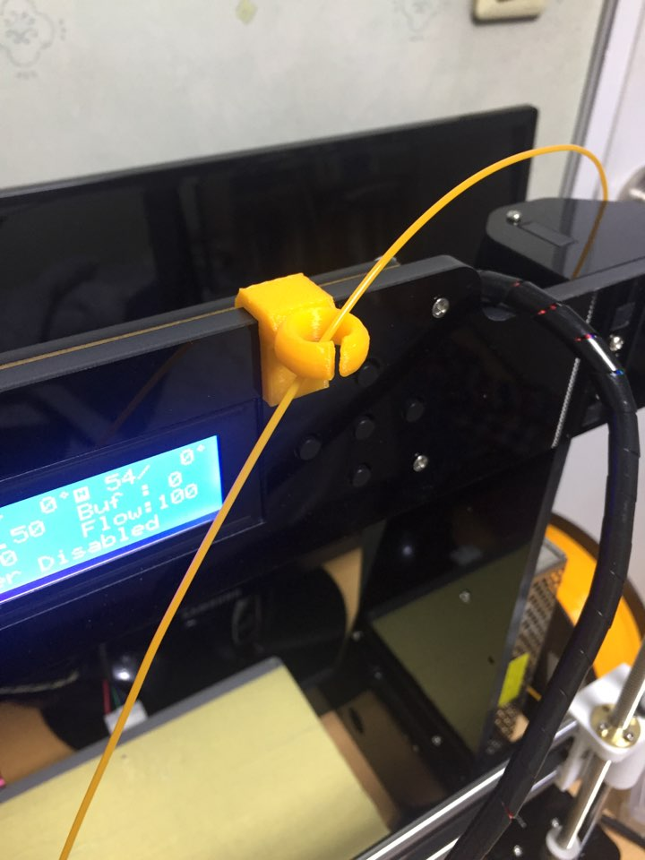](http://note.heyo.me/wp-content/uploads/2016/12/KakaoTalk_20161202_231557761.jpg)

필라멘트 거치대에서 노즐까지 거리가 있어서 가이드도 출력해서 부착.

[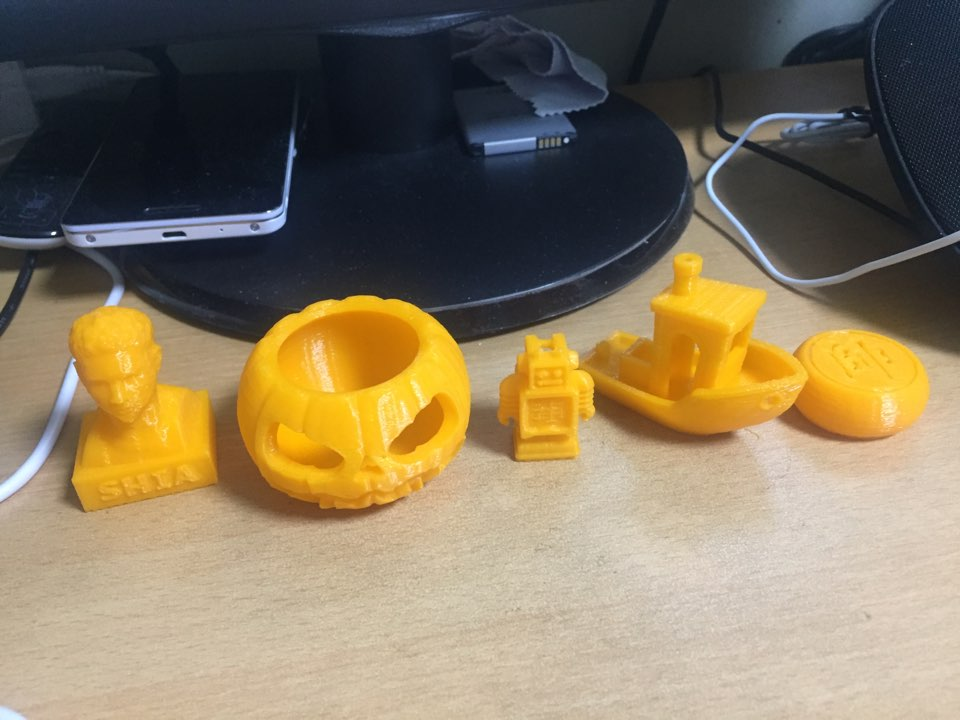](http://note.heyo.me/wp-content/uploads/2016/12/KakaoTalk_20161202_231558512.jpg)

무사히 출력되는거에 기뻐하며

[thingiverse.com](http://thingiverse.com)에서 이것저것 다운받아서 출력해봤다.

아무런 세팅을 하지 않은상태임에도 생각보다 괜찮게 나오는거같다.

다만 필라멘트 색이 뭔가 반짝이고 반투명한게.. 정말 마음에 안드는..

다른 필라멘트를 구입해야겠다.

구매/조립기 끝.
