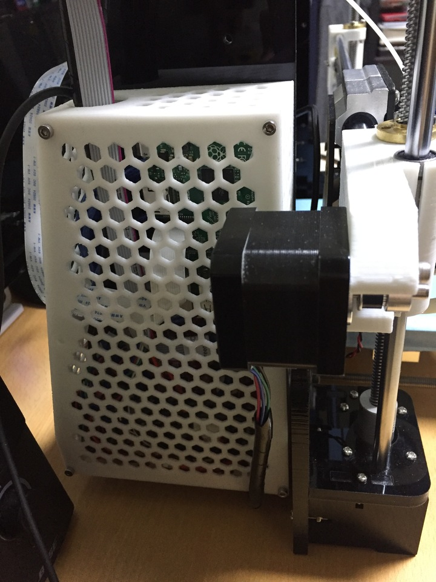
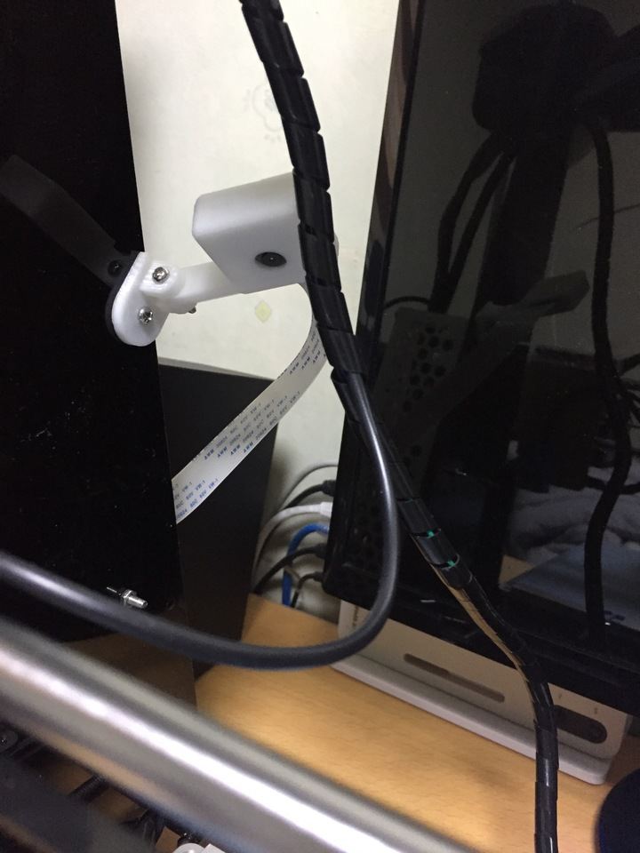

출력하다보면 SD카드를 꼈다뺏다하는게 엄청 귀찮다.

그게 아니면 컴퓨터와 연결해서 바로 출력해도되기하는데 그것도 컴퓨터를 항상 켜둬야한다는 단점이 있다.

그래서 더 편한방법이 없나.. 찾아보다 발견한것이 [OctoPrint](http://octoprint.org/) 이다.

웹에서 프린터를 제어 할 수 있게 해주는 프로그램인데

라즈베리파이 기반이며 1,2,3 모두 지원한다.

기본적인 x,y,z 스텝모터 제어, 프린터 설정, 출력, 터미널등 거의 모든 컨트롤제어가 가능하고

cura slicer engine까지 있어 stl파일을 바로 슬라이싱해서 출력도 할 수 있다.

할 수 있다는건데 쓸일은 없는거같다. 세세한 부분을 확인하기엔 불편해서..

카메라모듈까지 장착하면 출력되는 상황도 확인가능하고 녹화도 할 수 있으며

릴레이를 달아서 프린터 전원 on/off도 제어가능하다.

본체케이스에 라즈베리파이가 들어있는 모습.

카메라모듈이다.

라즈베리파이는 5V로 동작하기때문에 12V-5V 스텝다운 모듈을 달아준다.

굳이 같은 전원을 이용하려고 단거고 그냥 별도 usb전원이면 충분하다.

대충 밀어넣고 파워케이스 설치모습.

웹에서 동작모습이다.

인터페이스는 간단해서 별도 설명이 없어도 쉽게 쓸 수 있다.

웹서버로 동작하므로 설정에따라 외부에서 확인도 가능하다.
