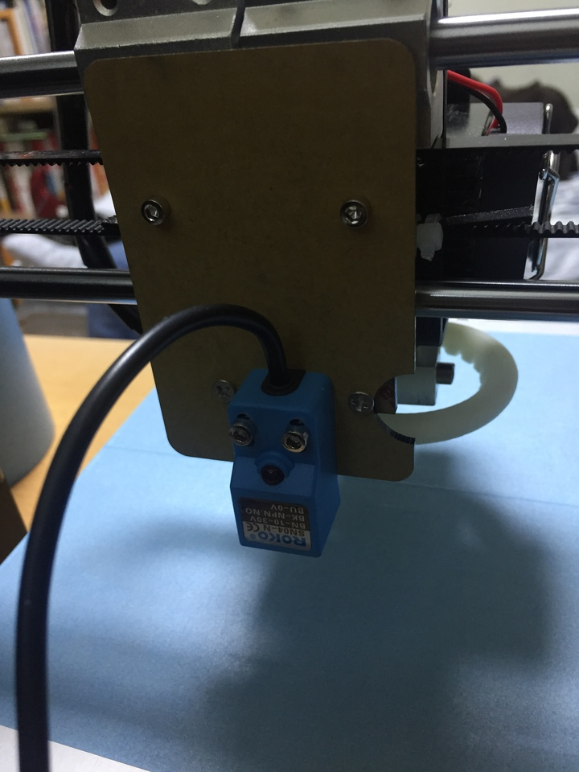

3d프린터 구입할때 오토레벨링이 된다는줄 알고 샀는데

조립하고 나서보니 없었다.

그래서 오토레벨링 모듈을 별도로 구입해서 장착해야했다.

일단 모듈을 aliexpress에서 $18 가량 주고 추가 구입했다.

장착모습.

장착은 별거 없다 그냥 출력부 뒤에다 끼우는 형태라..

보드쪽도 이제 Z축 엔드 스위치를 안쓰게 되므로 그걸빼고 거기다 오토레벨링 단자를 끼워주면된다.

간단한데다가 유투브에 동영상으로 상세히 설명되어있어 별 무리는 없다.

이것을 구입할때는 사실 오토레벨링이 동작하는 방법조차 모르던때라

anet a8에 맞는 모듈을 장착해야하는줄 알아서 구입했는데

찾아보면 다른 형태의 오토레벨링 모듈이 국내에서도 많이 있다

가격도 더 저렴하다.

삼디몰에서도 1.2만에 팔고있다.

전용 모듈이 아니라서 추가 파츠를 출력해서 달아야하는데 사람들이 올려놓은게 많으니 문제될건 없어보인다.

오히려 더 깔끔해보이기도 한다.

anet a8 전용 오토레벨링쪽이 뭔가 더 어설프다..

아크릴도 휘어지게 되서 약간 기울게 되는거 같고 X축 고정벨트도 가려버려서 관리하기도 힘들어진거같기도하고..

**한가지 조심할건 Z축 엔드 스위치가 없다는 사실을 항상 염두해둬야한다. Z축이 안멈추기 때문에 잘못하면 프린터가 격파될수도 있다. 이부분은 펌웨어 설정할때도 마찬가지..**

**또한가지 조심해야할 부분은 오토레벨링 모듈은 어디까지나 금속탐지 모듈이라는 점이다.**

**이점을 간과해서 유리판 같은거 올려둔채로 세팅하면 유리판격파 시험을 보게될 수 있다.**

그 다음 펌웨어..

난 당연히 오토레벨링 관련 기능이 펌웨어 내에 포함되어 있을줄 알았는데..

없었다.

아예 오토레벨링용 펌웨어를 따로 관리하나보다. 하..

검색을 해보았는데 anet a8 펌웨어를 구할수는 없었고

대신 커스텀 펌웨어를 찾았다. 은혜롭게도..

[skynet3d](https://www.facebook.com/skynet3ddevelopment/)

현재 2.0까지 배포하고 있는데 난 그냥 1.1를 설치했다.

아두이노를 통해서 설치하는데 툴과 설명서 모두 배포하는 펌웨어내에 있어서 쉽게 설치 할 수 있었다.

위에도 언급했지만 Z축 엔드 스위치가 없는 상태에서 세팅을 해야하므로 매사에 조심해서 세팅해야한다.

잘못하면 노즐이 멈추지않고 베드를 찍어눌러 노즐과 베드가 상할 수 있다..

여차하면 콘센트라도 뽑을수 있게 만반의 준비를..

오토레벨링을 세팅하고나니 확실히 편하긴하다.

프린터를 자주 옮기다보니 매번 베드 레벨 마추는게 스트레스였는데

지금은 Z축 수평만 마추고 바로 출력할 수 있어서 일단 확실히 시간단축이 되고

레벨이 정확하게 안맞아 첫레이어층이 항상 불안했는데 그런점도 확실하게 안정감있게 출력할 수 있다.
