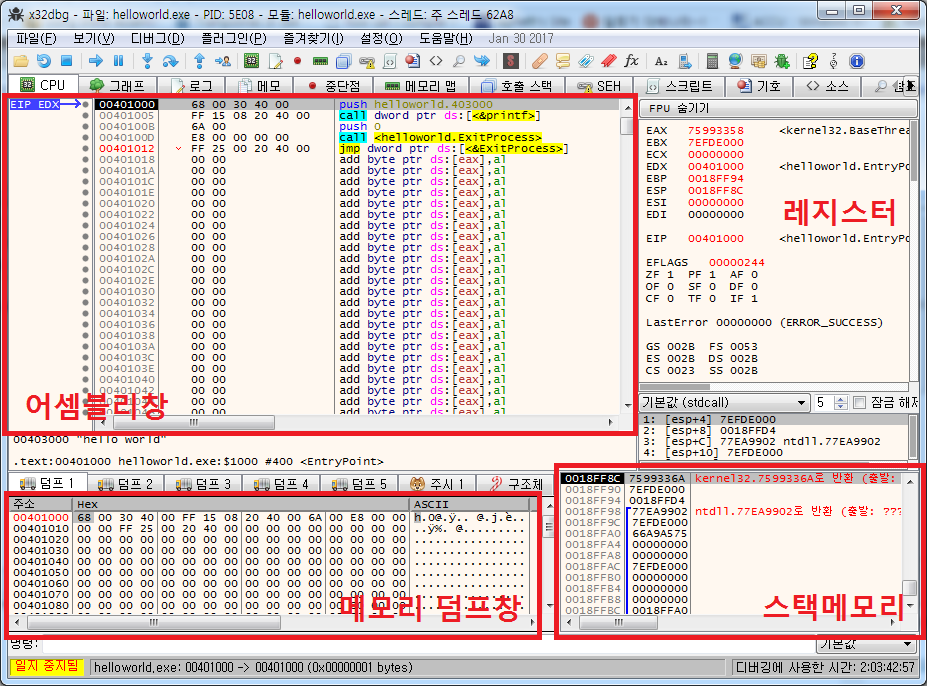
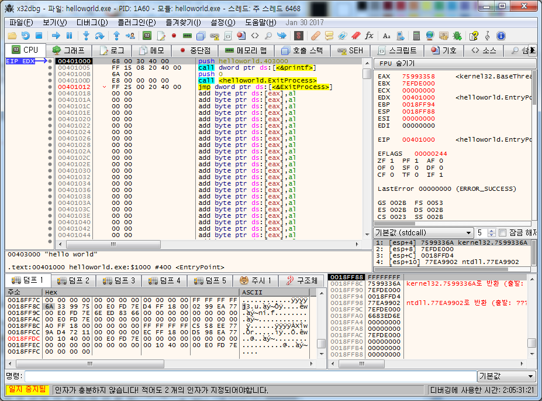
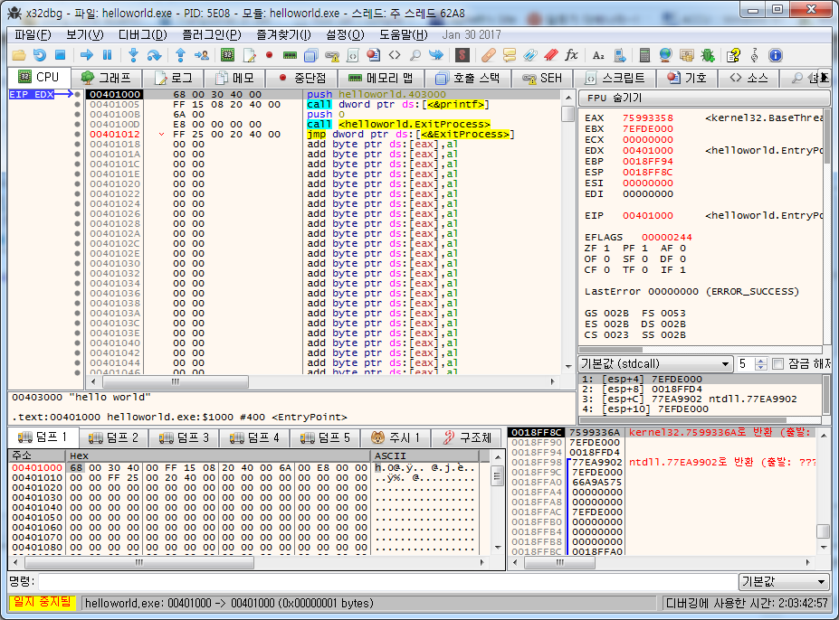
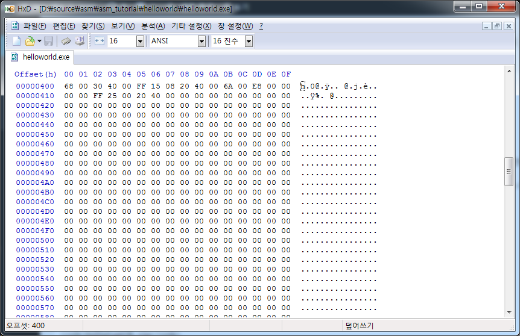
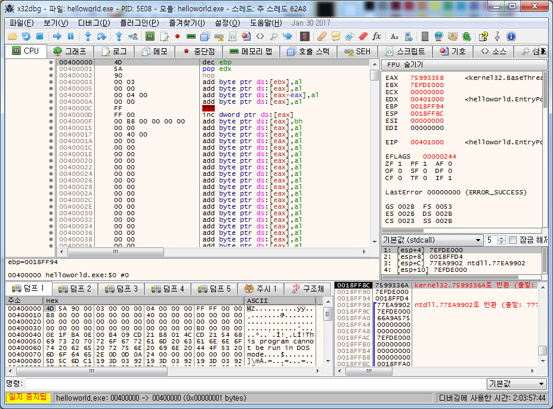

## 1.6. 디버거 설치

예제와 튜토리얼을 바로 확인 할 수 있도록 디버거를 설치한다.

디버거는 프로그램이 제대로 동작하는지 확인하거나 제대로 동작하지 않을때 확인 하려면 필수적으로 필요하다.

디버거는 여러가지가 있는데 64bit/32bit 모두 디버깅 할 수 있고 UI도 깔끔한 x64dbg ([http://x64dbg.com/](http://x64dbg.com/))를 설치한다.

download 를 누르면 날짜별로 스냅샷이 있는데 최신을 다운받는다. 나의 경우는 `snapshot_2017-02-05_20-52.zip` 이었다.

파일을 적당한 곳에 압축을 푼다.

64비트 디버거는 `release\x32\x32dbg.exe`에 있고,

32비트 디버거는 `release\x64\x64dbg.exe`에 있다.

32비트 디버거를 실행해보자.

[](http://note.heyo.me/wp-content/uploads/2017/02/x64dbg_info.png)

좌측에 어셈블리창, 덤프창이 있고 우측에 레지스터창, 스택메모리창이 있다.

어셈블리창과 덤프창은 메모리에 데이터를 표현해준다.

`어셈블리창`은 메모리 데이터를 기계어로 인식해서 어셈블리로 번역해서 보여준다.

반면 `덤프창`은 메모리 데이터를 16진수 바이트 그대로 나열하고 오른쪽에는 간단하게 해당 바이트의 ascii코드를 보여준다

위 화면에서 보면 둘다 같은 메모리 `00401000` 를 가르키고있고

68 00 30 40 00 FF 15 08 20 40 00 6A 00 E8 00 00 00 00 FF 25 00 20 40 00

의 같은 데이터를 표현하고 있다.

레지스터창은 레지스터에 현재 어떤 값이 들어있는지 보여주고있다. 이곳에서 현재 레지스터값을 쉽게 확인 할 수있다.

그 외에도 설명하진 않았지만 FLAG레지스터(zf, cf등)와 SEGMENT레지스터(gs, fs등)도 확인 할 수 있다.

마지막으로 우측 하단에 `스택메모리창` 이 있다.

스택구조로된 별도의 메모리 영역이라고 생각하면 된다.

스택(stack)은 간단히 그림 설명하자면

[](http://note.heyo.me/wp-content/uploads/2017/02/stack.png)

이런식으로 `push`하면 위에 하나가 쌓이고 `pop`하면 위에서 하나가 빠져나오는 구조다.

여기에서 스택메모리도 이거와 똑같은데 들어갈 수 있는 값은 `4byte값`이고 이런 `4byte값`이 `push`되거나 `pop`이 될 수 있다.

이 스택의 가장 위의 위치를 가지고 있는데 이 위치를 나타내주는 레지스터가 `esp` 이다.

디버거 화면을 다시 보면 `esp` 가 `0018FF8C` 값을 가지고 있는걸 볼 수 있다.

스택메모리창에서 보면 현재 가장 위의 주소값이 `0018FF8C` 이다.

한가지 주의할 점은 스택메모리는 거꾸로 자란다는것이다.

현재 가장 위의 스택메모리주소는 `0018FF8C` 인데

여기에 새로운 값 `FFFFFFFF` 을 `push` 한다면..

[](http://note.heyo.me/wp-content/uploads/2017/02/stack_2.png)

스택메모리에 `FFFFFFFF` 가 새로 들어갔고 가장 위의 주소값과 `esp`가 4가 줄어든 `0018FF88` 이 된걸 확인 할 수 있다.

이제 실제로 파일을 하나 디버깅해보자.

[helloworld 파일](http://note.heyo.me/wp-content/uploads/2017/02/helloworld.zip) 이 파일을 다운받은 후에 압축을 풀면 나오는 `helloworld.exe`파일을 \[파일\]-\[열기\]으로 열어본다.

\[디버그\]-\[실행\] or F9 를 한번만 눌러준다.

프로그램 시작위치로 이동하게 된다. 이 시작위치는 `Entry Point`라고 하고 프로그램이 시작되는 메모리 주소이다.

추후에 설명하겠지만 이 `Entry Point`를 조작해서 원래 시작코드가 아닌 다른 코드를 실행하게 할 수 있다.

원하는 작업을 한후 원래의 `Entry Point`로 이동해서 정상적으로 실행하게하면 사용자의 경우 이상함을 전혀 느끼지 못하게된다.

어셈블리창을 보면 `00401000` 에 멈춰 있을 것이다.

이것은 디버거에서 기본적으로 `Entry Point`에 `중단점`(or 브레이크포인트)를 설정해뒀기 때문에 Entry Point인 `00401000` 에서 멈춰져 있는것이다.

프로그램이 실행되는것은 어셈블리가 순차적으로 실행되는 것인데 `중단점`이란 어셈블리가 순차적으로 실행되다가 원하는 위치에서 멈추기를 원할때 사용된다.

원하는 메모리 주소에 `중단점`을 설정하면 프로그램이 실행되다 해당 메모리 주소에 도달하면 멈추게 된다.

이때 F7을 눌러 한단계씩 실행 할 수도 있고 F9 를 눌러 그냥 계속 실행하게 할 수도 있다.

레지스터창에서 현재 실행되고 있는 위치를 나타내는 레지스터 `eip`를 보면 `00401000` 를 나타내고 있다.

[](http://note.heyo.me/wp-content/uploads/2017/02/x64dbg_entry.png)

덤프창에서도 같은 `00401000` 메모리 위치를 보려면 덤프창에서 \[마우스 오른쪽키\]-\[이동\]-\[표현식\] 를 선택하거나 or 덤프창에 포커스를 마춘후 CTRL+G 를 눌른후 `00401000` 를 입력하면된다.

어셈블리창에서도 마찬가지로 메모리 주소 이동을 할 수 있다.

위의 `helloworld.exe`는 아래의 어셈블리 소스를 컴파일해서 만든 파일이다.

```nasm
.data
szHelloWorld        byte "hello world",0

.code
start:
    push offset szHelloWorld
    call crt_printf

    ; exit
    push 0
    call ExitProcess

end start
```

`start:` 밑의 코드를 보면 `offset szHelloWorld` 전역변수의 주소를 나타내는 부분이 실제 변수의 메모리 주소인 `00403000` 으로 변경된것만 빼면 디버거에서 어셈블리가 똑같이 표현되고 있는 것을 확인 할 수 있다.

덤프창에서 `00403000` 으로 이동해보면 문자열 `"hello world",0` 를 확인 할 수 있다.

마지막으로 한가지만 더 확인해보자.

디버거에서 어셈블리창을 보면

```avrasm
위치주소  | 기계어         | 어셈블리
00401000 | 68 00 30 40 00 | push helloworld.00403000
; helloworld은 무시해도된다. 00403000 메모리주소가 helloworld프로그램 영역이라는 일종의 도움말이다.
```

`push 00403000` 가 기계어로 68 00 30 40 00 로 표시되는 것을 확인 할 수 있다.

68은 `push` 를 나타내고 00 30 40 00 은 `00403000` 를 나타내는 것 인데 기계어에서는 `byte단위`로 반대로 표시되어있음을 알 수 있다.

00 30 40 00 를 다시 거꾸로 써보면 00 40 30 00 가 된다.

이렇게 실제 값이 메모리(파일)에 쓰여질때에는 `byte단위`로 거꾸로 쓰여진다.

이런 방식을 little endian이라고 하는데 별로 중요하지 않고 거꾸로 쓰여진다는 것만 기억하면된다.

## 1.7. 헥스에디터 설치

파일을 바이너리형태로 볼 수 있는 헥스에디터를 설치하자.

HxD ([https://mh-nexus.de/en/hxd/](https://mh-nexus.de/en/hxd/)) 에서 다운받는다.

다운받을때 Korea를 선택해서 다운받으면 `HxDSetupKOR.zip` 한글판으로 설치 할 수 있다.

실행후에 \[파일\]-\[열기\]를 선택하여 위에서 다운받은 `helloworld.exe`를 열어본다.

\[찾기\]-\[이동\] or CTRL+G를 누른후 `400` 입력한다.

[](http://note.heyo.me/wp-content/uploads/2017/02/hexeditor_entiry.png)

위에서 디버거로 봤었던

68 00 30 40 00 FF 15 08 20 40 00 6A 00 E8 00 00 00 00 FF 25 00 20 40 00

시작위치에 있던 기계어 바이트값들이 그대로 있는것을 확인 할 수 있다.

파일에 있는 내용이 그대로 메모리에 복사된 것이다.

파일의 제일 처음을 보면

[](http://note.heyo.me/wp-content/uploads/2017/02/hexeditor_base.png)

이런 바이너리값들을 확인 할 수 있는데..

이것은 디버거에서 메모리 `00400000` 에서 똑같은 바이너리값을 확인 할 수 있다.

[](http://note.heyo.me/wp-content/uploads/2017/02/debugger_base.png)

어셈블리창, 덤프창 모두 `00400000` 로 이동해봤다.

덤프창을 보면 헥스에디터에서 봤던 바이너리값들이 똑같이 들어가 있는 것을 확인 할 수 있다.

이 정보는 추후에 설명할텐데 프로그램의 여러가지 정보를 가지고 있는 데이터값들이다.

어셈블리창을 보면 어셈블리가 이상하게 표현되고 있는데 이것은 기계어명령이 아닌 그냥 데이터값을 어셈블리로 억지로 해석하다보니 저런식으로 표현된 것이다.

이런식으로 exe파일이 실행될때는 exe파일의 전체 데이터가 그대로 메모리에 복사 된 후에 적절한 시작위치에서 기계어가 해석되며 실행되는걸 알 수 있다.

참고로 `00403000` 에 있던 `"hello world",0` 문자열은 파일에서 `800` 위치에서 확인해볼 수 있다.

이제 실제 어셈블리 예제를 보도록 하자.

> [목차](http://note.heyo.me/?p=238) 이전글 [어셈블리어 튜토리얼 (1) 설정/기초](http://note.heyo.me/?p=560)
