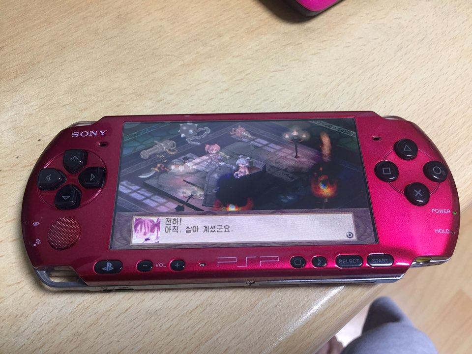

추억의 psp다. 실제로 추억의 에물 게임밖에 안한다. 사쇼, 킹오파정도

psp의 뒷판 도장이 벗겨져 케이스를 갈아보았다.

벗겨진부분이 지저분한것도 지저분한거지만 무엇보다 부스러기가 여기저기 떨어져서 주변이 지저분해지는게 버티기가 넘나 힘들었다.

aliexpress 에서 구입했다. $10 내외로 가격은 꽤나 저렴한편

기본적인 공구도 포함되어있다. ..만 안씀.

레드로 구입했다.

교체된 모습. 넘나 깔끔. 모든것이 정상작동..

..하지만.. 교체하는 과정이 정말 정말 힘들다.

쉽게 생각했는데 정말 빡셌다.

기본적으로 이런 기계분해를 잘못하면 하면 안될듯 싶..

심지어 케이스도 버젼별로 다른지 안맞는 부분이 있다.. ㅋ

거기다 정품이 아닌건지 십자패드와 버튼같은 중요부품이 넘나 조악하다

십자패드, 버튼은 검은색 전에것 그냥 다시 씀;;

조립하고 전원을 딱 켰는데 액정 반이 안켜져서 lcd 부품도 구입해서 교체.

덕분에 액정도 새액정이다ㅋㅋㅋ
