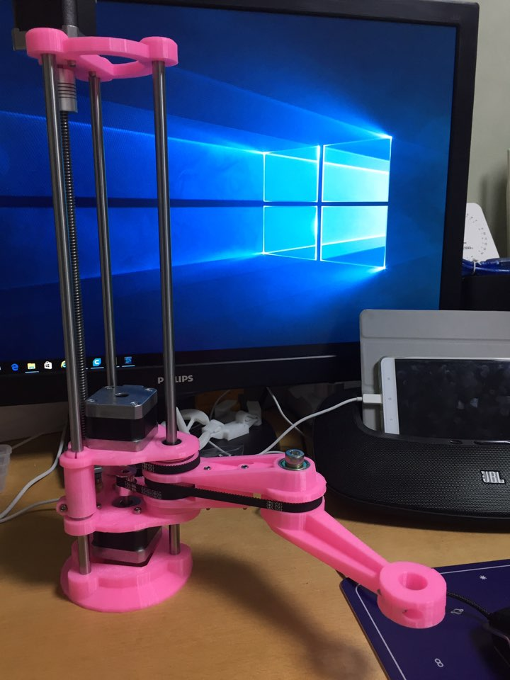
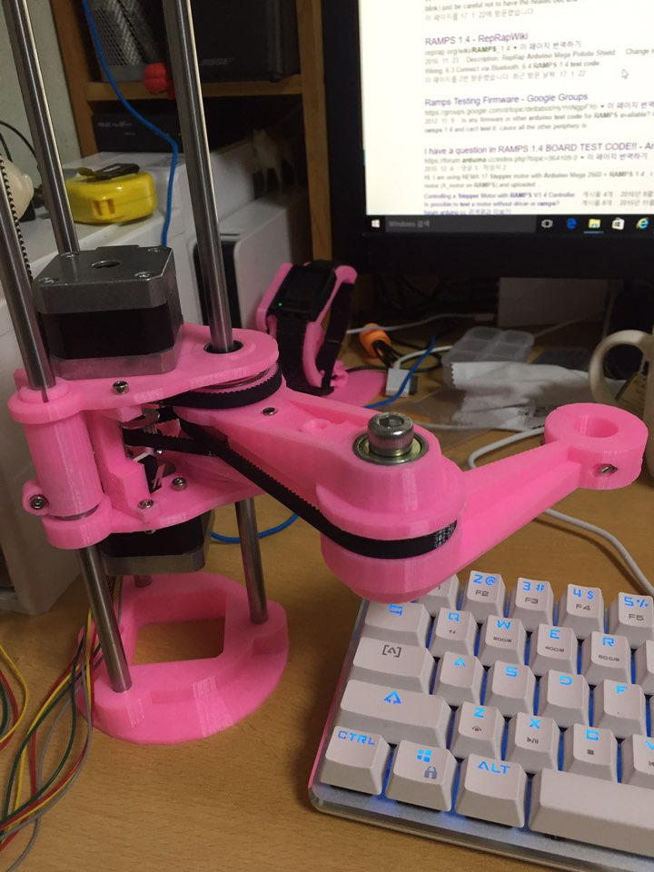
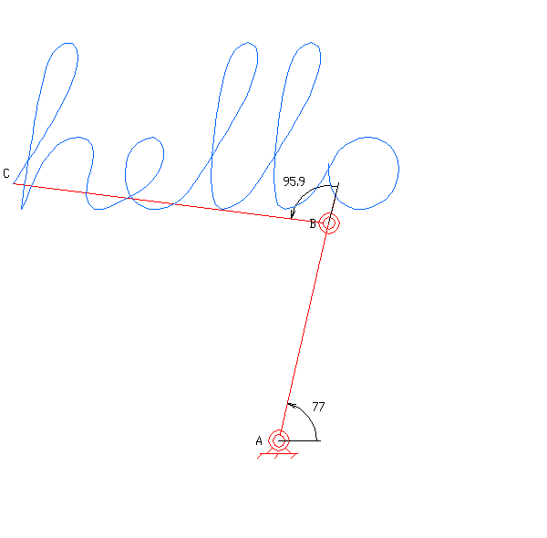
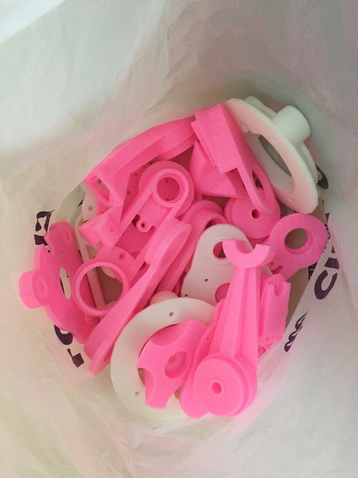

scara arm robot 제작중.. 3d프린터로 뭐 재미난거 만들게 없을까하다 만들기 시작했다. end-switch만 달면 하드웨어는 완성인거 같다. arduino mega + ramps 에 연결해서 각 모터구동 테스트까지 해봤다.

생각보다 하드웨어 값이 비싸다;; 거의 3d프린터값이.. ㅋ 실제로 아크릴 프레임을 제외하면 부품 대부분이 일치한다.

그러고보면 3d프린터 diy셋이 확실히 싸긴한듯

일단 1차 목표는 펜을 끼우고 글씨를 쓰는거다.

요롷코름

수많은 실패의 흔적들...
