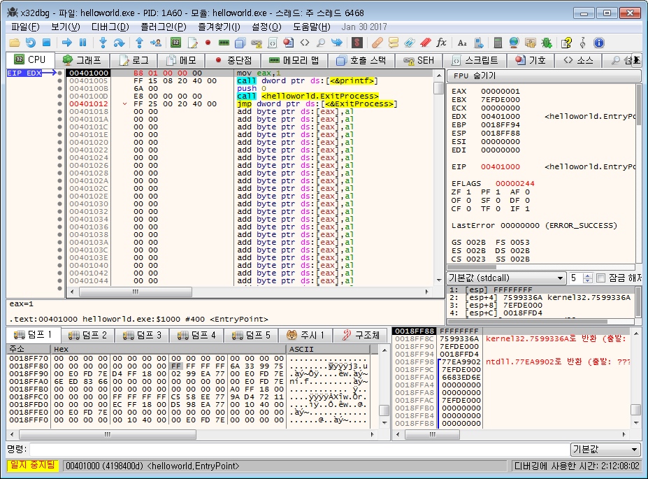

## 1.8. 명령어 상세설명(1)

여기서 설명하는 명령어들는 이전에말한 디버거에서 실시간으로 테스트해 볼 수 있다.

`x32dbg` 를 실행하고 다시 `helloworld.exe` 를 열어보자.

F9를 눌러 `Entry Point`까지 이동하자.

[](http://note.heyo.me/wp-content/uploads/2017/02/x64dbg_entry.png)

디버거를 이용해서 어셈블리코드를 실행 하는 방법에는 크게 두가지 방법이 있는데

먼저 **첫번째 간단한 방법**은

덤프창아래에보면 \[명령\]이라는 입력폼이 보이는데 이곳에다 바로 어셈블리 명령어를 입력할 수 있다.

\[명령\]의 단축키는 CTRL+ENTER 이다.

\[명령\]창에서 `mov eax, 1` 를 입력해보자.

레지스터창에서 `eax` 가 1로 변경된 것을 확인 할 수 있다.

그런데 이 방법의 경우 실행되지 않는 명령어도 꽤 있는거 같다.

**두번째 방법**은 어셈블리창에서 새롭게 어셈블리 코드를 입력하는 방법이다.

어셈블리창에서 변경을 원하는 곳에 마우스를 클릭하고 SPACE를 누르면 어셈블리를 바로 입력할 수 있는 창이 나타난다.

이 입력창에 어셈블리 명령어를 입력하면 바로 메모리에 반영된다.

`Entry Point`인 `00401000`를 클릭하고 SPACE를 눌러서 입력창을 띄운후 `mov eax, 1`을 입력해본다.

다음 어셈블리코드까지 계속 변경할 수 있도록 계속해서 입력창이 나타난다. 닫아주고 어셈블리창을 확인해보면

[](http://note.heyo.me/wp-content/uploads/2017/02/assem.png)

`push 00403000` 이 사라지고 입력한 `mov eax, 1`으로 대체 된 것을 확인 할 수 있다.

이 경우 둘다 5byte짜리 명령어라 다음 어셈블리코드인 `call dword ptr [&printf]` 가 그대로 있지만 5byte이상의 명령어를 입력하면 다음 어셈블리코드도 영향을 받을 수있다.

혹은 더 작아도 뒤에 남은 바이트가 다른 어셈블리코드로 해석되어 이상하게 표현될 수 있다. 이런경우는 `nop` 명령어로 남은 부분을 채워주면 된다.

`nop`은 아무일도 하지 않는 `1byte`짜리 명령어이다.

직접 채워도되지만 입력창에서 '잔존 바이트 NOP으로 채우기'를 체크해주면 알아서 채워준다.

이렇게 어셈블리코드를 변경한 후 한단계 실행인 F7를 누르면 `mov eax, 1`이 실행되고 `eax` 가 1로 변경된 것이 확인된다.

한단계가 실행됬기때문에 `eip` 커서가 `00401005` 로 이동했다.

다시 `00401000`로 돌아가려면 `00401000` 클릭하고 CTRL+\*를 누르거나 마우스 오른쪽 버튼을 클릭후 \[여기에 새로운 원점 설정\]을 선택한다.

이렇게 되돌아가서 어셈블리코드를 수정후에 또 다시 실행 할 수 있다.

## 1.8.1. **mov** : 값복사. 가장 많이 사용되는 명령어중 하나이다.

```
mov 대상, 소스
```

*소스*에 있는 값을 *대상*으로 복사한다.

```nasm
mov eax, 1
; eax레지스터에 1을 복사하라는 뜻이다. 실행하면 eax레지스터에 1이 들어가있다.
```

값, 레지스터, 메모리 모두 복사할 수 있다.

```nasm
mov eax, 1
; eax에 값 1을 복사
mov ebx, eax
; ebx에 eax를 복사. ebx레지스터에 1이 들어가있다.

mov dword ptr [00400000], 1
;메모리[00400000]에 값 1을 복사
mov ecx, dword ptr [00400000]
; ecx에 메모리[00400000]에 들어있는 값을 복사.
```

소스/대상 둘다 메모리가 될 수는 없다.

```nasm
mov dword ptr [00400000], dword ptr [00800000]
; 메모리[00800000]의 값을 메모리[00400000]에 복사. 이 경우 에러가 난다.

mov eax, dword ptr [00800000]
mov dword ptr [00400000], eax
; 레지스터를 사용해서 이렇게 한번 거쳐서 복사한다.
```

## 1.8.2. **lea** : 주소복사. 조금 특이한 명령어이다.

```
lea 대상, 소스
```

_(디버거에서 테스트하기 애매한 명령어이니 그냥 읽고 이해만 하자)_

*소스*의 메모리주소를 *대상*에게 복사한다. 얼핏보면 `mov`과 혼동할 수 있다.

`mov`는 소스의 **값**을 복사하지만 lea는 **메모리주소**를 복사한다.

lea는 주로 **지역변수**의 메모리주소를 알아낼 때 유용하게 사용된다.

**지역변수**는 함수내에서 사용되는 변수이다. 함수를 벗어나면 바로 사라진다.

c프로그래밍을 예로 들면

```c
int total = 0;

void main() {
    int num;

    num = 5;
    total = num + num;
}
```

`main`함수에서 `num`이 지역변수이다.

이 지역변수는 일전에 설명한 **스택메모리**에 저장된다.

반대로 **전역변수**가 있는데 함수밖에 선언되어있는 변수를 **전역변수**라고한다.

위 예제에서 `total`이 **전역변수**이다.

전역변수는 함수 안밖 프로그램 어디에서도 사용할 수 있다.

어셈블리로 같은 예를 들면

```nasm
.data
total dword 0

.code
main proc
    local num:dword

    mov num, 5

    mov eax, num
    add eax, num
    mov total, eax
main endp
```

`proc, endp`는 어셈블러에서 함수를 선언하는 방법이다.

c프로그램과 달리 지역변수는 `local`이라고 명시해야하며 항상 함수 제일위에 있어야한다.

마찬가지로 `num`은 지역변수 `total`은 전역변수이다.

어셈블리에서 전역변수는 `.data` 밑에 선언된다.

**전역변수**는 **고정메모리 주소**를 갖는다.

일전에 디버거 예제에 helloworld 프로그램을 다시 살펴보자

여기에서 `szHelloWorld` 는 전역변수이다.

어셈블리 소스에서 확인해보면

```nasm
push offset szHelloWorld
call crt_printf
```

디버거에서 확인해보면

```nasm
push 00403000
call dword ptr [&printf]
```

이렇게 메모리 `00403000` 으로 변경된것을 확인 할 수 있다.

전역변수는 이렇게 *고정메모리 주소*이기 때문에 `offset`키워드만 붙이면 쉽게 주소를 알아낼 수 있다.

다시 원래의 예제로 돌아가면

전역변수 `total`의 메모리 주소를 알고 싶으면 `offset`키워드를 붙이면된다.

```nasm
mov eax, offset total
; 레지스터 eax에 total의 메모리 주소를 복사한다.
```

이것은 또한 지금 설명하려고하는 `lea`를 사용하여 나타낼 수 있다.

```nasm
lea eax, total
; 레지스터 eax에 total의 메모리 주소를 복사한다.
```

반면 **지역변수**는 *고정메모리 주소*가 아니고 함수가 호출될 때에 **스택메모리**에 생겨났다가 함수가 끝날 때 사라진다.

이런 특성때문에 지역변수의 메모리 주소를 알아내는건 쉽지 않다. 고정메모리가 아니기 때문에 `offset`키워드를 이용할 수도 없다.

이럴때 `lea`가 유용하게 사용된다.

```nasm
lea eax, num
; 레지스터 eax에 num의 메모리 주소를 복사한다.
```

이 어셈블리코드를 나중에 디버거에서 확인해보면 아래와 같이 표현된다.

```avrasm
lea eax, dword ptr [00403000] ; 전역변수 total. 할당된 고정메모리주소가 00403000
lea eax, dword ptr [esp - 4]  ; 지역변수 num
```

`num` 이 어째서 `esp - 4` 로 표현되는지는 추후 `call` 설명할 때 함수와 함께 마저 설명하겠다.

## 1.8.3. **add** : 덧셈. 덧셈이다.

```
add 대상, 소스
대상 = 대상 + 소스
```

자세한 설명은 생략한다.

```nasm
mov eax, 1
; eax에 값 1을 복사
add eax, 1
; eax에 값 1을 더함
; eax = 2

mov eax, 1
; eax에 값 1을 복사
mov ebx, 1
; ebx에 값 1을 복사
add eax, ebx
; eax에 ebx를 더함
; eax = 2
```

## 1.8.4. sub : 뺄셈. 뺄셈이다.

```
sub 대상, 소스
대상 = 대상 + 소스
```

자세한 설명은 생략한다.

```nasm
mov eax, 1
; eax에 값 1을 복사
sub eax, 1
; eax에 값 1을 뺌
; eax = 0

mov eax, 1
; eax에 값 1을 복사
mov ebx, 1
; ebx에 값 1을 복사
sub eax, ebx
; eax에 ebx를 뺌
; eax = 0
```

## 1.8.5. dec : 1 감소

```
dec 대상
```

```nasm
mov eax, 1
dec eax
; eax는 0
```

## 1.8.6. inc : 1 증가

```
inc 대상
```

```nasm
mov eax, 1
inc eax
; eax는 2
```

## 1.8.7. **and, or, not, xor** : 비트연산

자주 쓸 일은 없어서 꼭 알 필요는 없지만 적어도 `and, or, not` 정도는 알아두는게 좋다.

말그대로 `비트(bit)` 에 대한 `연산`이다.

c언어에서 아래와 같이 사용된다.

```
and = &
or = |
not = !
xor = ^

연산자는 아니지만 비교문에 쓰이는 &&(and) ||(or) 도 같은 의미이다.
```

`비트(bit)`란 것은 저장단위의 가장 작은 단위를 나타내며 0, 1만 가지고 있다.

`bit`가 8개 모여 `byte`가 된다.

초반부에 잠깐 소개했었는데 그래서 32bit는 4byte 이다.

32bit 프로그래밍의 모든 레지스터, 메모리 주소는 4byte의 값 즉 dword 단위이다.

비트(bit)는 쉽게 2진수라고 생각하면 된다.

**and 연산**

```
1 and 1 = 1
0 and 0 = 0
1 and 0 = 0
0 and 1 = 0
```

and 연산은 1 and 1 만 1이 되고 그외에는 0이 된다.

1bit에서는 이렇게 명확한데 좀더 큰 값으로 설명해보자.

```
0F and C7 = ?
```

1byte 값(16진수)의 이것은 어떻게 될까? 16진수를 2진수로 변환해서 각각의 자리별로 and 연산을 하면된다.

```
00001111 ; 0F
11000111 ; C7
and 연산
00000111 ; 7
```

둘다 1인경우만 1이되고 나머지는 0이 되므로 결과는 **7** 이 된다.

이것을 어셈블리로 표현해보면

```nasm
mov eax, 0Fh
and eax, C7h
; eax = 7
```

위에선 16진수로 표현했는데 2진수로 표현할 수도 있다.

```nasm
mov eax, 00001111y
and eax, 11000111y
; eax = 7
```

숫자의 끝에 `h` 가 붙으면 `16진수` `y` 가 붙으면 `2진수`이다.

참고로 `8진수`를 `o` 를 붙이면된다. 물론 아무것도 안붙이면 `10진수`이다.

and연산은 masking할때 주로 사용된다.

특정값에 살리고 싶은 곳을 1로 채워넣고 죽이고 싶은 곳을 0으로 채워놓으면 특정값은 1을 채워놓은 곳만 남게된다.

예를 들어 이런 특정값 `8FE3` 이 있다고 하자. `하위 6비트`만 남기고 싶다면 `하위 6비트`만 1로 채우고 나머지는 0으로 채운 값을 `and` 연산하면된다.

```
1000111111100011 ; 8FE3h
0000000000111111
and 연산
0000000000100011 ; 하위 6비트값만 남게된다.
```

이러한 masking은 여기저기 자주 쓰이는데 한가지 예를 들면 네트워크 IP설정할때 서브넷마스크(subnet mask)라는 것을 들 수 있다.

주로 `255.255.255.0` 라고 설정되는데 여기서 `255`는 16진수로 `FF`가 되고 2진수로 표현하면

`11111111`이된다. 즉 `255.255.255.0` 라는것은 2진수로

`11111111.11111111.11111111.00000000` 가 된다.

이것을 and 연산하면 앞에 24자리는 그대로 두고 뒤에 8자리만 0으로 만들어 버린다.

근데 이 서브넷마스크가 정확히 어떻게 쓰이는지는 모르겠다. ㄲㄲ 브로드캐스트할때 쓰이는거 같긴한데.. 모르겠다. 별로 궁금하지 않기도하고..

**or 연산**

```
1 or 1 = 1
0 or 0 = 0
1 or 0 = 1
0 or 1 = 1
```

or 연산은 0 or 0 만 0이 되고 그외에는 1이 된다.

```
00001111 ; 0F
11000111 ; C7
or 연산
11001111 ; CF
```

둘다 0인경우만 0이 되고 나머지는 1이므로 결과는 **CF** 가 된다.

이것을 어셈블리로 표현해보면

```nasm
mov eax, 0Fh
or eax, C7h
; eax = CFh
```

or 연산은 중복 선택이 가능한 옵션에서 자주 쓰인다.

1byte 가지고 예를 들어 보겠다. 1byte는 총 8개의 bit를 가지고 있다.

각각의 비트 자리수별로 1만 설정하고 나머지는 0으로 설정한다면 아래와같이 8개의 값으로 나타낼수 있다.

```
00000001 옵션1
00000010 옵션2
00000100 옵션3
00001000 옵션4
00010000 옵션5
00100000 옵션6
01000000 옵션7
10000000 옵션8
```

이럴때 옵션1과 옵션6을 선택한다고 해보자.

```
00100001 옵션1 | 옵션6
```

이렇게 두 값을 or 연산시키면 두 옵션을 가지고 있다고 표현할 수 있다.

```
10100010 옵션2 | 옵션6 | 옵션8
```

세가지 옵션을 가지고 있다고 표현할 수 있다.

옵션1부터 옵션8까지 모든 옵션을 가지고 있다고 표현한다면 `11111111` 이렇게 나타낼 수 있다.

실제로 많은 `windows api 함수`들이 이런식으로 중복선택 가능한 옵션값을 선언해서 사용하고 있다.

세가지 값을 가지고 있는 10100010 값에서 옵션6을 가지고 있는지 판단하려면 어떻게 할까?

이때 and 연산이 활용된다.

`10100010 and 옵션6` 이 0이되면 옵션6이 포함 안되어 있는것이고 0이 아니면 옵션6이 포함된거라 판단할 수 있다.

```
10100010
00100000 ; 옵션6
and 연산
00100000 ; 옵션6이 있다고 판단할 수 있다.
```

```
10100010
01000000 ; 옵션7
and 연산
00000000 ; 옵션7은 없다고 판단할 수 있다.
```

**not 연산**

```
not 1 = 0
not 0 = 1
```

비트가 반대로 되는 연산이다. not연산이 되면 0은 1로 1은 0으로 바뀐다.

```
11000111 ; C7
not연산을 하면
00111000 ; 38
```

1이 0이되고 0이 1이 되었다.

이것을 어셈블리로 표현해보면

```avrasm
mov eax, C7h
not eax
; eax = 38h
```

**xor 연산**

```
1 xor 1 = 0
0 xor 0 = 0
1 xor 0 = 1
0 xor 1 = 1
```

특이한 비트연산자이다. 두 값이 같으면 0이 되고 다르면 1이 된다.

거의 볼일이 없는데 레지스터를 0으로 초기화할때에 정말 많이 보게된다.

```avrasm
xor eax, eax ; eax 를 0으로 초기화
```

이렇게 같은 레지스터를 양쪽에 넣으면 `xor`연산에 따라 0이된다.

예를 들어 `eax`에 값 `C7`이 있다고 가정해보자.

```
11000111 ; C7
11000111 ; C7
xor 연산
00000000 ; 0
```

두 값이 같을경우 1, 1 도 0 이되고 0, 0 도 0이된다. 즉, 어떠한 값도 같은 값을 `xor` 연산을 하면 0 이된다.

```nasm
mov eax, 0
```

이렇게 0으로 초기화해도 되는데 `xor` 로 초기화 하는 이유는 명령어의 크기때문이다.

`mov eax, 0` 는 B8 00 00 00 00 으로 총 **5byte**를 사용하게 된다.

반면 `xor eax, eax` 는 31 C1 로 총 **2byte**를 사용하게 된다. 두배가 넘는 차이이다.

그리고 간단한 암호화 할 때도 xor 연산이 사용되기도 한다. 예를들어 이런 것이다.

```
원본값 xor 키값 = 암호화값
암호화값 xor 키값 = 원본값
```

이런 특성을 이용하여 암호화에 쓰인다. 실제 예를 들어보자.

원본값은 `C7` 이고 키값은 `22` 이라고 정해보자.

```
11000111 ; C7
00100010 ; 22
xor 연산
11100101 ; E5
```

암호화된 값은 `E5` 이 되었다. 이것을 다시 키값 `22` 으로 xor 연산하면

```
11100101 ; E5
00100010 ; 22
xor 연산
11000111 ; C7
```

이렇게 원본값 `C7` 을 구할 수 있다.

사실 비트 연산의 경우 계산기 켜놓고 쉽게 구할 수 있으니.. 대충 쓰임새만 이해만 하고 넘어가면 될거 같다.

다음에는 함수 관련 명령어와 나머지 몇가지 명령어를 설명하겠다.

> [목차](http://note.heyo.me/?p=238) 이전글 [어셈블리어 튜토리얼 (2) 디버거](http://note.heyo.me/?p=1071)
