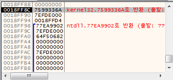
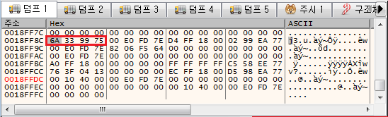
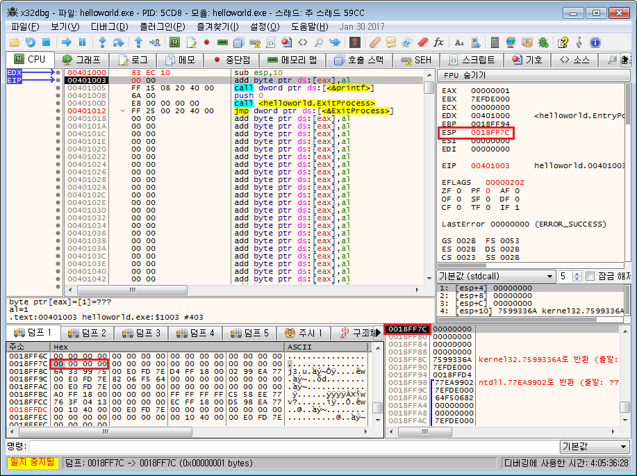
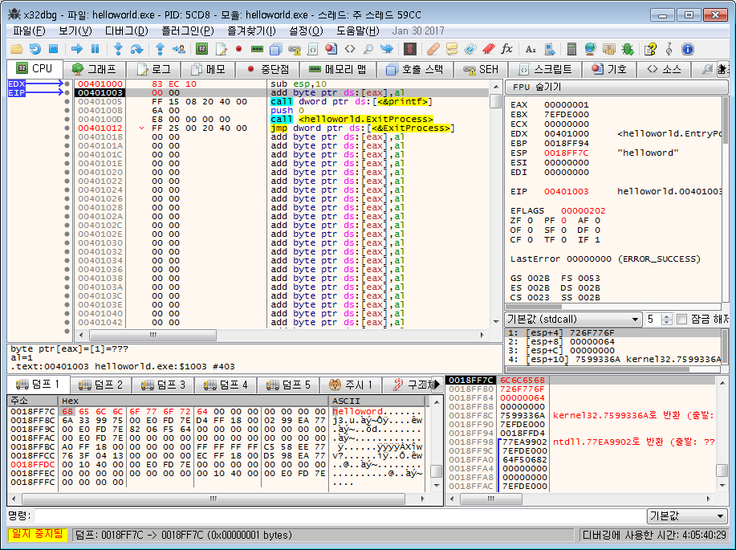

이전글

[어셈블리어 튜토리얼 (3) 명령어 상세설명](http://note.heyo.me/?p=1134)

## 1.8. 명령어 상세설명(2)

## 1.8.8. **push** : 스택메모리에 대상을 push해서 넣는다.

```nasm
push 대상
```

스택메모리에 `값/레지스터/메모리`를 push한다. 스택메모리 최상단 주소는 `esp` 레지스터에 저장되어 있다.

```nasm
push 1
; 스택메모리에 값 1을 넣는다.

mov eax, 1
push eax
; 스택메모리에 레지스터 eax값을 복사해서 넣는다.

mov dword ptr [00403000], 1
push dword ptr [00403000]
; 스택메모리에 메모리값을 복사해서 넣는다.
```

스택이 동작하는 방법은 일전에 기초편에서 설명하였다. 좀 더 자세히 살펴보자.

실제 디버거에서 **스택메모리창**를 확인해보자.

[](http://note.heyo.me/wp-content/uploads/2017/02/stack_memory.png)

현재 **스택메모리 최상단 주소(esp)**는 `0018FF8C` 이다.

이곳에 새로운 값을 push 하면 새로운 값이 최상단에 들어가고 **최상단 주소(esp)**는 4가 빠진 `0018FF8C - 4 = 0018FF88` 이 될 것이다.

이렇게 새로운 값이 `push` 가 되면 `4byte`씩 줄어들면서 스택의 가장위에 쌓이게 된다.

스택메모리도 메모리다. 스택메모리 특성상 확인하기 편하도록 **스택**의 형태로 나타내고 있지만 일반적인 덤프 형태로 볼 수도 있다.

스택메모리 주소를 덤프창에서 확인해보자.

[](http://note.heyo.me/wp-content/uploads/2017/02/stack_dump.png)

빨간 박스가 `0018FF8C` 의 값이다. 왼쪽으로 4byte씩 스택메모리에서 최상단 밑으로 쌓인 값들을 확인 할 수 있다.

값이 거꾸로 표현되는 것은 일전에 설명한 little endian 표현방식 때문이다.

스택메모리는 push에서 새로운 값을 넣을 수도 있지만 직접 `esp` 값을 빼서 이용 할 수도 잇다.

```nasm
sub esp, 10h ; 스택메모리를 10h 만큼 확보한다.
```

[](http://note.heyo.me/wp-content/uploads/2017/02/stack_raise.png)

스택메모리의 최상단이 `0018FF7C` 으로 되었고 `esp` 도 마찬가지다. 이렇게 push가 아닌 `esp` 의 값을 직접 빼서 `16byte(16진수 10h)`의 스택메모리가 확보되었다.

[](http://note.heyo.me/wp-content/uploads/2017/02/stack_local.png)

여기에 이렇게 문자열을 넣을수도 있다. 이렇게 스택메모리를 확보해서 사용하는 것이 **지역변수**이다.

위는 c언어에서 이렇게 사용된것과 비슷하다.

```c
void main() {
    char[16] buff;
    strcpy(buff, "helloworld");
}
```

지역변수 `buff`를 `16byte` 할당하고 거기에 문자열 "helloworld"를 복사해 넣는다.

이렇게 할당한 스택메모리는 다시 `add esp, 10h`로 `esp` 의 값을 더해서 해제한다.

## 1.8.9. **pop** : 스택에서 pop해서 대상에 값을 넣는다.

```nasm
pop 대상
```

스택메모리의 최상단값을 빼서 레지스터/메모리에 넣는다. 최상단 값이 빠졌기 때문에 `esp` 레지스터가 `4byte` 더해진다.

```nasm
pop eax
; 스택메모리 최상단의 값을 빼서 레지스터 eax에 넣는다.

pop dword ptr [00403000]
; 스택메모리에 최상단의 값을 빼서 메모리[00403000]에 넣는다.
```

스택메모리에 임의로 값을 `push` 했다면 스택메모리가 꼬이지 않도록 꼭 `pop` 도 해줘야한다.

또한 메모리값 복사할때도 `push, pop` 이 이용되기도 한다.

일전에 `mov`를 설명할때 메모리에서 메모리로 바로 값을 복사할 수 없다고했다.

그래서 `dword ptr [00403000]` 값을 `dword ptr [00408000]` 로 복사하려면 레지스터를 거쳐야한다고 했다.

```nasm
mov eax, dword ptr [00403000]
mov dword ptr [00408000], eax
```

이렇게 레지스터를 거쳐서 복사 할 수 있었는데

`push, pop`을 이용하면 레지스터를 사용하지 않고 복사 할 수 있다.

```nasm
push dword ptr [00403000]
pop dword ptr [00408000]
```

## 1.8.10. **jmp** : 점프

```nasm
jmp 이동할위치주소
```

특정 메모리 위치로 점프한다. `eip` 가 이동할위치주소로 변경된다.

```nasm
jmp 0040100c

mov eax, 0040100c
jmp eax

mov dword ptr [00403000], 0040100c
jmp dword ptr [00403000]
```

## 1.8.11. **call** : 함수 호출

```nasm
call 호출할위치주소
```

함수 호출할때 사용된다.

기본적으로 `jmp`와 동일한데 다른점은 `현재 실행위치(eip)` 다음위치를 스택에 `push` 한 후에 점프한다.

이 위치를 스택메모리에 넣은 이유는 `jmp` 후에 다시 돌아올때 사용하기 위함이다.

이것을 풀어서 이렇게 표현할 수도 있겠다.

```nasm
push jmp명령어다음위치
jmp 이동할 위치주소
```

`jmp명령어다음위치`만 정확히 구할 수 있다면 동일하게 동작한다.

함수를 호출할때 `파라메터`를 넘기는 경우가 있다.

함수를 호출할때 `파라메터`는 스택에 `push` 를 해서 넘길수 있다.

2개의 파라메터를 받는 함수 `sum` 이 있다고할때 이렇게 호출한다.

```c
sum(10, 20);
```

c언어에서는 이런식으로 함수를 호출한다.

```nasm
push 20
push 10
call sum
```

어셈블리에서는 이렇게 호출한다. 파라메터를 `push`하는데 마지막 파라메터부터 거꾸로 `push`한다.

즉, `sum`으로 `call` 할때는 스택메모리에는

```
00401000 ; 돌아올위치주소
10 ; 첫번째파라메터
20 ; 마지막파라메터
```

이렇게 `파라메터`와 `돌아올 위치 주소`가 쌓여져 있다.

만약 `sum`함수에서 **결과값을 반환**한다면 어떻게 받을까?

모든 함수의 `반환값(return value)`은 `eax` 에 넣어져있다.

이것은 **규칙**이므로 모든 함수는 반환값에 `eax` 를 이용한다.

`call` 후에 `eax` 값을 복사한다.

```c
int ret;
ret = sum(10, 20);
```

c언어에서는 이렇게 반환값을 받는다.

```nasm
push 20
push 10
call sum
mov ret, eax
```

어셈블리에서는 `call` 후에 `eax` 레지스터값이 반환값이 들어있다. 이것을 복사한다.

## 1.8.12. **ret** : 함수 리턴

함수가 종료될때 사용한다.

`call` 할때 스택메모리에 저장했던 위치값을 `pop` 한후 그 위치로 `jmp` 한다.

```nasm
pop eax
jmp eax
```

이것과 동일하다고 볼수 있다.

물론 실제로 이렇게 `eax`를 사용하면 반환값을 반환할 수 없다.

기본적으로 함수가 호출되었을 때는 `eax` 를 제외한 모든 일반 레지스터는 변하면 안된다.

그래서 함수 시작할때 함수에서 사용하는 레지스터는 백업했다가 함수가 종료될때 레지스터를 복구하는 코드를 넣게된다.

함수내에서 레지스터 `ecx edx esi` 를 사용한다고한다면

```nasm
push ecx
push edx
push esi
; ecx edx esi 를 백업

.
.
.

pop esi
pop edx
pop ecx
; ecx edx esi 를 복구
; 스택구조이기 때문에 push한 반대로 pop
```

이런식으로 함수에서 레지스터가 변하지 않도록 구현한다.

함수 종료되는부분이기때문에 레지스터를 못쓰고 전역변수를 이용해서 아까코드를 다시 구현해보면

```nasm
pop returnVal
jmp returnVal
```

이렇게 전역변수(메모리)를 이용하여 구현 할 수도 있겠다.

물론 그냥 `ret` 를 사용하면 된다.

위의 코드를 보면 함수가 끝날때 `ret`가 호출될때에는 스택메모리 제일 위에는 돌아갈 위치주소가 있어야 정상적으로 동작할 것이다.

함수내에서 `push`를 한후에 `pop`을 하지않아서 다른값이 스택메모리 제일위에 있다면 엉뚱한곳으로 이동될 수 있다.

이를 방지하기 위해서 함수는 보통 다음과같은 어셈블리 코드를 시작과 끝에 항상 포함하고있다.

```nasm
push ebp
mov ebp, esp
; ebp를 저장해두고 ebp에 esp를 저장한다.
.
.
.
mov esp, ebp
pop ebp
; ebp값을 esp으로 복사하여 esp를 복구한다음에 ebp도 복구한다.
ret
```

사실 이 부분은 직접 코딩할 일은 없을 것이다. 어셈블리 언어에도 `proc, endp` 로 함수를 선언할 수 있는데 이렇게 함수를 선언하면 저런 구문은 알아서 추가되서 `ret`까지만 입력하면된다.

```nasm
mov esp, ebp
pop ebp
```

함수 종료때 사용하는 이 구문은 명령어 `leave`로 대체 되기도 한다.

```nasm
push ebp
mov ebp, esp
```

함수 시작때 사용하는 이 구문도 명령어 `enter`로 대체 될 수 있지만 선호되지 않는다. 정확히는 모르겠지만 몇가지 구문이 더 추가되서 좀 더 부하가 걸린다고 한다.

## 1.8.13. **cmp** : 비교하는 명령어이다.

```
cmp 비교대상1, 비교대상2
```

두개의 값을 비교한다. 비교된 결과값은 `zf, sf, cf`등의 flag레지스터에 저장된다.

결과값은 `비교대상1 - 비교대상2` 을 해서 0이되면 `zf`가 1이 되고 0이 아니라면 0이 된다.

그리고 0이 아닐때 양수가 되면 `cf`는 0이되고 음수가 되면 1이 된다.

설명이 복잡하지만 결국은 두값을 비교한다는 의미다. 이정도만 기억해도 상관없다.

이런 비교 명령어는 **리버스 엔지니어링**에 빠질 수 없는 **크랙**에 관련되서 꽤 중요한 비중을 가지고 있다.

왜냐하면 이 `cmp` 명령어가 곧 다른언어에서 `if 구문`이기 때문다.

크랙에서 이게 정품사용자냐 아니냐같은 문제는 결국 어딘가에 있는 `if 문` 하나로 결정될 수 있기 때문이다.

비교된 결과값 `flag레지스터`를 가지고 다음에 항상 따라오는 `jmp`문 친구들이 있다.

```
je(jz) : zf가 1이라면 jmp 아니면 다음명령어 실행
jnz : zf가 0이라면 jmp 아니면 다음명령어 실행
jb : zf가 0이고 cf가 1이라면 jmp 아니면 다음명령어 실행
ja : zf가 0이고 cf가 0이라면 jmp 아니면 다음명령어 실행
jbe jae jg jge jl jle
...등등등 정말 많다..
```

[JG/JNLE/JL/JNGE after CMP](http://stackoverflow.com/questions/9617877/assembly-jg-jnle-jl-jnge-after-cmp) 이곳에 가보면 전부 나열된 것을 확인 할 수 있다. 보면 ㄷㄷㄷ하다.

이 모든걸 알면 좋겠지만 사실 이 명령어를 어셈블리 코딩할 때는 전혀 쓸일이 없다.

보통 어셈블리에서 코딩할 때도 `.if` 같은 매크로성 `지시어`를 이용하기 때문에 일일히 `cmp jmp`를 사용하지 않는다.

다만 디버거에서 자주 볼 일은 있을텐데 그때에는 어떻게 동작할지 디버거가 설명해주므로 굳이 저많은 `jmp 명령어들`를 일일히 기억할 필요는 없다.

## 1.8.14. **nop** : 놉놉. 아무것도 하지 않는 코드

아무것도 하지 않는 명령어이다. 종종 바이트를 채울때 사용된다. 예를들어 `5byte` 명령어를 `3byte` 명령어로 대체할때 쓰레기값 `2byte` 가 남는데 이것이 엉뚱한 명령어로 해석되는것을 방지하기 위해 남은 `2byte`를 `nop` 명령어로 채우는 형태이다.

어셈블리 기초에 대해 모두 알아본셈이다.

다음에는 실제 어셈블리 예제를 만들어보자.
