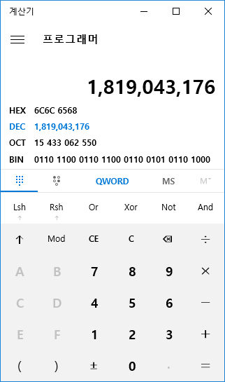

## 2.2. memcpy, strcpy, strcmp

**memcpy.asm**

메모리값을 복사하는 소스이다. c언어를 다뤄봤으면 이와비슷한 함수를 본적이 있을 것이다.

이 소스를 설명하며 **함수선언**과 몇가지 추가적인 명령어를 보도록 할 것이다.

```nasm
.686
.model flat, stdcall
option casemap :none

include c:\masm32\include\kernel32.inc
include c:\masm32\include\msvcrt.inc
includelib c:\masm32\lib\kernel32.lib
includelib c:\masm32\lib\msvcrt.lib

.data
szHelloWorld        db "hello world",0
buff            db 50 dup(0)

.code
memcpy proc, lpSrc:dword, lpDst:dword, count:dword
    push esi
    push edi
    push ecx

    mov esi, lpSrc
    mov edi, lpDst
    mov ecx, count
@@:
    mov al, byte ptr [esi]
    mov byte ptr [edi], al
    inc esi
    inc edi
    loop @B

    xor eax,eax

    pop ecx
    pop edi
    pop esi
    ret
memcpy endp

memcpy2 proc uses esi edi ecx, lpSrc:dword, lpDst:dword, count:dword
    mov esi, lpSrc
    mov edi, lpDst
    mov ecx, count
    rep movsb
    ret
memcpy2 endp

start:
    push sizeof szHelloWorld    ; count
    push offset buff        ; lpDst
    push offset szHelloWorld    ; lpSrc
    call memcpy

    push offset buff
    call crt_printf

    ; exit
    push 0
    call ExitProcess

end start
```

`szHelloWorld db "hello world",0` 일전에 설명했듯이 전역변수이고 db는 byte와 같으니 `byte배열` 이다. 문자열이 들어갔기때문에 문자열이라고 불러도 무방하겠다.

끝이 `,0`로 끝나는 것은 문자열의 끝을 표시할때 끝을 0값으로 넣는다. 문자열의 끝을 알기위함이다.

```c
char* szHelloWorld = "hello world";
```

c언어에서 이렇게 선언한 것과 동일하다. c언어에서 이렇게 문자열을 선언하면 보이지 않지만 문자열끝에 0값이 들어가있다.

`buff db 50 dup(0)` 마찬가지로 전역변수이고 `byte배열` 이다. 새로나오는 표현식 `50 dup(0)`이 보이는데 배열의 수가 50개이고 값은 0으로 채우라는 뜻이다.

```nasm
buff db 0,0,0,0,0,0,0, ..생략.. 0,0,0,0,0,0,0,0,0,0
; 이렇게 0을 50개 쓴것과 동일하다.
```

```c
char buff[50] = {0,0,0,0,0,..생략..,0,0,0,0,0};
```

이렇게 선언한 것과 동일하다.

일전에 헥스에디터로 확인했을 때 잠시 설명했지만 다시 하자면 `.data` 에 선언된 전역변수는 exe파일에도 그대로 값이 정의되어 있다. 여기서도 exe파일을 생성하면 **data섹션**에 "hello world" 문자열과 0이 50개인 값이 들어가 있을 것이다.

`memcpy proc, lpSrc:dword, lpDst:dword, count:dword` asm에서의 함수 선언이다. `memcpy` 는 함수명이다. `proc` 는 이것이 함수라는 지시어이고 `lpSrc:dword, lpDst:dword, count:dword` 는 이 함수가 받는 파라메터를 선언한 것이다.

미리 함수 끝을 보자면 `memcpy endp` 이렇게 함수명 memcpy 와 함수 끝을 알리는 지시어 `endp` 로 되어있다.

c언어와 비교해보면

```c
void memcpy (void* lpSrc, void* lpDst, int count) {
    함수내부
}
```

이렇게 되어있다. c언어에서는 `void*` 이런것과 같은 type이 중요하고 다양한 type에 맞춰서 casting을 해야 하는데 asm에서는 큰 의미가 없다. 위에서도 32bit(4byte) 데이터형인 dword로 모두 받고 있다.

```nasm
push esi
push edi
push ecx

.
.
.

pop ecx
pop edi
pop esi
```

함수내에서 `esi, edi, ecx` 를 사용하기위해서 각 값을 잃지 않기위해서 `push`하여 스택메모리에 백업해두고 함수내에서 `esi, edi, ecx` 레지스터를 자유롭게 사용하다가 함수 끝부분에서 다시 `pop`하여 복구한다. 스택구조상 push된 역순으로 pop된다.

이 부분은 좀 더 편하게 정의할 수도 있는데 다음에 정의된 함수 `memcpy2`의 선언을 보면

```nasm
memcpy2 proc uses esi edi ecx, lpSrc:dword, lpDst:dword, count:dword
```

이렇게 되어있는데 `uses esi edi ecx` 이 부분을 추가하면 각 레지스터의 push, pop 을 알아서 해준다.

다시 memcpy 함수를 이어서 보자.

```nasm
mov esi, lpSrc
mov edi, lpDst
mov ecx, count
```

각 파라메터를 레지스터에 복사한다. 이 소스에서는 메인에서 이 함수를 호출할때 결국 lpSrc 파라메터는 szHelloWorld의 주소를 넘겨주고 lpDst 파라메터는 buff의 주소를 넘겨줄 것 이다.

따라서 esi 에는 szHelloWorld 메모리주소, esi 에는 buff 메모리주소가 있다고 생각하자.

ecx 에는 count 가 들어간다. 뒤에 나오는 명령어 `loop` 에 사용된다.

`@@:` 라벨이다. 이전에 jmp 설명하면서 설명한적이 있다. 다만 이 라벨은 명칭이 좀 이상한게 `@@` 이다. 구체적인 라벨명 정하기 귀찮을때 사용한다고 생각하면 되겠다. 익명 라벨이라고 생각하면된다.

이 익명라벨로 jmp 해오려면 이름이 없기때문에 `jmp start`(start라벨로 이동) 같이 라벨명을 적을 수 없고 `jmp @B` `jmp @F` 이렇게 표현 할 수 있다.

`@B`는 현재위치에서 위쪽의 `@@`라벨로 이동한다. `@F`는 현재위치에서 아래쪽의 `@@`라벨로 이동한다.

```nasm
mov al, byte ptr [esi]  ; esi메모리 위치의 값을 al로 복사
```

`byte ptr [esi]`는 처음 나왔다. 주로 `dword ptr`만 사용해왔었다. 이것은 메모리의 위치에 한 byte 값만 읽는다는 의미이다. `dword ptr`는 4byte 값(dword)을 읽어왔다. 당연히 2byte를 읽는 `word ptr` 도 있다.

```
메모리주소 | 헥스                                            | ascii
00403000  | 68 65 6C 6C 6F 20 77 6F 72 6C 64 00 00 00 00 00 | hello world.....
```

이렇게 메모리가 있고 `esi` 가 `00403000` 라고 한다면 (실제로 아마 memcpy.exe를 디버깅해보면 esi는 전역변수 szHelloWorld 의메모리주소인 00403000 가 맞을 것이다)

`byte ptr [esi]` 는 1byte 값인 68 이 된다. `word ptr [esi]` 는 2byte 값인 68 65 가 된다. `dword ptr [esi]` 는 4byte 값인 68 65 6C 6C 가 된다.

그리고 전에 잠시 설명한 *little endian*에 따라 4byte의 68 65 6C 6C 값을 정수 `dword`로 표현하면 거꾸로 뒤집어서 6C 6C 65 68 가 된다.

실제 이 값의 10진수값을 알려면 위도우 계산기(프로그래머모드)에서 16진수로 입력해보면

[](http://note.heyo.me/wp-content/uploads/2017/02/calc.png)

1819043176 이 값이 된다.

byte 가 거꾸로 기술된다는게 헷갈릴 수 있는데 반대 예를 한번 보자.

```nasm
mov dword ptr [esi], 1 ; dword 값 1을 쓴다면

메모리주소 | 헥스                                            | ascii
00403000  | 01 00 00 00 6F 20 77 6F 72 6C 64 00 00 00 00 00 | ....o world.....

00 00 00 01 이 거꾸로 쓰여져 01 00 00 00 이렇게 된다.
```

다시 소스로 돌아가자.

`al` 이 나왔는데 일전에 설명했듯이 이것은 `eax` 레지스터의 하위 1 byte 이다. byte값을 복사하기 때문에 `eax` 대신 하위 byte인 `al` 를 사용한다.

`esi` 메모리위치 (00403000) 에서 1 byte를 읽어서 al 레지스터에 복사했다. 실행하고나면 `al` 레지스터에는 byte 값 `68 (아스키값 'h')` 이 저장되어 있을 것 이다.

```
mov byte ptr [edi], al  ; al의 값을 esi메모리로 복사
```

edi 의 메모리위치 (0040300C) 에 al 의 값 1byte 를 복사한다. (위에서 설명했듯이 edi 는 전역변수 buff 의 메모리주소 0040300C)

이것을 실행하면 이렇게 될 것이다.

```
메모리주소 | 헥스                                            | ascii
00403000  | 68 65 6C 6C 6F 20 77 6F 72 6C 64 00 00 00 00 00 | hello world.....

0040300C  | 68 00 00 00 00 00 00 00 00 00 00 00 00 00 00 00 | h...............
```

`al` 의 값 `68 (아스키값 'h')` 이 edi 메모리위치에 복사되었다.

```nasm
inc esi
inc edi
```

esi, edi 를 1씩 증가한다. `esi` 는 `00403001`, `edi` 는 `0040300D` 가 될 것이다.

`loop @B` 루프 명령어 이다. `ecx` 가 0이 될때까지 `@@라벨`로 `jmp` 한다는 의미이다.

`ecx`는 위에서 파라메터 count 값을 복사했다.

결국 파라메터 count 만큼 `@@: ~ loop @B` 구문이 반복 된다는 의미이다.

ecx 가 12 라면 12번을 반복할 것이고 esi 는 `0040300B` 까지 edi 는 `0040301D` 까지 증가 될 것이다.

```
메모리주소 | 헥스                                            | ascii
00403000  | 68 65 6C 6C 6F 20 77 6F 72 6C 64 00 00 00 00 00 | hello world.....

0040300C  | 68 65 6C 6C 6F 20 77 6F 72 6C 64 00 00 00 00 00 | hello world.....
```

최종적으로 이렇게 되고 loop 를 벗어난다.

`ret` 명령어를 끝으로 함수가 종료된다. 함수를 호출한 곳으로 돌아간다.

그 다음 함수 **memcpy2** 이다. 이 함수는 정확하게 **memcpy** 와 동일하게 동작한다.

6줄이 줄어들게 해준 지시어 `uses esi edi ecx`는 위에서 설명했다.

`rep movsb` 이 명령어는 두가지 명령어서 함께 사용되었다.

먼저 `movsb` 이 명령어는

```nasm
mov al, byte ptr [esi]
mov byte ptr [edi], al
inc esi
inc edi
```

이 명령어와 정확하게 일치한다. esi 메모리값을 1byte 읽어 edi 메모리값에 1byte 복사한다. 레지스터도 사용하지 않고 4줄짜리 명령어를 한번에 표현한다.

당연히 훨씬 효율적이다. 메모리 복사 전용 명령어라고 생각해도 무방하다.

`movsb` 의 맨끝에 `b` 는 byte를 의미하는 것으로 `movsw, movsd` 도 존재한다. 당연히 w는 word, d는 dword 이다.

```nasm
mov ax, word ptr [esi]
mov word ptr [edi], ax
add esi,2
add edi,2
; word 값 복사하고 2byte이동

mov eax, dword ptr [esi]
mov dword ptr [edi], eax
add esi,4
add edi,4
; dword 값 복사하고 4byte이동
```

마찬가지로 위의 코드를 정확하게 대체 할 수 있다. 이것을 활용해서

```nasm
mov esi, 메모리주소1
mov edi, 메모리주소2
movsd
movsb
; 5byte 복사
```

이렇게 간편하게 5byte를 복사를 할 수도 있다.

`rep` 을 보자. 이것은 반복 명령어로 ecx 횟수만큼 rep 뒤에 있는 명령어를 반복한다. 즉 `rep movsb` 는 ecx 횟수만큼 movsb를 반복하는 것 이다.

결국 memcpy2는 memcpy와 정확하게 일치하게 동작한다.

`start:` 아래 구문은 이전에 설명했었으므로 넘어가도록 하자.

**strcpy.asm**

문자열을 복사하는 프로그램이다. memcpy와 비슷하지만 문자열이기 복사할 크기를 지정하지 않고 문자열의 끝을 인식해서 복사한다.

```nasm
.686
.model flat, stdcall
option casemap :none

include c:\masm32\include\kernel32.inc
include c:\masm32\include\msvcrt.inc
includelib c:\masm32\lib\kernel32.lib
includelib c:\masm32\lib\msvcrt.lib

.data
szHelloWorld        db "hello world",0
buff            db 50 dup(0)
len         dd 0
szLength        db "copy length : %d",0
crlf            db 10,13  ; 캐리지리턴(계행) c언어에서 \r\n로 표현되는 값

.code
strcpy proc uses esi edi ecx, lpSrc:dword, lpDst:dword
    mov esi, lpSrc
    mov edi, lpDst
    xor ecx, ecx
    .while byte ptr [esi+ecx] != 0
        mov al, byte ptr [esi+ecx]
        mov byte ptr [edi+ecx], al
        ; movsb 로 대체 가능하다.
        inc ecx
    .endw

    mov eax, ecx
    ; 리턴값으로 ecx(문자열 복사한 횟수)
    ret
strcpy endp

start:
    push offset buff        ; lpDst
    push offset szHelloWorld    ; lpSrc
    call strcpy

    mov len, eax            ; return value

    push offset buff
    call crt_printf

    push offset crlf
    call crt_printf

    push len
    push offset szLength
    call crt_printf

    ; exit
    push 0
    call ExitProcess

end start
```

`.while byte ptr [esi+ecx] != 0` 이 구문만 보자. 나머지는 새로운 내용이 없다.

`while` 구문이다. `.if` 처럼 제어구문을 쉽게 사용할 수 있도록 `.while` 제공해준다. `.endw` 으로 while 구문의 끝을 나타낸다.

이런 제어문 지시어들은 cmp와 jmp(or loop)등를 이용해서 어렵게 코딩을 하지 않도록 도와준다.

```nasm
    jmp ENDW
STARTW:
    mov al, byte ptr [esi+ecx]
    mov byte ptr [edi+ecx], al
    inc ecx
ENDW:
    cmp byte ptr [esi+ecx], 0
    jne STARTW
```

.while 지시어가 없다면 이런식으로 코딩해야할 것이다. 하.. 끔찍

`byte ptr [esi+ecx]` esi+ecx 의 메모리위치의 1byte값이 0이 아니라면 while구문이 반복된다는 의미이다. while구문안에서 `inc ecx`으로 ecx가 1씩 증가하고 있다. 결국 esi 의 메모리주소를 1씩 진행해서 byte값이 0이 나올때까지 edi 의 메모리주소에 1byte씩 복사한다는 의미이다.

위에서본 memcpy 와 거의 흡사한데 차이점은 위에서는 esi를 직접 증가시켰다면 여기서는 esi는 그대로고 ecx를 0부터 1씩증가해서 esi+ecx로 표현했다는 점이다.

```nasm
mov eax, ecx
```

함수 종료전에 eax 에 ecx 값을 복사한다. 리턴값을 설정한 부분이다.

나머지는 기존 코드랑 동일하므로 넘어간다.

**strcmp.asm**

문자열에 특정 문자열을 포함하는지 체크하는 프로그램이다. 위의 두 프로그램과 거의 비슷하다. 함수를 쉽게 호출 할 수 있는 **invoke**를 설명한다.

```nasm
.686
.model flat, stdcall
option casemap :none

include c:\masm32\include\kernel32.inc
include c:\masm32\include\msvcrt.inc
includelib c:\masm32\lib\kernel32.lib
includelib c:\masm32\lib\msvcrt.lib

.data
szHelloWorld        db "hello world",0
szForamt1       db "strlen : %d",0
szFind1         db "hell",0
szFind2         db "heven",0
crlf            db 10,13

.data?
buff            db 50 dup(?)
len         dd ?

.code
strlen proc uses esi, lpStr:dword
    mov esi, lpStr
    xor eax, eax
    .while byte ptr [esi+eax] != 0
        inc eax
    .endw
    ret
strlen endp
; 문자열 길이 구하는 함수 strcpy 코드와 거의 똑같다.

strcmp proc uses esi edi ecx, lpSrc:dword, lpFind:dword
    push lpFind
    call strlen
    mov ecx, eax

    mov esi, lpSrc
    mov edi, lpFind

    repe cmpsb

    mov eax, ecx
    ret
strcmp endp

start:
    jmp @main
    szNotFound db " -> not found",0
    szFound db " -> found",0
@main:
    push offset szHelloWorld
    call crt_printf

    push offset crlf
    call crt_printf

    ; 문자열 수
    push offset szHelloWorld
    call strlen
    mov len, eax

    ; 문자열 수 출력
    push len
    push offset szForamt1
    call crt_printf

    ; szFind1 와 비교 시작

    push offset crlf
    call crt_printf

    push offset szFind1
    call crt_printf

    push offset szFind1
    push offset szHelloWorld
    call strcmp

    .if eax == 0
        push offset szFound
        call crt_printf
    .else
        push offset szNotFound
        call crt_printf
    .endif

    ; szFind2 와 비교 시작 (invoke사용)

    invoke crt_printf, offset crlf
    invoke crt_printf, offset szFind2
    invoke strcmp, offset szHelloWorld, offset szFind2

    .if eax == 0
        invoke crt_printf, offset szFound
    .else
        invoke crt_printf, offset szNotFound
    .endif

    ; exit
    invoke ExitProcess, 0

end start
```

szHelloWorld 변수 "hello world" 에 szFind1 "hell", szFind2 "heven"이 포함되는지의 여부를 확인하는 코드이다. szFind1 는 포함되고 szFind2 는 포함되지 않을 것이다.

```nasm
.data?
buff            db 50 dup(?)
len         dd ?
```

`.data?`는 `.data` 와 똑같이 **전역변수**를 선언한다. 차이점은 이곳에 선언된 전역변수는 초기값을 가지지 않는다. 모든 값은 `?` 로 정의한다. 또한 초기값이 없으므로 .data 와 달리 exe파일이 생성될때 파일내부에 값이 존재하지 않는다.

strcmp 함수내부에서 `repe cmpsb`. 새로운 명령어다. 바로 위에서 사용했던 `rep movsb` 와 비슷하다.

movsb 와 달리 자주쓰지는 않으니 꼭 기억 할 필요는 없을거 같다.

`cmpsb` 는 esi 메모리위치의 1byte 값과 edi 메모리위치의 1byte 값을 비교하고 1byte 전진한다.

```nasm
cmp byte ptr [esi], byte ptr [edi] ; flag들에 비교결과값 설정
inc esi
inc edi
; 이것과 동일하다고 볼 수 있다.
```

`repe` 도 `rep` 와 거의 동일하다. `ecx` 만큼 반복하는데 다만 flag값을 확인해서 `ecx` 가 0 일때 뿐만아니라 `zf` 가 0 일때도 반복을 중단한다.

즉 esi, edi의 메모리위치의 1byte 값이 서로 같고 ecx가 0보다 클경우에 esi, edi 메모리위치를 1씩 전진하면서 계속 비교하는 구문이다.

결국 값이 다를경우에만 ecx가 0이 되기전에 중단된다.

함수의 마지막에 eax에 ecx을 복사해서 리턴 값을 설정한다.

ecx가 0이면 주어진 횟수가 모두 반복된것이므로 모두 일치하다고 판단할 수 있고 0보다 크면 일치하지 않는다고 판단할 수 있다.

```nasm
.if eax == 0
    push offset szFound
    call crt_printf
.else
    push offset szNotFound
    call crt_printf
.endif
```

if else 구문이다. 제어문을 쉽게 작성 할 수 있도록 도와준다.

```nasm
invoke crt_printf, offset crlf
invoke crt_printf, offset szFind2
invoke strcmp, offset szHelloWorld, offset szFind2

.if eax == 0
    invoke crt_printf, offset szFound
.else
    invoke crt_printf, offset szNotFound
.endif

; exit
invoke ExitProcess, 0
```

`invoke` 는 함수를 쉽게 호출 할 수 있도록 도와주는 지시어이다. 이전에는 파라메터를 먼저 역순으로 `push` 하고 함수를 `call` 했었다.

이걸 좀더 간편하게 `invoke` 를 사용하여 다른 고급 언어에서 함수 호출하듯이 `invoke 함수명, 파라메터1, 파라메터2` 이렇게 사용할 수 있다.

`.if, .while` 등의 제어문과 마찬가지로 당연히 실제코드는 `push 파라메터2 push 파라메터1 call 함수명` 으로 들어간다.

이제 자주사용하는 명령어와 지시어는 대부분 소개한 것 같다.

다음에는 Window 프로그램 예제를 살펴보겠다.

> [목차](http://note.heyo.me/?p=238) 이전글 [어셈블리어 튜토리얼 (5) HelloWorld](http://note.heyo.me/?p=1073)
