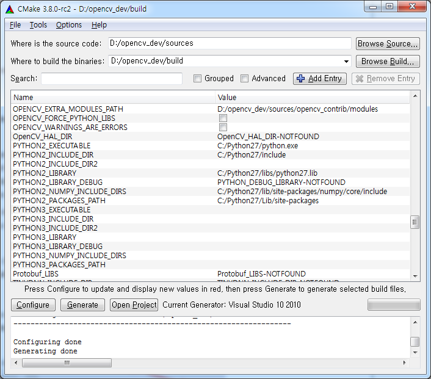
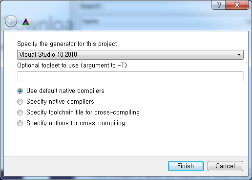

일단 기본적인 opencv-python은 pip를 이용해서 쉽게 설치할 수 있다.

```
pip install opencv-python
```

하지만 이미지 특징점을 찾는 `SIFT, FAST, Face찾기`등의 (특허가 있는) 알고리즘같은 경우는 기본 opencv에 포함되어있지 않다.

이는 별도의 모듈묶음 **opencv\_contrib**으로 따로 배포한다.

**opencv\_contrib**까지 포함하여 다시 빌드를 해야한다.

# opencv-python 빌드

1. python 2.7.x 다운로드 [https://www.python.org/](https://www.python.org/) 2.7 버전으로 진행하였다. 예전에는 2.7.x버젼만 가능하였다. 요즘은 3.x 버전도 될거같은데 확실하지는 않다.
    
2. numpy를 설치한다.
    
    ```
    pip install numpy
    ```
    
3. opencv소스를 다운받는다. [https://github.com/opencv/opencv](https://github.com/opencv/opencv)
    
4. opencv\_contrib소스를 다운받는다. [https://github.com/opencv/opencv\_contrib](https://github.com/opencv/opencv_contrib)
    
5. 빌드도구 cmake를 다운받는다. [https://cmake.org/download/](https://cmake.org/download/)
    
6. 다운받은 opencv소스를 c:\\에 압축푼다. 폴더명을 opencv\_dev로 변경한다.
    
    ```
    c:\opencv_dev\build
    c:\opencv_dev\sources
    ```
    
7. 다운받은 opencv\_contlib소스를 c:\\opencv\_dev에 압축푼다.
    
    ```
    c:\opencv_dev\opencv_contlib
    ```
    
8. cmake를 실행한다. source에 c:\\opencv\_dev\\sources build에 c:\\opencv\_dev\\build 를 입력한다.
    
    [](http://note.heyo.me/wp-content/uploads/2017/03/cmake2.png)
    
    나는 d:\\기준으로 하였다.
    
9. configure를 클릭한다. 설치된 Visual Studio 버젼을 선택한다.
    
    설치되어있지 않다면 Visual Studio를 설치한다. [https://www.visualstudio.com/ko/downloads/](https://www.visualstudio.com/ko/downloads/) 현재 기준으로 Visual Studio Community 2017 를 설치하면되겠다.
    
    [](http://note.heyo.me/wp-content/uploads/2017/03/cmake-config.png)
    
    나는 이미 설치된 vs2010 으로 진행하였다.
    
10. PYTHON2 으로 시작한 변수가 제대로 설정되어있는지 확인한다.
    
11. OPENCV\_EXTRA\_MODULES\_PATH 값을 수정한다. 없다면 \[Add Entry\]를 클릭하여 추가한다.
    
    opencv\_contlib의 경로를 입력한다.
    
    ```
    OPENCV_EXTRA_MODULES_PATH=c:\opencv_dev\opencv_contlib\modules
    ```
    
    [](http://note.heyo.me/wp-content/uploads/2017/03/cmake2.png)
    
12. GENERATE를 클릭한다.
    
13. 성공적으로 GENERATE가 되었다면 build 폴더에 OpenCV.sln가 생겼을 것이다.
    
14. OpenCV.sln 를 Visual Studio에서 연다.
    
15. Release 모드로 변경한다.
    
16. ALL\_BUILD 프로젝트를 빌드한다.
    
17. 오류를 수정한다. Visual Studio 버젼에따라 조금씩 다를 수 있을 것 같다. 아마 낮은 버젼일수록 자잘한 오류가 많은 듯하다.
    
    나같은 경우는
    
    pow, sqrt 형변환 오류가 많이 나왔다. 정수를 점을 붙여서 2.0 이런식으로 명시적으로 형을 마추거나 정확한 형으로 casting했다.
    
    그리고 한가지더 dnn 프로젝트에서
    
    > layer\_loader.cpp 명시적 특수화는 명시적으로 인스턴스화되지 않을 수도 있습니다
    
    라는 오류가 났다. 해당 줄을 주석처리해서 해결했다.
    
18. ALL\_BUILD 프로젝트 빌드가 성공하면 INSTALL 프로젝트를 빌드한다.
    
19. python에서 opencv를 사용해본다.
    
    ```
    import cv2
    ```
    
    이런 오류가 났다.
    
    > ImportError: DLL load failed: 지정된 모듈을 찾을 수 없습니다.
    
    나의경우 cv2.pyd 가 정적으로 빌드가 안되서 관련 dll을 못찾아서 발생하는 오류였다.
    
    ```
    c:\opencv_dev\build\install\x86\vc10\bin
    ```
    
    이곳 파일들을
    
    ```
    C:\Python27\Lib\site-packages\cv2
    ```
    
    이곳에 모두 복사한다.
    

기본설치 메뉴얼:[http://docs.opencv.org/3.1.0/d5/de5/tutorial\_py\_setup\_in\_windows.html](http://docs.opencv.org/3.1.0/d5/de5/tutorial_py_setup_in_windows.html)
