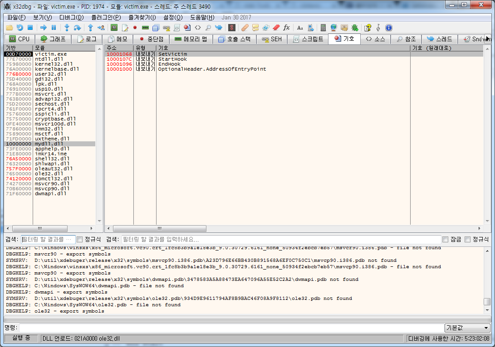

DLL인젝션을 이용하여 다른 프로세스에 침투하는 방법을 알아봤으니 이제 프로세스 조작의 일종인 **api hooking** 에 대해서 알아보자.

**api hooking**란 `윈도우 api 함수` 를 가로채서 다르게 동작하게 하는것이다. 후킹이란 뭔가를 가로채는것인데 여러가지 후킹이 있다. 다른 일반적인 후킹도 있는데 다 가로챈다는 의미로 사용된다. 키보드 후킹은 키보드 입력을 가로채는 것이고 마우스 후킹은 마우스 입력을 가로채는 것이다.

**api hooking** 이라고 용어를 정했을뿐 결국은 **다른 프로세스(프로그램)의 메모리 조작**하는 것이다.

api hooking에도 몇가지 방법이 있는데 먼저 가장 간단한 `IAT(Import address table)` 변경을 통한 방법부터 해보도록하자.

이 방법은 정말 간단한데 그냥 실행파일에 정의되어있는 PE구조체중 IAT의 값만 변경하는 방법이다.

PE구조체는 실행파일(exe)에 가장 첫부분에 있는 실행하는데에 필요한 여러가지 구조체의 집합(MZ로 시작하는 구조체포함)이다. 실행하는데에 관한 여러가지 정보를 가지고 있다.

[](http://note.heyo.me/wp-content/uploads/2017/02/hexeditor_base.png)

그 구조체 중에 **IAT** 부분도 있는데 여기에 값을 수정하는 것이다.

**IAT**는 프로그램에서 DLL의 LIB파일을 통해 사용하는 DLL 함수주소를 모아둔 테이블이다.

이전 예제 `injector.asm` 를 예로들면 `DLL인 mydll.dll 의 함수` 를 쓰기위해 LIB 을 include 했고 `SetVictim, StartHook, EndHook` 을 사용하고 있다.

injector.exe 실행파일안에 IAT를 살펴보면 mydll.dll 의 SetVictim, StartHook, EndHook 의 주소를 가지고 있다.

디버거에서는 **기호**에서 확인할 수 있다.

[](http://note.heyo.me/wp-content/uploads/2017/03/dllinject_winhook2.png)

이런 별도의 IAT를 가지는 이유는 DLL들의 주소를 확정할 수 없기때문이다.

예를들어 injector 에서 mydll.dll 의 StartHook 함수를 호출한다고 했을때 asm소스에서는

```x86asm
StartHook proto
; 함수만 정의하고 
call StartHook 
; 함수를 call
```

이렇게 사용하면되지만 이것이 기계어로 번역이 되기위해선 주소가 필요하다. `mydll.dll.StartHook`주소가 `00700100` 이라고 한다면

```x86asm
call 00700100
```

기계어로는 E8 00 01 70 00 이다.

이런식으로 기계어로 변환이 되어야하는데 문제는 **DLL의 주소는 정해져있지않고** 로드될 때 빈메모리에 할당된다는것이다. `00700100` 이 될수도 있고 `00E00100` 가 될수도 있다는 말이다.

그래서 IAT를 쓰는것이다. 아래와 같다고 보면 된다.

```x86asm
.data?
_iat_StartHook dword

.code
call dword ptr [_iat_StartHook]
; _iat_StartHook의 메모리주소가 04001100 이라면 이것은 아래와같다.
; call dword ptr [04001100]
```

기계어로는 FF 15 00 11 00 04 이렇게 된다. 실제 StartHook의 메모리주소를 몰라도 일단 기계어로 작성을 할 수가 있다.

이런식으로 일종의 전역변수에 메모리주소로 호출하는식이다. 실행될때 DLL의 메모리주소가 결정되면 `_iat_StartHook` 변수에 **mydll.dll 의 StartHook 주소**를 넣어주는것이다.

결국은 메모리 어딘가에 있는 전역변수에 있는 \_iat\_StartHook의 값을 수정하게 되면 해당 함수대신 다른 함수가 대신 호출되도록 조작할수 있다.

\_iat\_StartHook의 값은 IAT에 정의되어있다. 값을 수정하는거니 소스도 간단하다.

## 3.3. api hooking(IAT)

**IAT**의 메모리값을 수정해서 **api hooking**을 시도하는 예제이다.

PE 포맷을 훑어서 IAT의 값을 바꾸는 함수만 추가되었을뿐 앞서본 DLL 인젝션 예제와 크게 다르지 않다.

여기서는 메세지박스 API `MessageBoxA, MessageBoxW` 함수를 후킹해서 메세지박스에서 **예, 아니오, 취소** 어떤걸 클릭해도 **취소**를 클릭한 것처럼 수정해 보도록하겠다.

```x86asm
.686
.model flat, stdcall
option casemap:none

include c:\masm32\include\windows.inc
include c:\masm32\macros\macros.asm
include c:\masm32\include\user32.inc
include c:\masm32\include\kernel32.inc

includelib c:\masm32\lib\user32.lib
includelib c:\masm32\lib\kernel32.lib

GetMsgProc proto, nCode:dword, wParam:dword, lParam:dword

GetFunctionTable proto, hModule:dword, lpszDll:dword, lpszProc:dword
PatchAddress proto, lpOrgProc:dword, lpNewProc:dword
MyMessageBoxA proto, arg1:dword, arg2:dword, arg3:dword, arg4:dword
MyMessageBoxW proto, arg1:dword, arg2:dword, arg3:dword, arg4:dword

.data
lpApiMessageBoxA    dword 0
lpIATMessageBoxA    dword 0

lpApiMessageBoxW    dword 0
lpIATMessageBoxW    dword 0

szUSER32        db "USER32.DLL",0
szMessageBoxA       db "MessageBoxA",0
szMessageBoxW       db "MessageBoxW",0

.data?
szVictim            byte 50 dup(?)
hCBTHook            dword ?
hGlobalModule       dword ?

szMsg               byte 50 dup(?)
hVictim             dword ?

.code
DllEntry proc hInstance:HINSTANCE, reason:DWORD, reserved1:DWORD
    .if reason==DLL_PROCESS_ATTACH
        push hInstance
        pop hGlobalModule

        invoke GetModuleHandle, addr szVictim
        .if eax!=0
            mov hVictim, eax
            invoke GetFunctionTable, hVictim, addr szUSER32, addr szMessageBoxA
            mov lpIATMessageBoxA, eax

            .if eax!=0
                invoke PatchAddress, lpIATMessageBoxA, addr MyMessageBoxA
                mov lpApiMessageBoxA, eax
            .endif

            invoke GetFunctionTable, hVictim, addr szUSER32, addr szMessageBoxW
            mov lpIATMessageBoxW, eax

            .if eax!=0
                invoke PatchAddress, lpIATMessageBoxW, addr MyMessageBoxW
                mov lpApiMessageBoxW, eax
            .endif

        .endif
    .elseif reason==DLL_PROCESS_DETACH
        invoke GetModuleHandle, addr szVictim
        .if eax!=0
            invoke PatchAddress, lpIATMessageBoxA, lpApiMessageBoxA
        .endif
    .endif
    mov eax, TRUE
    ret
DllEntry Endp

GetFunctionTable proc uses ebx esi edi, hModule:dword, lpszDll:dword, lpszProc:dword
    local dwCount:dword
    mov dwCount, 0

    ; IMAGE_DOS_HEADER에서 e_lfanew를 더하면
    ; NT Header로 이동 IMAGE_NT_HEADER (IMAGE_FILE_HEADER)
    ; http://www.nirsoft.net/kernel_struct/vista/IMAGE_DOS_HEADER.html
    mov eax, hModule
    mov ebx, eax
    add ebx, dword ptr [eax+3Ch]

    ; Optional Header로 이동
    ; https://msdn.microsoft.com/en-us/library/windows/desktop/ms680336(v=vs.85).aspx
    add ebx, 4              ; PE\0\0
    add ebx, sizeof IMAGE_FILE_HEADER

    ; Import Data Directory 시작으로 이동
    ; https://msdn.microsoft.com/en-us/library/windows/desktop/ms680339(v=vs.85).aspx
    ; NumberOfRvaAndSizes까지 60h
    ; 두번째 배열 8h
    add ebx, 68h

    ; IMAGE_IMPORT_DESCRIPTOR 으로 이동
    mov ebx, (IMAGE_DATA_DIRECTORY ptr [ebx]).VirtualAddress    
    add ebx, hVictim

    assume ebx:ptr IMAGE_IMPORT_DESCRIPTOR 

    .while [ebx].OriginalFirstThunk!=0 && [ebx].FirstThunk!=0
        mov esi, hVictim
        add esi, [ebx].Name1

        invoke lstrcmpi, esi, lpszDll
        .if eax==0
            mov edi, hVictim
            add edi, [ebx].OriginalFirstThunk

            .while dword ptr [edi]!=0
                mov eax, hVictim
                add eax, dword ptr [edi]
                assume eax:ptr IMAGE_IMPORT_BY_NAME

                invoke lstrcmpi, addr [eax].Name1, lpszProc
                .if eax==0
                    mov eax, hVictim
                    add eax, [ebx].FirstThunk
                    add eax, dwCount

                    jmp GET_FUNCTION_TABLE_EXIT
                .endif

                add edi, 4
                add dwCount, 4
            .endw
        .endif

        add ebx, sizeof IMAGE_IMPORT_DESCRIPTOR
    .endw

    xor eax, eax

GET_FUNCTION_TABLE_EXIT:
    ret
GetFunctionTable endp

PatchAddress proc uses esi edi, lpOrgProc:dword, lpNewProc:dword
    local dwOrgProtect:dword
    local mbi:MEMORY_BASIC_INFORMATION

    invoke VirtualQuery, lpOrgProc, addr mbi, sizeof mbi
    mov esi, mbi.Protect
    and esi, not PAGE_READONLY
    and esi, not PAGE_EXECUTE_READ
    or esi, PAGE_READWRITE

    invoke VirtualProtect, lpOrgProc, 4, esi, addr dwOrgProtect

    mov eax, lpOrgProc
    mov eax, dword ptr [eax]
    push eax

    ; address 교체
    lea esi, lpNewProc
    mov edi, lpOrgProc
    movsd
    ;mov eax, lpNewProc
    ;mov edi, lpOrgProc
    ;mov dword ptr[edi], eax

    invoke VirtualProtect, lpOrgProc, 4, dwOrgProtect, 0
    pop eax

    ret
PatchAddress endp

GetMsgProc proc, nCode:dword, wParam:dword, lParam:dword
    invoke CallNextHookEx, hCBTHook, nCode, wParam, lParam
    ret
GetMsgProc endp

; export functions
SetVictim proc, lpszVictim:dword
    invoke lstrcpy, addr szVictim, lpszVictim
    ret
SetVictim endp

StartHook proc
    invoke SetWindowsHookEx, WH_CBT, addr GetMsgProc, hGlobalModule, NULL
    mov hCBTHook, eax
    ret
StartHook endp

EndHook proc
    .if hCBTHook!=0
        invoke UnhookWindowsHookEx, hCBTHook
    .endif
    ret
EndHook endp

; hook functions
MyMessageBoxA proc, arg1:dword, arg2:dword, arg3:dword, arg4:dword
    push arg4
    push arg3
    push arg2
    push arg1
    call lpApiMessageBoxA
    mov eax, IDCANCEL

    ret
MyMessageBoxA endp

MyMessageBoxW proc, arg1:dword, arg2:dword, arg3:dword, arg4:dword
    push arg4
    push arg3
    push arg2
    push arg1
    call lpApiMessageBoxW
    mov eax, IDCANCEL

    ret
MyMessageBoxW endp


end DllEntry
```

DLL 인젝션에서 추가된 부분만 설명하도록하겠다.

```x86asm
GetFunctionTable proto, hModule:dword, lpszDll:dword, lpszProc:dword
```

lpszDll **DLL파일명**, lpszProc **함수명** 인자를 넘기면 **IAT**를 훑어서 해당 api 함수에 해당되는 IAT 주소를 반환하는 함수이다.

**반환된 IAT 주소**란 앞서 설명한 `_iat_StartHook`의 메모리주소가 여기에 해당되겠다.

```x86asm
PatchAddress proto, lpOrgProc:dword, lpNewProc:dword
```

메모리주소 lpOrgProc에 lpNewProc의 값을 복사하는 함수이다. 반환값은 메모리주소 lpOrgProc 안에 있던 원래 값이다. 즉, 실제 api 함수주소를 반환한다.

```x86asm
mov eax, lpNewProc
mov ecx, lpOrgProc
mov dowrd ptr[ecx], eax
```

이렇게 값을 복사하는 것이다. 그런데 IAT메모리쪽은 수정할수 없도록 속성이 설정되어있기때문에 수정할수 있도록 해당 메모리 보호모드를 수정하고 값을 복사한후에 다시 원래 속성으로 되돌리는 작업이 앞뒤에 붙어있다.

```x86asm
MyMessageBoxA proto, arg1:dword, arg2:dword, arg3:dword, arg4:dword
MyMessageBoxW proto, arg1:dword, arg2:dword, arg3:dword, arg4:dword
```

원래의 MessageBoxA, MessageBoxW 를 대체하는 함수이다.

api hooking이 이루어지면 이제 MessageBoxA, MessageBoxW 가 호출될때마다 원래 함수가 아닌 여기서 정의한 **MyMessageBoxA, MyMessageBoxW** 가 호출 될 것이다.

```x86asm
lpApiMessageBoxA    dword 0
lpIATMessageBoxA    dword 0
```

`lpApiMessageBoxA` 원래의 MessageBoxA 주소이다. PatchAddress 에서 반환한 값을 여기에 저장해둔다. MyMessageBoxA 에서 원래함수를 호출해서 메세지박스를 띄워줄때 이용한다.

`lpIATMessageBoxA` IAT에서 찾은 MessageBoxA 의 IAT 주소이다. GetFunctionTable 를 통해 찾은 값을 이곳에 저장해둔다.

```x86asm
invoke GetModuleHandle, addr szVictim
.if eax!=0
    mov hVictim, eax
```

DLL 인젝션에서 설명했던 부분이다. DLL이 현재 로드된 실행파일명이 szVictim이 맞을 경우에만 if문이 실행된다. szVictim의 프로세스의 주소값을 hVictim에 저장한다.

```x86asm
invoke GetFunctionTable, hVictim, addr szUSER32, addr szMessageBoxA
mov lpIATMessageBoxA, eax
```

GetFunctionTable함수를 이용하여 user32.dll 의 MessageBoxA 의 IAT 주소를 얻어온다. lpIATMessageBoxA 변수에 저장한다.

```x86asm
.if eax!=0
    invoke PatchAddress, lpIATMessageBoxA, addr MyMessageBoxA
    mov lpApiMessageBoxA, eax
.endif
```

반환된값이 있을경우 PatchAddress함수를 이용하여 lpIATMessageBoxA 메모리주소에 MyMessageBoxA 주소값을 복사한다.

api hooking은 이렇게 간단하게 이루어진다.

GetFunctionTable함수와 PatchAddress함수만 살펴보면되겠다.

먼저 GetFunctionTable함수를 보겠다. PE포맷을 훑어서 IAT를 찾는 함수라고 설명했었다.

```x86asm
; IMAGE_DOS_HEADER에서 e_lfanew를 더하면
; NT Header로 이동 IMAGE_NT_HEADER (IMAGE_FILE_HEADER)
mov eax, hModule
mov ebx, eax
add ebx, dword ptr [eax+3Ch]
```

`mov eax, hModule` szVictim 프로세스의 시작주소에서 시작한다. 메모리에서의 PE포맷 시작위치이다. (MZ로 시작되는)

윈도우에서 PE포맷은 구조체 `IMAGE_DOS_HEADER` 로 시작된다. 이 구조체는 이곳에서 확인 가능하다. [http://www.nirsoft.net/kernel\_struct/vista/IMAGE\_DOS\_HEADER.html](http://www.nirsoft.net/kernel_struct/vista/IMAGE_DOS_HEADER.html)

중요한 정보는 아니니 대충봐도 된다. MSDN에도 있었던거 같은데.. 지금은 찾을 수 없는거같다;; 다른건 볼필요 없고 처음나오는 `WORD e_magic`이 "MZ"이다. 그리고 가장 마지막에 `DWORD e_lfanew` 이 있는데 이것이 IMAGE\_NT\_HEADER 구조체의 시작주소이다.

앞으로나오는 모든 주소값은 시작주소 hModule를 더해서 구한다.

e\_lfanew의 위치가 3Ch 이기때문에 3Ch를 더한값을 구한다.

```x86asm
asume eax:ptr IMAGE_DOS_HEADER
add ebx, [eax].e_lfanew
```

이런식으로 표현해도 상관없겠다. 구조체를 설명하면서 설명한적이 있다.

IMAGE\_NT\_HEADER 구조체는 이곳에서 확인가능하다. [https://msdn.microsoft.com/en-us/library/windows/desktop/ms680336(v=vs.85).aspx](https://msdn.microsoft.com/en-us/library/windows/desktop/ms680336(v=vs.85).aspx)

```x86asm
; Optional Header로 이동
add ebx, 4              ; PE\0\0
add ebx, sizeof IMAGE_FILE_HEADER
```

IMAGE\_OPTIONAL\_HEADER 로 이동하기위해 DWORD Signature 4byte를 더하고 IMAGE\_FILE\_HEADER크기만큼 더한다.

```x86asm
; Import Data Directory 시작으로 이동
; https://msdn.microsoft.com/en-us/library/windows/desktop/ms680339(v=vs.85).aspx
add ebx, 68h
```

IMAGE\_DATA\_DIRECTORY 으로 이동하기위해 68h을 더한다. DWORD NumberOfRvaAndSizes 까지의 크기가 60h이다. 정해져있지만 구한다고 생각하면

```x86asm
asume ebx:ptr IMAGE_OPTIONAL_HEADER 
lea eax, [ebx].DataDirectory
sub eax, ebx
; eax는 60h
```

살짝 복잡하게 구할수 있다.

IMAGE\_DATA\_DIRECTORY는 IAT뿐만아니라 EAT(Export address table)도 포함하고 있는 배열이다. IMAGE\_DATA\_DIRECTORY의 첫번째 배열이 EAT이다. IAT는 두번째 배열이다. 따라서 첫번째 EAT의 크기인 8byte 까지 더해서 68h를 더하면 IAT의 위치이다.

IMAGE\_DATA\_DIRECTORY에는 실제값이 있는게 아니라 주소값이 있다. [https://msdn.microsoft.com/en-us/library/windows/desktop/ms680305(v=vs.85).aspx](https://msdn.microsoft.com/en-us/library/windows/desktop/ms680305(v=vs.85).aspx)

```x86asm
; IMAGE_IMPORT_DESCRIPTOR 으로 이동
mov ebx, (IMAGE_DATA_DIRECTORY ptr [ebx]).VirtualAddress    
add ebx, hVictim
```

VirtualAddress으로 프로세스의 시작주소 hVictim에서의 상대주소이다.

IAT의 실제정보가 있는 IMAGE\_IMPORT\_DESCRIPTOR 를 구하기위해 hVictim + VirtualAddress 를 구한다.

asume을 축약해서 쓴표현이다.

```x86asm
asume ebx:ptr IMAGE_DATA_DIRECTORY
mov ebx, [ebx].VirtualAddress
add ebx, hVictim
```

이렇게 풀어쓸수도 있겠다. 이제 IMAGE\_IMPORT\_DESCRIPTOR 까지 왔다.

이제 가장 복잡한 이중 loop구문이다.

```x86asm
assume ebx:ptr IMAGE_IMPORT_DESCRIPTOR 

.while [ebx].OriginalFirstThunk!=0 && [ebx].FirstThunk!=0
    mov esi, hVictim
    add esi, [ebx].Name1

    invoke lstrcmpi, esi, lpszDll
    .if eax==0
        mov edi, hVictim
        add edi, [ebx].OriginalFirstThunk

        .while dword ptr [edi]!=0
            mov eax, hVictim
            add eax, dword ptr [edi]
            assume eax:ptr IMAGE_IMPORT_BY_NAME

            invoke lstrcmpi, addr [eax].Name1, lpszProc
            .if eax==0
                mov eax, hVictim
                add eax, [ebx].FirstThunk
                add eax, dwCount

                jmp GET_FUNCTION_TABLE_EXIT
            .endif

            add edi, 4
            add dwCount, 4
        .endw
    .endif

    add ebx, sizeof IMAGE_IMPORT_DESCRIPTOR
.endw
```

그냥 구조체 구조 자체가 더럽다보니;; 복잡해 보이긴 하는데 구조체를 그림으로 그려보면 그나마 눈에 들어와서 조금은 쉽게보인다.

IMAGE\_IMPORT\_DESCRIPTOR 는 하나만 있지않고 아래와같이 연속해서 이어붙어있는 배열이다.

```
[IMAGE_IMPORT_DESCRIPTOR]
[IMAGE_IMPORT_DESCRIPTOR]
[IMAGE_IMPORT_DESCRIPTOR]
.
.
```

각각의 IMAGE\_IMPORT\_DESCRIPTOR 에는 import된 dll들이 들어있다.

dll의 확인은 IMAGE\_IMPORT\_DESCRIPTOR 구조체의 Name1으로 한다.

그러므로 첫번째 loop는 IMAGE\_IMPORT\_DESCRIPTOR배열을 순회하면서 원하는 dll명과 일치하는 IMAGE\_IMPORT\_DESCRIPTOR를 찾는다.

일치하는 IMAGE\_IMPORT\_DESCRIPTOR를 찾았으면 그 다음은 함수명을 찾아야한다.

IMAGE\_IMPORT\_DESCRIPTOR 구조체의 OriginalFirstThunk, FirstThunk가 있다.

이곳에 import한 함수들의 정보를 가지고있는데 구조가 괴랄맞다.

OriginalFirstThunk에는

```
[함수명를가르키는주소]
[함수명를가르키는주소]
[함수명를가르키는주소]
.
.
```

이렇게 4byte배열이 있고

OriginalFirstThunk에는

```
[함수주소]
[함수주소]
[함수주소]
.
.
```

이렇게 4byte배열이 있다.

이런식으로 각각 함수명과 함수주소의 배열을 따로 가지고있다.

실은둘다 IMAGE\_THUNK\_DATA 구조체이긴하나 dword 값 하나를 가진 구조체라 그냥 dword값이라고 생각해도 무방하다.

```c
typedef struct _IMAGE_THUNK_DATA32 {
    union {
        DWORD ForwarderString;
        DWORD Function;
        DWORD Ordinal;
        DWORD AddressOfData; //PIMAGE_IMPORT_BY_NAME
    } u1;
} IMAGE_THUNK_DATA32;
```

OriginalFirstThunk에서 원하는 함수명과 일치하는 위치를 찾은후에 FirstThunk에서 해당위치의 함수주소를 찾는다.

\[함수명를가르키는주소\]는 실제로는 IMAGE\_IMPORT\_BY\_NAME 구조체를 가르킨다.

```c
typedef struct _IMAGE_IMPORT_BY_NAME {
    WORD    Hint;
    BYTE    Name[1];
} IMAGE_IMPORT_BY_NAME, *PIMAGE_IMPORT_BY_NAME;
```

조금 복잡하긴한데 그냥 구조체가 복잡하게 얽혀있구나.. 정도로만 이해해도 상관없을거 같다. 좀더 자세히 살펴보려면 이곳을 보면 도움이 될 것같다. IAT를 훑는 예제이다. [https://win32assembly.programminghorizon.com/pe-tut6.html](https://win32assembly.programminghorizon.com/pe-tut6.html)

이제 PatchAddress 함수를 살펴보자.

```avrasm
invoke VirtualQuery, lpOrgProc, addr mbi, sizeof mbi
```

파라메터 lpOrgProc 안의 값은 위에서 GetFunctionTable 함수로 힘겹게 구해온 IAT주소이다. 이곳에 값을 쓰기위해서 일단 메모리정보를 읽어온다. MEMORY\_BASIC\_INFORMATION 구조체로 정보를 받아온다.

이중에 mbi.Protect 를 수정하여 쓰기권한을 부여한다.

```x86asm
mov esi, mbi.Protect
and esi, not PAGE_READONLY
and esi, not PAGE_EXECUTE_READ
or esi, PAGE_READWRITE
```

예전에 and, or 설명하면서 복수의 옵션을 설정하는 방법을 설명했다. 간단히 설명하면 `and not`는 빼는거고 `or`는 더하는거다. 읽기만 가능한 옵션인 PAGE\_READONLY, PAGE\_EXECUTE\_READ 는 빼고 읽고쓸수 있는 PAGE\_READWRITE 를 설정한다.

```x86asm
invoke VirtualProtect, lpOrgProc, 4, esi, addr dwOrgProtect
```

VirtualProtect 함수는 Protect 를 설정하는 api 이다. 앞서 조정해준 Protect를 파라메터로 넘긴다. 기존에 설정되어있던 원래의 Protect값을 `dwOrgProtect` 에 저장한다. 메모리를 수정한후에 원래대로 돌려놓기위해서다.

```x86asm
mov eax, lpOrgProc
mov eax, dword ptr [eax]
push eax
```

IAT에 있던 원래 주소를 백업해둔다. 스택에 넣어뒀다가 함수끝에서 다시 pop하여 eax에 설정해서 해당 주소값을 반환할 것이다.

```x86asm
; address 교체
lea esi, lpNewProc
mov edi, lpOrgProc
movsd
; 같은 의미
;mov eax, lpNewProc
;mov edi, lpOrgProc
;mov dword ptr[edi], eax
```

IAT의 주소 lpOrgProc 에 새로운주소 lpNewProc 값을 복사한다. `esi, edi, movsd` 를 사용하여 복사한다. `mov` 만을 이용해서 복사해도 된다.

```x86asm
invoke VirtualProtect, lpOrgProc, 4, dwOrgProtect, 0
```

저장해두었던 원래의 Protect `dwOrgProtect`로 돌려놓는다.

```x86asm
; hook functions
MyMessageBoxA proc, arg1:dword, arg2:dword, arg3:dword, arg4:dword
    push arg4
    push arg3
    push arg2
    push arg1
    call lpApiMessageBoxA
    mov eax, IDCANCEL

    ret
MyMessageBoxA endp
```

MessageBoxA 함수대신 호출될함수이다. 파라메터수를 마춰준다.

저장해두었던 원래의 MessageBoxA 함수주소 lpApiMessageBoxA를 호출한다. 메세지박스가 나타날것이다. 항상 IDCANCEL를 반환하기위해 반환값인 eax에 IDCANCEL 복사한다.

**injector.asm**

앞서 사용했던 injector 그대로이다. mydll.lib만 apihook.lib으로 변경되었다.

```x86asm
.686
.model flat, stdcall
option casemap:none

include c:\masm32\include\windows.inc
include c:\masm32\include\msvcrt.inc
include c:\masm32\macros\macros.asm
include c:\masm32\include\kernel32.inc
include c:\masm32\include\user32.inc

SetVictim proto, lpszVictim:dword
StartHook proto
EndHook proto

includelib c:\masm32\lib\kernel32.lib
includelib c:\masm32\lib\user32.lib
includelib c:\masm32\lib\msvcrt.lib
includelib apihook.lib

LoadDll proto
UnloadDll proto

.data
szVictim        byte "victim.exe",0

szStart         db "start injecting dll.",13,10,0
szEnd           db "end injecting dll.",13,10,0

.data?
hMyDll          dword ?

.code
start:
call Main
invoke ExitProcess, 0

LoadDll proc
    invoke SetVictim, addr szVictim
    invoke StartHook

    ret
LoadDll endp

UnloadDll proc
    invoke EndHook

    ret
UnloadDll endp

Main proc
    invoke LoadDll

    invoke crt_printf, addr szStart

    ; x 를 누를때까지 대기
    .repeat
        invoke crt_getchar
    .until al=='x'

    invoke crt_printf, addr szEnd

    invoke UnloadDll
    ret
Main endp

end start
```

DLL 인젝션 예제와 똑같이 실행해보면 된다.

다만 이번에는 victim을 윈도우창을 클릭했을때 나타나는 메세지박스를 선택했을때

언제나 "cancel"이 나타난다.

[](http://note.heyo.me/wp-content/uploads/2017/03/victim.png)

다음에는 Trampoline 기법을 이용한 api hooking을 알아보도록 하겠다.

> [목차](http://note.heyo.me/?p=238) 이전글 [어셈블리어 튜토리얼 (9) DLL Injection (WinHook)](http://note.heyo.me/?p=1232)
