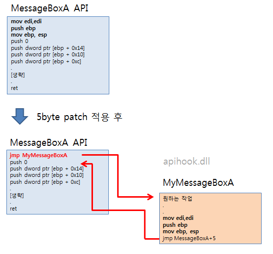

이번엔 **Trampoline** 기법을 이용한 api hooking을 살펴보도록 하겠다.

뜻은 어릴때 뛰어놀던 "방방이" 인거 같은데 왜이런 명칭인지는 모르겠다. ㄲㄲ

5byte patch 라고도 한다. 32비트 프로그램에서 함수의 시작부분은 거의 항상

```nasm
mov edi, edi
push ebp
mov ebp, esp
```

이렇게 시작하는데 이 부분이 기계어로 정확히 5byte이다.

```nasm
jmp 메모리주소
```

이 jmp 명령어도 5byte인데 이를 이용해서 함수 시작부분을 jmp 명령어로 덮어쓴다.

[](http://note.heyo.me/wp-content/uploads/2017/03/5byte_patch.png)

이런식으로 자연스럽게(?) 우회해서 원하는 작업을 추가할수 있다.

64비트 프로그램에서는 함수대부분이 mov edi, edi / push ebp / mov ebp, esp 로 시작하지 않고 또한 jmp 구문도 5byte가 아닌 12byte인데다가 레지스터도 신경써야한다. 좀 더 복잡해지지만 기본적인 원리는 같다. 이 부분은 추후 64비트쪽에서 따로 다뤄보도록하겠다.

IAT를 수정하는 방법에 비교해 이 방법은 장점이 몇가지 더 있다. 일단 IAT방식은 직접 import하는 함수들만 수정할 수 있다.

예를들어 **인터넷익스플로러**(iexplore.exe)에서 **post값을 중간에서 가로채기위해서** `wininet.dll`의 `HttpSendRequest` 를 후킹한다고 생각해보자 (실제로 다음다음 예제로 다룰것이다.)

HttpSendRequest 의 정보는 [여기서](<https://msdn.microsoft.com/ko-kr/library/windows/desktop/aa384247(v=vs.85).aspx>) 확인할수있다. post로 값을 전송할때 사용한다.

IAT수정을 사용한다고 했을 때에는 `iexplore.exe` 에서 wininet.dll의 HttpSendRequest api를 직접 사용하지 않으므로 import하여 사용하는 모듈이 어느곳인지 찾아야한다. 찾아보면 urlmon.dll에서 사용한다. 이런식으로 정확하게 어느모듈에서 import하는지 찾아야하는 번거로움이 있다.

심지어 이경우 urlmon.dll에서 사용은하지만 import해서 사용하지 않는다. 즉, IAT에도 없다. 이말은 곧 동적으로 `GetProcAddress` 로 구해서 사용하면 IAT에 없으므로 적용할 수 없다는 말이기도 하다.

또 다른 문제는 iexplore.exe 에서 MessageBox를 import하여 사용하기도하지만 iexplore.exe 에서 사용하는 다른 모듈에서도 MessageBox 를 import해서 사용할수 있다.

이런경우 전체 적용을 하기 위해서는 각각의 모든모듈의 IAT를 수정해야한다.

그밖에서도 IAT 수정은 쉽게 검출이 가능하다는 단점도 있다. PE format이 조작되었는지는 간단하게 체크할수있다.

IAT수정과 달리 Trampoline 이라는 방법은 API 함수자체를 수정하는 방법이다. 이전의 IAT 예제로 설명하자면 MessageBox를 api hooking한다고 했을때 **IAT수정**의 경우는 victim.exe의 IAT를 수정하는 하는 반면 **Trampoline**은 user32.dll 의 MessageBox API함수자체를 수정하게된다.

그러므로 MessageBox API가 어디서 어떻게 불리든(정적으로든 동적으로든) api hooking이 항상 작동하게 된다.

## 3.4. api hooking(Trampoline)

이전 IAT예제와 동작하는 기능은 같다. MessageBox를 Trampoline기법으로 api hooking하여 메세지박스를 호출했을 때 어떤 버튼을 눌러도 항상 cancel로 동작하게 한다.

```nasm
.686
.model flat, stdcall
option casemap:none

include c:\masm32\include\windows.inc
include c:\masm32\include\user32.inc
include c:\masm32\include\kernel32.inc
include c:\masm32\include\winmm.inc

includelib c:\masm32\lib\user32.lib
includelib c:\masm32\lib\kernel32.lib
includelib c:\masm32\lib\winmm.lib

LoadApiHook proto, lpszDll:dword, lpszProc:dword, lpTossProc:dword, lpTossJMP:dword
GetMsgProc proto, nCode:dword, wParam:dword, lParam:dword

MyMessageBoxW proto

.data
szUSER32        db 'USER32.DLL',0
szMessageBoxW       db 'MessageBoxW',0

.data?
szVictim            byte 50 dup(?)
hCBTHook            dword ?
hGlobalModule       dword ?

.code
DllEntry proc hInstance:HINSTANCE, reason:DWORD, reserved1:DWORD
    .if reason==DLL_PROCESS_ATTACH
        .if hGlobalModule==0
            push hInstance
            pop hGlobalModule
        .endif
        invoke GetModuleHandle, addr szVictim
        .if eax!=0
            invoke MessageBox, 0, addr szVictim, addr szVictim, 0

            mov eax, offset MyMessageBoxWJMP
            invoke LoadApiHook, addr szUSER32, addr szMessageBoxW, addr MyMessageBoxW, eax
        .endif
    .elseif reason==DLL_PROCESS_DETACH
        invoke GetModuleHandle, addr szVictim
    .endif
    mov eax, TRUE
    ret
DllEntry Endp

GetMsgProc proc, nCode:dword, wParam:dword, lParam:dword
    invoke CallNextHookEx, hCBTHook, nCode, wParam, lParam
    ret
GetMsgProc endp

ProtectMemCopy proc uses ecx, lpSrc:dword, lpDst:dword, count:dword, isExecute:dword
    local dwOrgProtect:dword
    local mbi:MEMORY_BASIC_INFORMATION

    invoke VirtualQuery, lpDst, addr mbi, sizeof mbi
    mov ecx, mbi.Protect
    and ecx, not PAGE_READONLY
    and ecx, not PAGE_EXECUTE_READ
    .if isExecute==0
        or ecx, PAGE_READWRITE
    .else
        or ecx, PAGE_EXECUTE_READWRITE
    .endif

    invoke VirtualProtect, lpDst, count, ecx, addr dwOrgProtect

    mov ecx, count
    mov esi, lpSrc
    mov edi, lpDst
    rep movsb

    invoke VirtualProtect, lpDst, count, dwOrgProtect, addr dwOrgProtect
    xor eax, eax

    ret
ProtectMemCopy endp

LoadApiHook proc uses esi edi ebx, lpszDll:dword, lpszProc:dword, lpTossProc:dword, lpTossJMP:dword
    local hModule:dword
    local lpOrgProc:dword

    local StubOrg[5]:byte
    local StubHook[5]:byte
    local OrgJmpStub[5]:byte

    invoke GetModuleHandle, lpszDll
    mov hModule, eax
    .if eax==0
        jmp LOAD_HOOK_EXIT
    .endif

    invoke GetProcAddress, hModule, lpszProc
    mov lpOrgProc, eax
    .if eax==0
        jmp LOAD_HOOK_EXIT
    .endif

    ; 원본 stub 백업
    invoke ProtectMemCopy, lpOrgProc, addr StubOrg, 5, 0

    ; Hook 함수로 점프하는 stub
    mov eax, lpTossProc
    sub eax, lpOrgProc
    sub eax, 5
    lea esi, StubHook
    mov byte ptr [esi], 0E9h ; E9 00 00 00 00
    mov dword ptr [esi + 1], eax

    ; hook stub으로 교체
    invoke ProtectMemCopy, addr StubHook, lpOrgProc, 5, 1

    ; 원본 stub 깔기
    invoke ProtectMemCopy, addr StubOrg, lpTossJMP, 5, 1

    ; 원본 함수로 점프하는 stub
    mov eax, lpOrgProc
    sub eax, lpTossJMP
    sub eax, 5
    lea esi, OrgJmpStub
    mov byte ptr [esi], 0E9h ; E9 00 00 00 00
    mov dword ptr [esi + 1], eax

    mov esi, lpTossJMP
    add esi, 5
    invoke ProtectMemCopy, addr OrgJmpStub, esi, 5, 1

LOAD_HOOK_EXIT:
    ret
LoadApiHook endp

; hook functions
MyMessageBoxW proc
    mov eax, esp
    push [eax+16]
    push [eax+12]
    push [eax+8]
    push [eax+4]
    call MyMessageBoxWJMP
    mov eax, IDCANCEL
    ret 16
MyMessageBoxW endp
MyMessageBoxWJMP:
    db 5 dup(90h) ;mov edi,edi / push ebp / mov ebp, esp
    db 5 dup(90h) ;jmp 0FFFFFFFFh (MessageBoxW address + 5)

; export functions
SetVictim proc, lpszVictim:dword
    invoke lstrcpy, addr szVictim, lpszVictim

    ret
SetVictim endp

StartHook proc
    invoke SetWindowsHookEx, WH_CBT, addr GetMsgProc, hGlobalModule, NULL
    mov hCBTHook, eax
    ret
StartHook endp

EndHook proc
    .if hCBTHook!=0
        invoke UnhookWindowsHookEx, hCBTHook
    .endif
    ret
EndHook endp


end DllEntry
```

앞의 예제와 거의 비슷하다. **LoadApiHook 함수설명**과 **MyMessageBoxW 함수**가 어떻게 달라졌는지만 중점적으로 설명하도록 하겠다.

```nasm
ProtectMemCopy proto, lpSrc:dword, lpDst:dword, count:dword, isExecute:dword
```

메모리복사 함수이다. 예전에 memcpy 예제처럼 메모리를 복사한다. 다만 주로 읽기전용의 메모리를 쓰게 될 것이기 때문에 [VirtualProtect](<https://msdn.microsoft.com/ko-kr/library/windows/desktop/aa366898(v=vs.85).aspx>)를 이용해서 메모리 보호모드를 `READWRITE` 로 변경후에 복사한다. 복사후에는 다시 원래의 보호모드로 복구한다.

lpSrc 원본주소, lpDst 대상주소, count 복사할 수, isExecute 실행영역여부

```nasm
LoadApiHook proto, lpszDll:dword, lpszProc:dword, lpTossProc:dword, lpTossJMP:dword
```

실제 api hooking을 처리하는 함수이다. API의 시작부분 5byte를 jmp구문으로 변경하고 원래의 시작부분을 우회하는 함수 밑에 깔아두고 jmp 구문도 작성하여 원래의 API로 돌아가게 한다.

lpszDll DLL명, lpszProc API함수명, lpTossProc 대신할 함수주소, lpTossJMP TossProc함수끝주소

ProtectMemCopy부터 설명하겠다.

```nasm
invoke VirtualQuery, lpDst, addr mbi, sizeof mbi
mov ecx, mbi.Protect
and ecx, not PAGE_READONLY
and ecx, not PAGE_EXECUTE_READ
.if isExecute==0
    or ecx, PAGE_READWRITE
.else
    or ecx, PAGE_EXECUTE_READWRITE
.endif
```

앞의 IAT예제에서 설명했었다. isExecute 파라메터 비교문만 추가되었는데 실행권한이 있는 메모리일경우 `PAGE_READWRITE` 대신 `PAGE_EXECUTE_READWRITE` 옵션을 준다.

이후는 일반 메모리 복사이다.

LoadApiHook를 살펴보자.

```nasm
local lpOrgProc:dword
local StubOrg[5]:byte
local StubHook[5]:byte
local OrgJmpStub[5]:byte
```

지역변수들이다. lpOrgProc는 GetProcAddress로 구한 API함수주소를 저장한다.

StubOrg는 API함수 시작부분 5byte를 저장하기위한 지역변수이다. 99%가 `mov edi,edi/push ebp/mov ebp,esp` 일 것이다.

StubHook는 덮어쓸 jmp 구문이다. 여러가지 jmp 구문이 있지만 여기서는 E9 opcode를 사용할 것이다. E9 00 00 00 00 (DWORD)로 5byte를 사용하며 제약없이 어디든 점프할수 있다고만 알아둬도 되겠다. 다른 jmp는 [여기](https://www.tptp.cc/mirrors/siyobik.info/instruction/JMP.html)에서 확인 가능하다.

OrgJmpStub는 마지막에 다시 `API함수주소+5` 로 점프하는 jmp 구문이다. 여기서도 E9 opcode를 이용한다.

```nasm
; Hook 함수로 점프하는 stub
mov eax, lpTossProc
sub eax, lpOrgProc
sub eax, 5
lea esi, StubHook
mov byte ptr [esi], 0E9h ; E9 00 00 00 00
mov dword ptr [esi + 1], eax
```

StubHook에 jmp문을 만든다. jmp문 E9 opcode는 어디든 점프할수 있지만 상대값이다. 현재위치 기준에서 주어진 DWORD 만큼 점프한다.

점프하고자하는 `lpTossProc` 주소에서 현재위치인 `lpOrgProc + 5` 를 빼면 상대값을 구할 수 있다.

> lpTossProc - (lpOrgProc + 5)

`mov byte ptr [esi], 0E9h` E9 opcode를 복사하고

`mov dword ptr [esi + 1], eax` 위에서 구한 상대값(DWORD)을 E9 옆에 복사한다.

```nasm
; 원본 stub 깔기
invoke ProtectMemCopy, addr StubOrg, lpTossJMP, 5, 1
```

MyMessageBoxW가 호출되고 이어서 실행되기위해 MyMessageBoxWJMP위치에(MyMessageBoxW 바로밑) 함수의 원래의 5byte를 복사한다. (mov edi,edi/push ebp/mov ebp,esp)

```nasm
; 원본 함수로 점프하는 stub
mov eax, lpOrgProc
sub eax, lpTossJMP
sub eax, 5
lea esi, OrgJmpStub
mov byte ptr [esi], 0E9h ; E9 00 00 00 00
mov dword ptr [esi + 1], eax
```

앞서 만든 jmp구문과 비슷하다. `원래의 API함수 + 5` 위치로 점프하는 구문을 만든다.

```nasm
mov esi, lpTossJMP
add esi, 5
invoke ProtectMemCopy, addr OrgJmpStub, esi, 5, 1
```

`MyMessageBoxWJMP + 5` 위치에 위에서 만든 jmp구문을 복사한다.

이제 MyMessageBoxWJMP를 호출하면 정확하게 원래의 API가 동작하게 된다.

```nasm
MyMessageBoxWJMP:
mov edi,edi
push ebp
mov ebp, esp
jmp MessageBoxW주소 + 5
```

결과적으로 MyMessageBoxWJMP의 nop들은 위와같이 변경된다.

마지막으로 api hooking 함수 MyMessageBoxW 를 살펴보자

```nasm
; hook functions
MyMessageBoxW proc
; naked 함수다. MyMessageBoxW: 를 써도 무방하다.
    mov eax, esp
    push [eax+16]
    push [eax+12]
    push [eax+8]
    push [eax+4]
    call MyMessageBoxWJMP
    mov eax, IDCANCEL
    ret 16
MyMessageBoxW endp
MyMessageBoxWJMP:
    db 5 dup(90h) ;원래의 5byte (mov edi,edi / push ebp / mov ebp, esp) 가 될것이다.
    db 5 dup(90h) ;jmp 0FFFFFFFFh (MessageBoxW address + 5)
```

MyMessageBoxWJMP 아래는 아무일도 하지 않는 nop(90h)으로 채워져있지만 LoadApiHook에서 채워진다.

MyMessageBoxW 함수는 파라메터등을 전혀 설정하지 않는다. 이것은 MyMessageBoxW: 라벨과 동일하다. 파라메터를 쓰게되면 push ebp, mov ebp, esp 등 일반적인 함수구문이 붙게된다.

MyMessageBoxW 함수에서 아무일도 하지 않으면

```nasm
MyMessageBoxW proc
; 아무것도 하지 않는다.
MyMessageBoxW endp
MyMessageBoxWJMP:
    db 5 dup(90h) ;원래의 5byte (mov edi,edi / push ebp / mov ebp, esp) 가 될것이다.
    db 5 dup(90h) ;jmp 0FFFFFFFFh (MessageBoxW address + 5)
```

`MyMessageBoxWJMP` 구문이 실행되어 자연스럽게 원래의 함수처럼 동작한다.

여기서는 원래의 MessageBoxW API를 호출하고 그 결과값을 수정하기위해서 esp에 직접 접근해서 파라메터를 새롭게 push해줬다. 그리고 MyMessageBoxWJMP를 call 해서 MessageBoxW를 호출하고 결과값을 받는다.

반환값 eax, IDCANCEL를 복사하고 ret 한다. 파라메터가 4개이기 때문에 `ret 16`을 한다.

테스트는 IAT예제와 동일하게 진행한다.

injector.exe 로 dll injection 을 준비하고 victim.exe 를 실행한다.

화면을 클릭하면 나오는 메세지박스중 어떤 버튼을 클릭해도 "cancel"이 나오게된다.

다음에는 api hooking을 이용한 스피드핵을 살펴보겠다. MessageBoxW 대신 다른 API함수를 후킹했을뿐 지금 본 예제와 완전히 동일하다.

> [목차](http://note.heyo.me/?p=238) 이전글 [어셈블리어 튜토리얼 (10) api hooking (IAT)](http://note.heyo.me/?p=1235)
