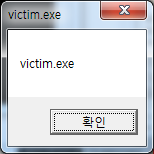

# 3\. 리버스 엔지니어링 (1)

다른 프로세스(프로그램)이 내가 원하는 동작을 하게하려고 하면 크게 두가지 방법이 있다.

1. 파일수정(exe) : 해당 프로그램을 직접 수정하는 방법
2. 메모리수정 : 내가 만든 프로그램을 해당 프로그램에 침투하는 방법

첫번째 방법은 바이너리 패치라고하며 해당 프로그램(exe)을 어셈블리 단위로 파악해서(디어셈블) 원하는 동작을 기계어로 exe파일에다 **직접 입력/수정**을 해야한다. 이 방법은 정말 간단한 프로그램이면 모를까 조금만 커져도 파악하기도 쉽지않고 기계어로 원하는 동작을 코딩해서 집어넣기도 쉽지않다. (더군다나 많은 exe파일은 _패킹_이라는 일종의 암호화되어 있어 디어셈하기 힘들다)

두번째 방법은 동적라이브러리(DLL) 삽입이다. 윈도우에서 모든 프로그램은 DLL을 이용하고있다. 실제로 앞서 _kernel32.dll user32.dll_ 등 많은 DLL을 사용해왔고 직접 만들어서 사용해보기도 했다. 직접만든 DLL라이브러리를 원하는 프로그램에 삽입할수 있다면 해당 프로그램을 내부에서 수정할 수 있다. **DLL 라이브러리이기 때문에 만들기도 훨씬 수월하다.**

물론 이 방법도 기존 프로그램의 동작을 수정하려면 해당 프로세스의 메모리를 직접 조작해서 기계어 단위로 수정해야한다. 하지만 극히 일부분으로 예를 들어 jmp 구문을 집어넣어서 우리의 DLL 라이브러리의 특정 함수로 이동만하면 된다. 기계어로 수정하는 부분은 jmp 명령어 하나이고 나머지는 일반적인 DLL 라이브러리이다. 말이 복잡하긴한데 실제 예를 보면 상당히 간단하다.

사실 두방법을 굳이 나눈것이고 실제로는 첫번째 방법으로 하더라도 DLL을 로드하는 구문(LoadLibrary)만 최소한의 기계어로 삽입해서 DLL을 삽입하는 두번째 방법을 섞어서 이용하기도 한다.

첫번째 방법보다 두번째 방법이 훨씬 간편하니 일단 두번째 방법인 `DLL 인젝션(Injection)` 부터 살펴보도록하겠다.

DLL 인젝션은 다양한 방법이 있다. 어떤방법을 써도 상관없기에 한가지만 알아도 사용하는데에 큰 문제가 없다. 다만 실제로 온라인 게임같은 일종의 안티해킹이 반영된경우(GameGuard같은)에는 많은 방법이 막힐수 있기에 몇가지 알아두면 좋을 수 있다.

Windows Hooking 글로벌 후킹를 이용한 방법부터 살펴보겠다.

## 3.1. DLL Injection (WinHook)

Windows Hooking(SetWindowHookEx)을 이용한 DLL 인젝션이다.

[SetWindowsHookEx MSDN](https://msdn.microsoft.com/ko-kr/library/windows/desktop/ms644990(v=vs.85).aspx) 를 살펴보면 아래와 같이 api 함수 설명에도 명시되어있다.

> SetWindowsHookEx can be used to inject a DLL into another process. SetWindowsHookEx를 사용하여 DLL을 다른 프로세스에 삽입 할 수 있습니다.

`SetWindowHookEx` 파마메터에 DLL 핸들을 넘기면 해당 DLL을 다른 프로세스에 인젝션(삽입)된다. 정확히 말하면 DLL이 **모든 프로세스**에 인젝션된다.

**injector.asm**

간단하게 DLL 라이브러리를 로드하는 프로그램이다. 별다른 일은 하진 않는다.

```x86asm
.686
.model flat, stdcall
option casemap:none

include c:\masm32\include\windows.inc
include c:\masm32\include\msvcrt.inc
include c:\masm32\macros\macros.asm
include c:\masm32\include\kernel32.inc
include c:\masm32\include\user32.inc

SetVictim proto, lpszVictim:dword
StartHook proto
EndHook proto

includelib c:\masm32\lib\kernel32.lib
includelib c:\masm32\lib\user32.lib
includelib c:\masm32\lib\msvcrt.lib
includelib mydll.lib

LoadDll proto
UnloadDll proto

.data
szVictim        byte "victim.exe",0

szStart         db "start injecting dll.",13,10,0
szEnd           db "end injecting dll.",13,10,0

.data?
hMyDll          dword ?

.code
start:
call Main
invoke ExitProcess, 0

LoadDll proc
    invoke SetVictim, addr szVictim
    invoke StartHook

    ret
LoadDll endp

UnloadDll proc
    invoke EndHook

    ret
UnloadDll endp

Main proc
    invoke LoadDll

    invoke crt_printf, addr szStart

    ; x 를 누를때까지 대기
    .repeat
        invoke crt_getchar
    .until al=='x'

    invoke crt_printf, addr szEnd

    invoke UnloadDll
    ret
Main endp

end start
```

`invoke SetVictim, addr szVictim` mydll.dll 의 SetVictim 을 호출한다.

SetWindowHookEx는 **모든 프로세스**에 인젝션을 하기때문에 원하는 프로그램만을 필터링하기위해 원하는 프로그램명을 넘겨준다. 여기서는 **"victim.exe"**를 넘겨줬다.

`invoke StartHook` mydll.dll 의 StartHook 함수를 호출한다. 아래에 나오겠지만 이 함수안에서 SetWindowHookEx 를 호출한다.

**mydll.asm**

삽입되는 DLL 라이브러리다. 여기서는 별도의 작업을 하진 않고 `injector.asm` 에서 SetVictim 을 통해 넘겨준 실행파일명(victim.exe) 을 필터링해서 이 프로세스에 Attach된 경우만 판단해서 메세지박스를 띄운다.

SetWindowsHookEx 를 호출하는데 실제로 Window Hooking 을 이용하면 키보드 후킹, 마우스 후킹, 윈도우 관리 후킹등 다양한 일을 할 수 있는데 SetWindowsHookEx MSDN 을 한번 훑어보면 간단한 예제들이 있다. 여기서는 Windows Hooking 를 이용하기 위한것이 아니라 단순히 부가효과인 모든 프로세스에 인젝션하기 위해서이므로 다른작업은 하지 않는다.

```x86asm
.686
.model flat, stdcall
option casemap:none

include c:\masm32\include\windows.inc
include c:\masm32\include\user32.inc
include c:\masm32\include\kernel32.inc

includelib c:\masm32\lib\user32.lib
includelib c:\masm32\lib\kernel32.lib

.data?
szVictim            byte 50 dup(?)
hCBTHook            dword ?
hGlobalModule       dword ?

.code
DllEntry proc hInstance:HINSTANCE, reason:DWORD, reserved1:DWORD
    .if reason==DLL_PROCESS_ATTACH
        .if hGlobalModule==0
            push hInstance
            pop hGlobalModule
        .endif
        invoke GetModuleHandle, addr szVictim
        .if eax!=0
            invoke MessageBox, 0, addr szVictim, addr szVictim, 0
        .endif
    .elseif reason==DLL_PROCESS_DETACH
    .endif
    mov eax, TRUE
    ret
DllEntry Endp

GetMsgProc proc, nCode:dword, wParam:dword, lParam:dword
    invoke CallNextHookEx, hCBTHook, nCode, wParam, lParam
    ret
GetMsgProc endp

; export functions
SetVictim proc, lpszVictim:dword
    invoke lstrcpy, addr szVictim, lpszVictim

    ret
SetVictim endp

StartHook proc
    invoke SetWindowsHookEx, WH_CBT, addr GetMsgProc, hGlobalModule, NULL
    mov hCBTHook, eax
    ret
StartHook endp

EndHook proc
    .if hCBTHook!=0
        invoke UnhookWindowsHookEx, hCBTHook
    .endif
    ret
EndHook endp

end DllEntry
```

`.if reason==DLL_PROCESS_ATTACH` 앞서 살펴본적이 있다. DLL이 프로세스에 로드되었을 때 (인젝션) 를 의미한다. DLL\_PROCESS\_DETACH 는 언로드 될 때를 의미한다.

```x86asm
push hInstance
pop hGlobalModule
```

hGlobalModule 에 DLL의 핸들을 저장한다. SetWindowsHookEx 함수 호출에 이용된다.

이 넘겨진 핸들의 DLL을 모든 프로세스에 인젝션하는 것이다.

`invoke GetModuleHandle, addr szVictim` GetModuleHandle 함수를 이용하여 현재 로드되어있는 프로세스를 확인한다. 여기서는 _SetVictim_ 으로 넘겨받은 _victim.exe (szVictim)_ 이 로드되어있는지 확인한다. 즉, 지금 **mydll.dll 이 붙은 곳이 victim.exe 프로세스인지 체크한다.**

`invoke MessageBox, 0, addr szVictim, addr szVictim, 0` 해당 프로세스에 붙었다면 메세지박스를 띄운다.

```
GetMsgProc proc, nCode:dword, wParam:dword, lParam:dword
    invoke CallNextHookEx, hCBTHook, nCode, wParam, lParam
    ret
GetMsgProc endp
```

SetWindowsHookEx 함수에 이용되는 함수이다. 후킹의 정보가 넘어오는 함수인데 여기선 후킹을 사용하기위해 쓰인것이 아니므로 아무런 동작으로 하지 않고 기본동작만 하고있다.

`invoke SetWindowsHookEx, WH_CBT, addr GetMsgProc, hGlobalModule, NULL` SetWindowsHookEx 를 호출한다. WH\_CBT 후킹을 걸었는데 윈도우와 관련된(생성/소멸/창크기등)내용을 후킹할때 사용한다. 여기서는 큰 의미는 없다. 다만 DLL이 올라가는 시점때문에 WH\_CBT, WH\_GETMESSAGE정도만 사용한다. (WH\_KEYBOARD를 사용했을경우에는 해당 프로세스에서 키보드를 눌러야 DLL이 삽입된다)

`invoke UnhookWindowsHookEx, hCBTHook` 윈도우 후킹을 해제한다. 이때 모든 프로세스에 인젝션되었던 mydll.dll 들이 언로드(DLL\_PROCESS\_DETACH) 된다.

**dll.def**

```
SECTIONS
    .bss   SHARED
LIBRARY mydll
EXPORTS SetVictim
EXPORTS StartHook
EXPORTS EndHook
```

DLL 라이브러리를 생성할때 이용하는 모듈정의파일이다. 앞서 만든 DLL과 대부분 흡사한다. `SECTIONS`부분만 추가되었다. 각 세션에 대해서 EXECUTE, READ, WRITE, SHARE 권한을 지정할 수 있는 키워드이다.

`.bss` 섹션에 대해서 SHARED 권한을 설정하였다. `.bss` 섹션이란 초기화되지 않은 값을 선언한 `.data?` 이 부분을 의미한다. 참고로 앞서 `.data` 는 `.data` 로 `.code` 는 `.text` 로 생성된다고 설명한적이 있다.

SHARED 권한을 설정한 이유를 알아보자. SetWindowsHookEx 함수를 호출하는 순간 mydll.dll 은 아래와 같이 모든 프로세스에 인젝션(로드 혹은 Attach 다 같은말인데..)된다.

```
injector.exe - mydll.dll   <-- 맨처음 mydll.dll 을 로드한 우리 프로세스
iexplore.exe - mydll.dll   <-- 인터넷 익스플로러 프로세스
explorer.exe - mydll.dll   <-- 탐색기 프로세스
chrome.exe - mydll.dll     <-- 크롬 프로세스
등등등 모든 프로세스
```

디버거를 이용하면 더 명확하게 확인할 수 있다.

[](http://note.heyo.me/wp-content/uploads/2017/03/dllinject_winhook2.png)

디버거를 실행시키고 \[기호\]탭을 보면 mydll.dll이 로드되어있는걸 확인할 수 있다.

이렇게 모든 프로세스에 mydll.dll 이 로드되지만 기본적으로 각각의 mydll.dll 의 **메모리 영역은 독립적이다.** 때문에 injector.exe에 로드된 mydll.dll 의 변수값을 설정한다고해서 다른 프로세스의 변수값이 변하지 않는다.

우리는 SetVictim을 이용하여 injector.exe 에서 mydll.dll 의 szVictim 변수에 victim.exe 를 설정하였다. 하지만 다른 프로세스의 mydll.dll 의 szVictim 변수값은 여전히 초기값 `50 dup(?)` 상태인 것이다.

이렇게 될경우 `invoke GetModuleHandle, addr szVictim` 으로 프로세스를 필터링하는 구문이 의미가 없어지는 것이다. 모든 프로세스에서도 szVictim 값은 victim.exe 이 되어야 필터링이 가능하다.

이를 위해서 SECTIONS 키워드로 `.bss` 에 `SHARED` 권한을 설정함으로써 모든 mydll.dll은 `.bss`섹션. 즉, `.data` 부분은 메모리를 공유하게 된다.

이제 컴파일해서 테스트해보자.

```
c:\masm32\bin\ml /c /coff injector.asm
c:\masm32\bin\link /subsystem:console injector
```

injector 는 콘솔프로그램이다. injector.exe 를 생성한다.

```
c:\masm32\bin\ml /c /coff mydll.asm
c:\masm32\bin\link /subsystem:windows /dll /DEF:dll.def mydll
```

dll.def를 이용하여 dll파일을 생성한다.

[victim.exe 프로그램](http://note.heyo.me/wp-content/uploads/2017/03/victim.zip) 을 다운로드해서 테스트해보자.

[](http://note.heyo.me/wp-content/uploads/2017/03/victim.png)

victim.exe 은 간단한 윈도우 프로그램으로 창을 클릭하면 메세지박스가 나타나고 _예,아니오,취소_ 을 클릭하면 거기에 맞는 메세지(yes, no, cancel)가 나타나는 프로그램이다.

## 테스트 순서

injector.exe 실행한다.

[](http://note.heyo.me/wp-content/uploads/2017/03/dllinject_winhook3.png)

victim.exe 실행한다.

[](http://note.heyo.me/wp-content/uploads/2017/03/dllinject_winhook1.png)

메세지박스가 뜬다.

> [목차](http://note.heyo.me/?p=238) 이전글 [어셈블리어 튜토리얼 (8) DLL 프로그램](http://note.heyo.me/?p=1230)
