# 1

[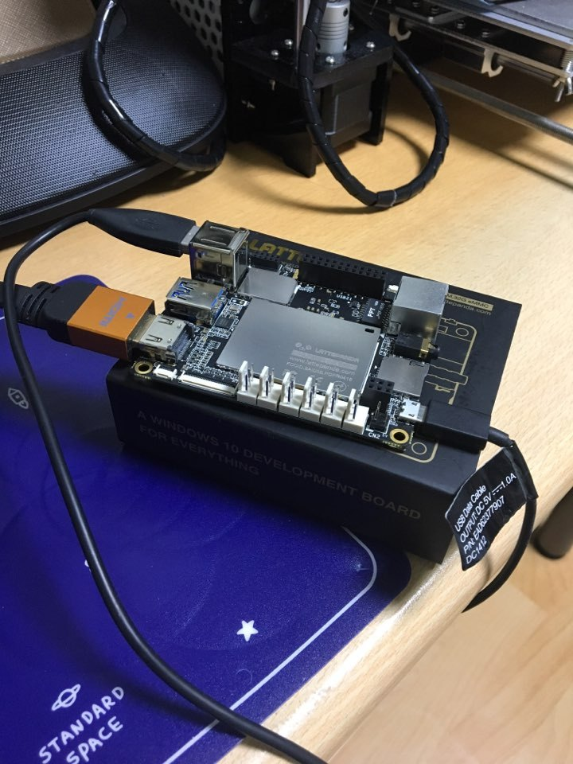](http://note.heyo.me/wp-content/uploads/2017/03/11ca791d1bae459b9c2.jpg)

[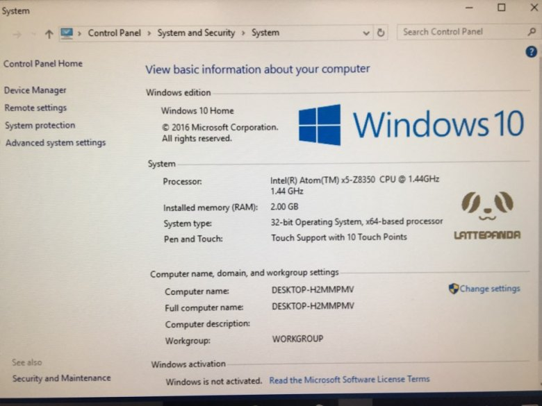](http://note.heyo.me/wp-content/uploads/2017/03/be9b3c21a02b4a7e82c.jpg)

[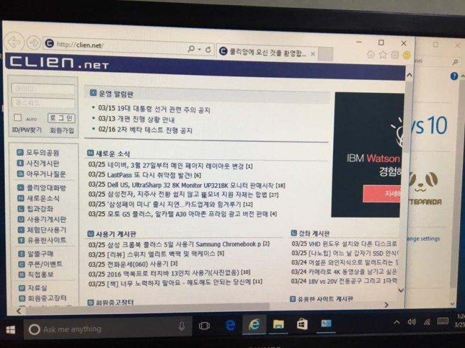](http://note.heyo.me/wp-content/uploads/2017/03/7e624916ba0e403e9b4.jpg)

[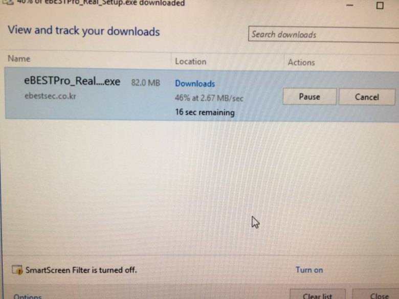](http://note.heyo.me/wp-content/uploads/2017/03/baaf9f184ab44e6b9c1.jpg)

[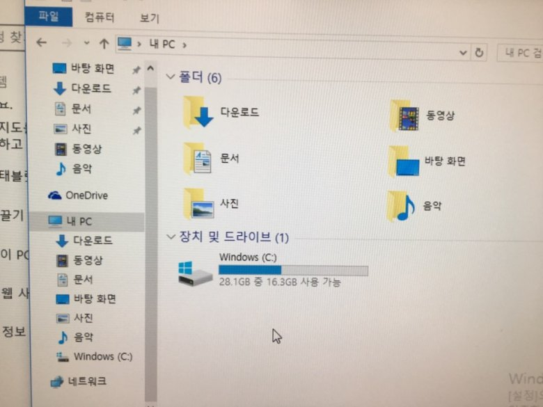](http://note.heyo.me/wp-content/uploads/2017/03/2af322b1f65f4fdfb6b.jpg)

윈도우10을 풀로 돌리는 초소형PC입니다. 인텔cpu(x86) + arduino 컨셉으로 윈도우10에서 편하게(?) iot 개발&구동을 할수있다는 컨셉같습니다. 개인적으로는 저게 의미가 있나.. 싶지만 어쨋든 현재로선 유일(?)한 컨셉이네요

라즈베리파이 정도의 크기이지만 cpu가 x86이니만큼 전류가 최소 2A가 확보되야합니다. 5V 마이크로USB로 동작합니다.

램2기가 / 스토리지32기가 버전과 램4기가 / 스토리지 64기가 버전이 있습니다. 전 램2기가 버전을 샀습니다. 유선랜, 무선랜, 블루투스 포함되어있습니다.

윈도우10가 기본 설치되어있습니다. 32비트 버전이고 풀 윈도우10입니다. 프로그램은 아두이노가 기본적으로 설치되어있습니다. 윈도우10말고도 Android x86, Ubuntu 지원한다고 합니다. (arm계열에도 있기에 큰의미가..)

어느정도 예상했지만 발열심합니다. cpu는 밑바닥에 있는거 같습니다. 손가락 대면 3초정도 버틸 수 있습니다. 사진처럼 그냥 맨바닥에 두면 상당히 위험해보입니다. 실제로 뻗기도하는군요. 옆으로 돌려놓으니 괜찮습니다.

간단하게 인터넷 접속해봅니다. 클리앙 잘뜨네요. 이베스트HTS 다운받아 설치해봤습니다. WIFI 인터넷속도 괜찮네요. node.js, python도 설치했습니다. 그래도 17기가 남는군요. 용량은 생각보다 넉넉합니다. 유투브에서 1080재생해봅니다. 끊깁니다.

pinout을 사용하지 않으면 스틱pc와 별차이 없어보입니다. 만.. 유선랜도 있고 케이스와 쿨러구성 이런거 생각하면 이것도 나름 장점이 있어보입니다.

추가 1. 윈도우 업데이트하고나니 유투브 1080 재생 잘됨 추가 2. 방열판 하나 붙이니 발열이 의외로 쉽게 잡힘 (1080 재생중에 만져도될정도)

# 2

[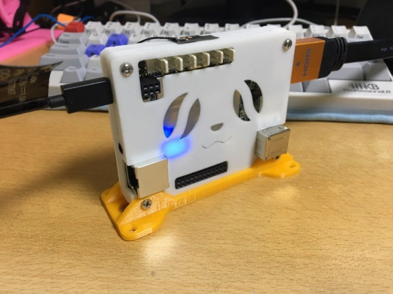](http://note.heyo.me/wp-content/uploads/2017/03/20ef7867dbae4eeda02.jpg)

[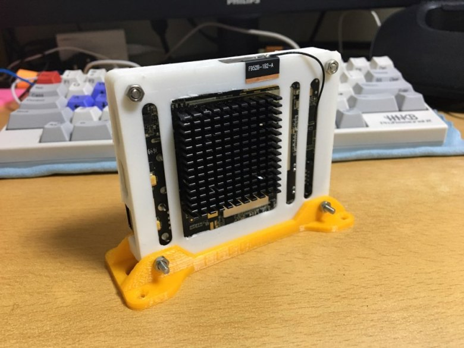](http://note.heyo.me/wp-content/uploads/2017/03/e4e7fde1a5024d1d8d7.jpg)

[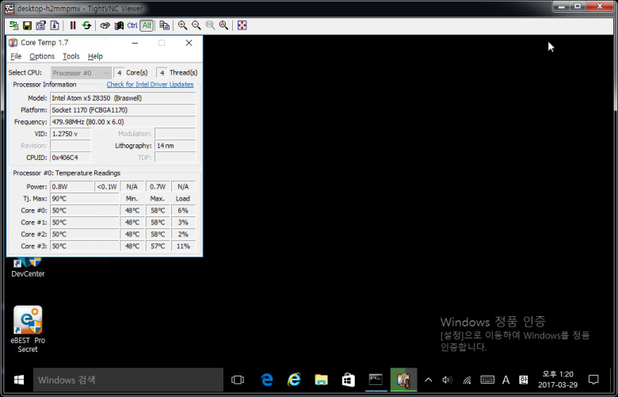](http://note.heyo.me/wp-content/uploads/2017/03/42ff6a3b73964bfbba4.png)

[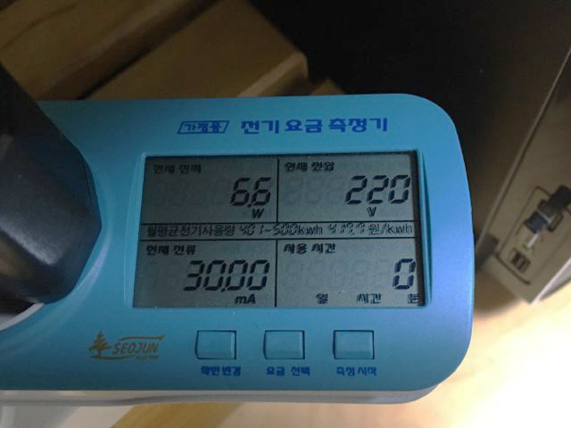](http://note.heyo.me/wp-content/uploads/2017/03/e45af14b978d4da7a6c.jpg)

[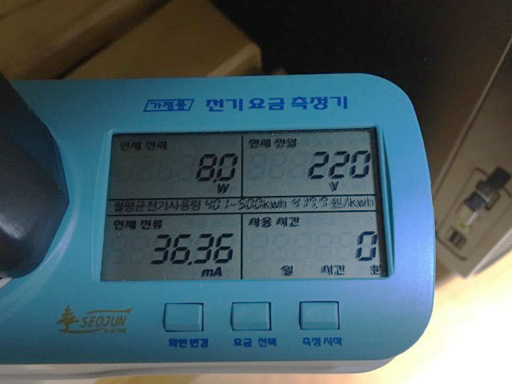](http://note.heyo.me/wp-content/uploads/2017/03/836084202fde4d50b33.jpg)

[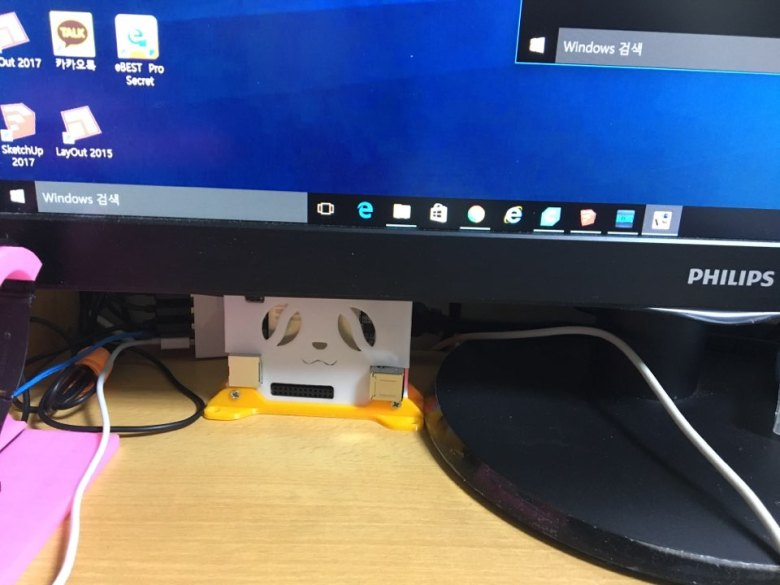](http://note.heyo.me/wp-content/uploads/2017/03/ca10e3838a4c4a578da.jpg)

저번 간단 사용기에 이어 2일정도 사용후에 작성하는 조금상세 사용기입니다.

라떼판다모양의 케이스를 씌워주었습니다. 마땅한 케이스가 없었는데 이건 이쁘네요 방열판하나 장착해주었습니다. 쿨러까지 달았다가 방열판만으로도 충분한거 같아 쿨러는 띄었어요 뒤에 살며시 나온 선이 기본안테나입니다. 안테나가 있어서 그런지 무선은 잘잡아요

기본설치된 윈도우10에 원격제어가 없습니다. 관리하기 번거롭네요. 문서를 뒤적거려도 관련내용은 없습니다. 다만 VNC를 설치해서 관리하는 방법이 설명되어있어서 일단 저도 VNC 설치했습니다. ..원격제어보다 불편하네요

cpu 온도입니다. 50도~60도 사이를 왔다갔다하네요 잘은 모르겠지만 지금쓰는 데탑과 비슷한걸로보아 안정적인거 같습니다.

전력소모량입니다. 기본 6.6W ~ 6.8W 유투브(1080)재생시 7.8W ~ 8.0W 나오네요. 미니베어본이 20W정도 나오는거에 비하면 확실히 적습니다. ..만 라즈베리파이에 비하면 엄청나군요.. (라즈베리파이는 2.4W ~ 3.0W)

현재 위치입니다. 확실히 사이즈가 작으니 공간차지않하는건 장점입니다. ..만 그럴거면 스틱PC가 나을거같기도하고 그러하네요. (스틱PC를 안써봐서 모름)

추가1. 덧글로 알려주셨는데 원격제어는 홈버젼이라 없군요 추가2. 패치가 있을거같다고 하셔서 찾아보니 정말 있네요.

https://github.com/stascorp/rdpwrap

이거 참고하면 될거같아요
