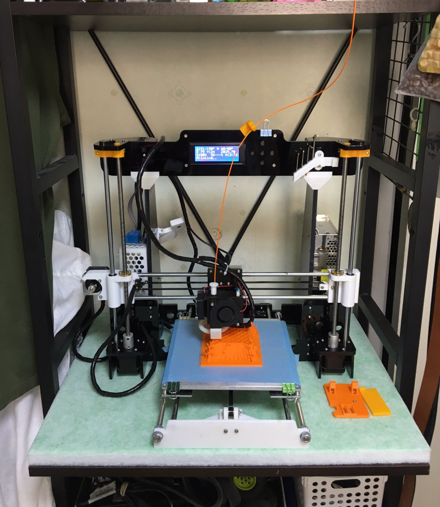

3D프린터를 선반으로 옮겼다. 밑에 방음블럭을 깔아두니 한결 조용해졌다.

그후 이것저것 출력물들이다. 뭐 크게 뽑은건 없고 거치대, 케이스, 모델등이다.

정작 필요한건 안뽑고;; 3d툴을 잘못다루니.. 스케치업으로 만드는게 쉽지 않다 ㅋ

페블 거치대다. 스틸, 타임.

필라멘트 롤러다. 거치대보다 편한듯하다.

이어폰 보관함이다.

스타워즈 병사? 간만에 abs출력물인데.. 오래안써서 그런지 필라멘트가 부분부분 변색되었다;;

쵸파쵸파. abs출력물이다. 확실히 abs가 출력후 가공하기 좋은거 같다.

철왕좌. pla이다. 생각보다 안이쁨 abs로 뽑아서 아세톤처리 했으면 좋았을거 같은데 아쉽다.

다스베이더 귀요미.

초소형PC 라떼팬더 케이스~

기타 업그레이드 부품. y축 체인, z축 지지대등

미니 탁상시계(8cm). 간만에 스케치업으로 만들었다.

이어폰 거치개~

소켓 암~

현재 선반에 자리잡은 모습이다.
