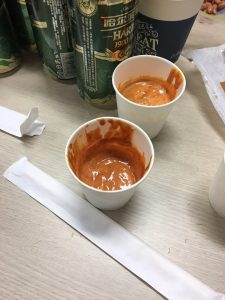

1.물 1000 cc

2.마늘분 90g\*2 ,양파즙 2컵 (둘중에 하나)

3.물엿 2컵

4.고추장 4컵

5.설탕 1컵

6.진간장 1/2컵

7.청량고추가루 고운것 1컵

8.후추 1/4컵

9.라면스프 3/4컵

10.참깨 1/2컵

11.땅콩(분태) 1/2컵

12.참기름 1/4컵

13.캡사이신 (1컵 반~2컵) -> 너무 매움

13.캡사이신 (1/2컵)

\*1~4까지 넣고 10분간 끓임, 타지않게 국자로 계속저어준다

5~12까지 넣고 10분간 더 끓임

다음으로 13을 넣는다. 물로 농도조절 식으면 뻑뻑해지니 약간 묽게
