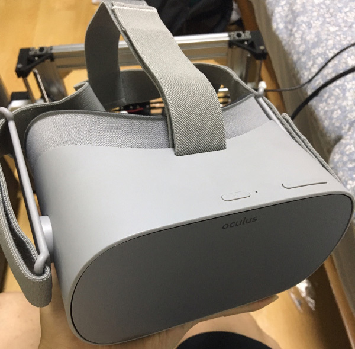

**오큘러스고**를 사용한지 2주정도 되었네요. vr기기는 기어vr이 처음이었는데 조금 사용해보고 나름 만족스러워서 더 낫다는 오큘러스 고로 바로 넘어왔습니다.

일단 기어vr보다 좋은점은 펜타일 격자가 안보이는점, 발열로 인한 대기없음 이 두가지가 확실하게 좋았습니다.

착용감도 좋아진거 같은데.. 이 부분은 조금 긴가민가하다가.. (렌즈에 습기안차고 덜더운부분인데 빛이 새어들어온다거나.. 좀더부드러운 느낌인데 광대쪽만 눌리는 느낌)

이번에 fitted interface 구입해서 적용하니 이제는 확실하게 좋다고 느껴집니다. 코사이 구멍도 거의 없어져서 빛샘이 거의없고 무엇보다 광대부분이 꽤 눌렸는데 이부분이 해소되었어요 걱정했던 안경도 큰문제 없었습니다. 안경착용하고도 불편함없이 사용할수 있어요

## 주로 사용하는 앱

1) 피가수스 (동영상플레이어)

samba지원(NAS) 이거하나때문에 skybox대신 사용합니다.. 솔직히 화면은 skybox가 낫다고 생각되요. skybox에서 samba만 지원되면 좋을텐데 말이죠.. 그리고 dts영상 재생안되요.. 인코딩해야되서 번거롭네요.

**최근 패치로 skybox에서 samba 지원합니다!**

2) 브라우저 (pooq)

브라우저 쓸일이 있겠나 싶었는데.. pooq 재생용으로 매우 자주 쓰게되네요 구입전에 pooq안되다는 글을 봐서 거의 포기하고 있었는데.. 해보니 되네요.. 좀 불편하긴하지만요. 재생 버튼 누르기전에 오른쪽 상단의 "PC모드" 아이콘을 클릭해서 PC모드인상태에서 재생버튼 누르면 되네요. 재생후에는 "팝업"버튼 누르면 보기편하게 마춰지네요.

3) 넷플릭스(한국어만..)

가장 아쉬운 부분이네요. 하루빨리 자막 버그가 고쳐지길 빌뿐입니다.. 리뷰에서도 꽤 보이는데.. 고치기 어려운건지 신경을 안쓰는건지 구입할때만해도 금새 고치겠지하는 마음에 구입했는데 너무 길어지네요;; 일단은 자막없는 영상위주로 보고있어요 가장 안타까운 부분.

**패치로 자막 버그 사라졌습니다!**

4) 기타 체험용 게임

신기하다..정도 막 재밌다는 게임은 아직 못찾았네요. 애초에 큰기대도 안하긴했지만요.

## 단점

일단 배터리가 은근히 짧은거 같습니다. 주로 nas연결해서 봐서 그런지 2시간정도 빠듯한거 같더라고요. 그리고 예상은 했지만 앱이 너무 없네요.. 없는것도 없는거지만 앱들이 업데이트를 전혀안하는것같아요;; 브라우저라도 제대로 나와서 pooq처럼 재생이라도 잘되었으면 좋겠어요. netflix나 왓챠같은곳에서 말이죠

전체적으로 제가 활용하는데에 있어서 만족스러운 기기였던거 같습니다.
