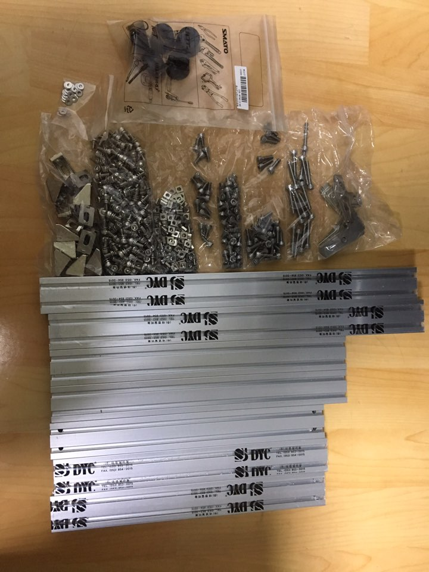
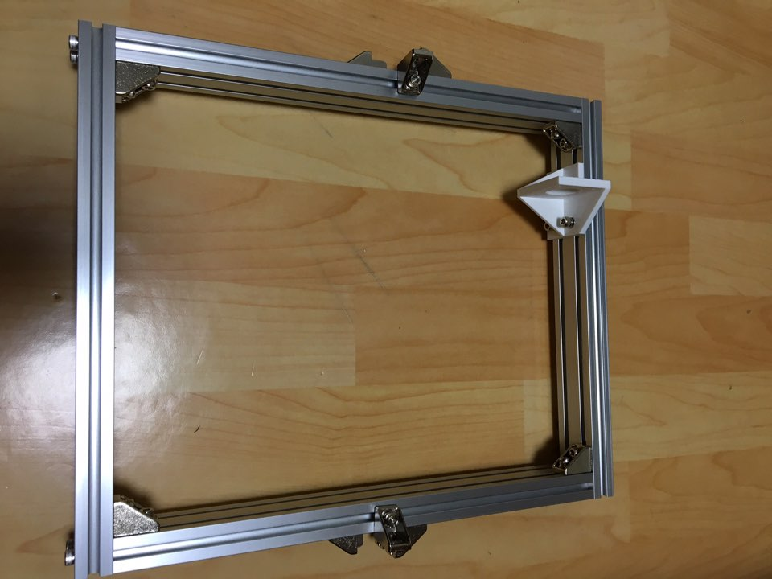
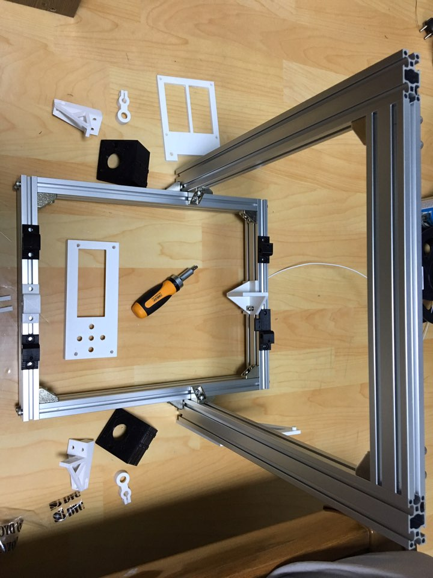
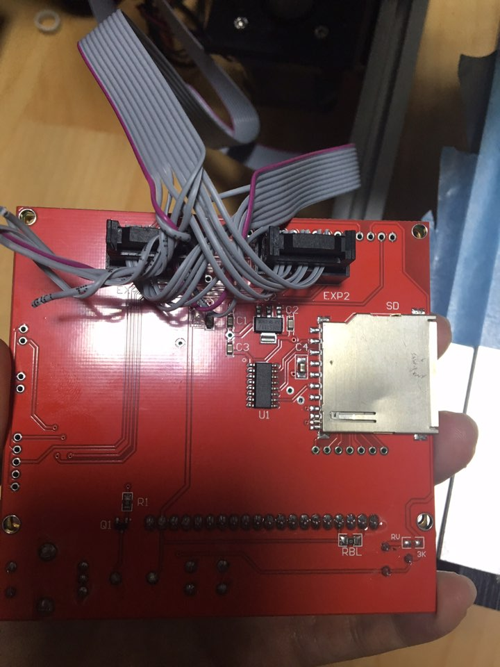
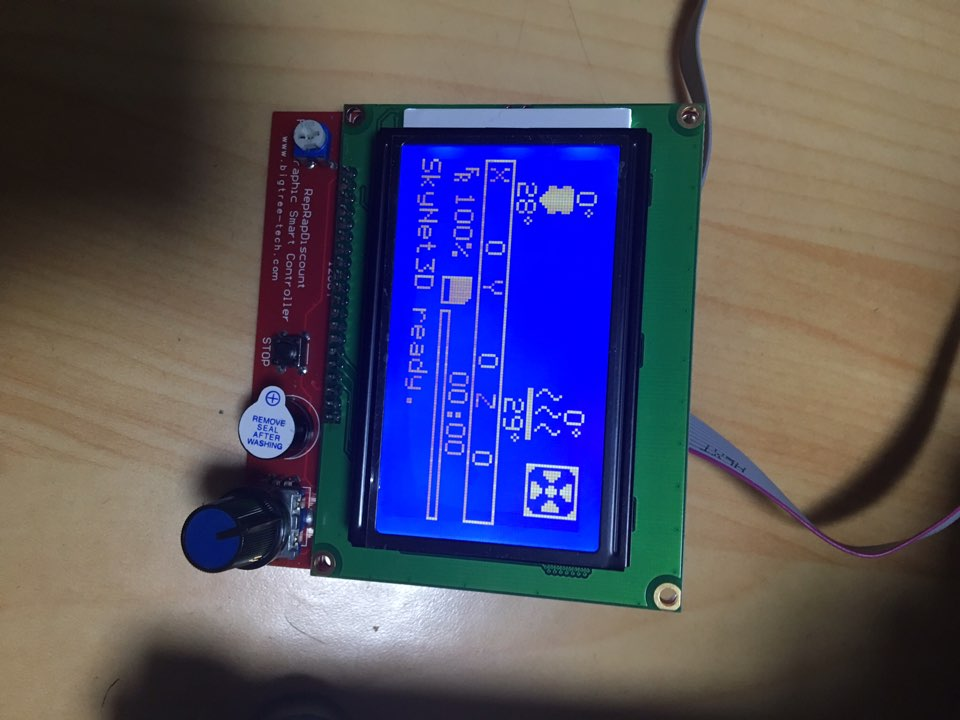
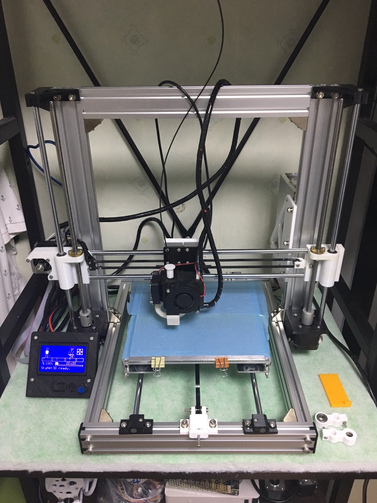
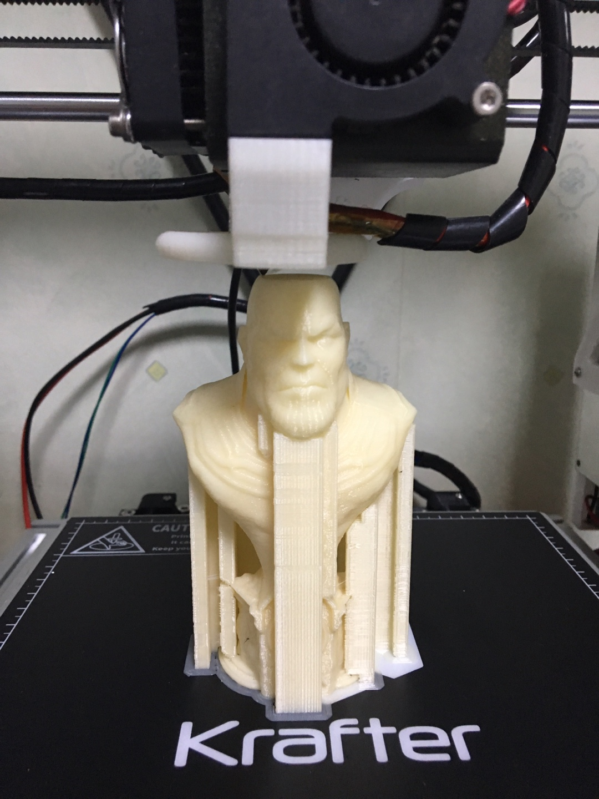
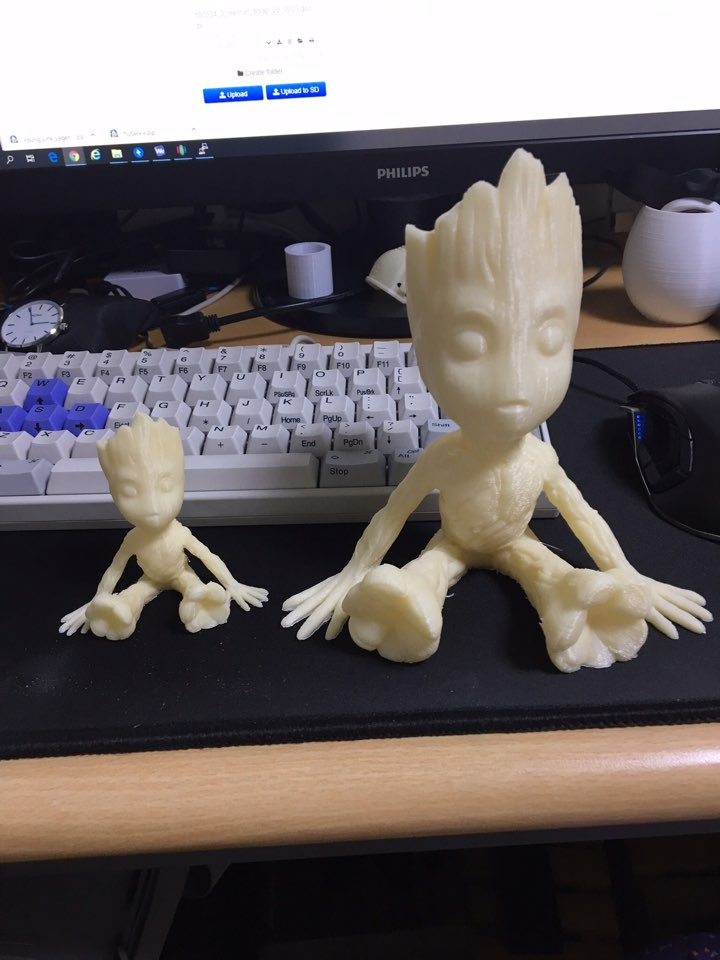

a8 의 아크릴 기본프레임을 철프레임으로 바꾸는 프로젝트가 있길래 따라 만들었다.

철프레임인만큼 더 튼튼해지고 안정성이 높아져 출력물 퀄리티가 높아지....는 사실 잘 모르겠고

일단 멋져보여서 시작함.

친철하게 자세히 설명된 글이 있어 편하게 제작할 수 있었다.

[https://cafe.naver.com/makerfac/41826](https://cafe.naver.com/makerfac/41826) 참고

> 수정1: 브라켓은 가이드 홈이 있는것과 없는것을 구분해서 살 필요가 있다. [https://cafe.naver.com/makerfac/62349](https://cafe.naver.com/makerfac/62349) 참조 수정2: 기본파츠는 이게 더 좋다. [https://www.thingiverse.com/thing:2657605](https://www.thingiverse.com/thing:2657605)

비용은 5만원정도 들은거같다.

주문한 기본 프로파일과 부속품들.

뚞딱뚞딱 밑판 완성

뚞딱뚞딱 기본프레임 완성

am8로 업그레이드하면서 lcd도 업그레이드 해보았다. 반년전에 사놨던거 같은데..

막상 적용하려고보니 기본적으로 anet a8과 호환되지 않았다... ㅋㅋㅋ

a8용을 샀어야 했는데 아무거나 싼걸 사다보니 잘못샀다. (저렴한 lcd 12864 reprap)

[https://www.thingiverse.com/thing:2103748](https://www.thingiverse.com/thing:2103748)

> 2달후 수정사항: 그냥 펌웨어에서 pins\_ANET\_10.h 파일을 수정해도 가능하지 싶다. (...)

다행히도 변환하는 방법을 찾아서 적용했다..

납땜하기 싫어서 선끼우는 방식으로함

펌웨어 업데이트도 해주고.. 다행히 잘나옴.

나머지 설치해주면.. 완성~

빌드시트도 붙이고~ 타노스 출력

그루트도 출력..

프레임이 흔들릴일이 없으니 출력 품질이 올라갔을거 같다.. (느낌적인 느낌)

사실 세밀한거 뽑을때는 어차피 저속출력이라 아크릴프레임에 보강정도만으로도 충분한 느낌이라..

뭐 암튼 튼튼하고 멋져짐.
