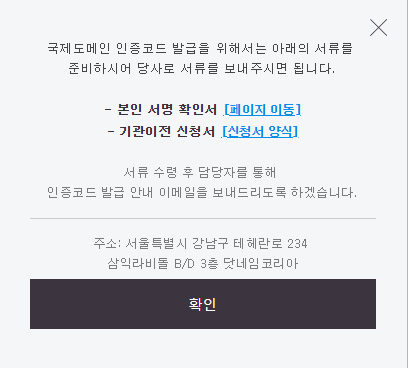

최초에 가비아에서 도메인을 구입하여 사용하다..

닷네임코리아로 기관이전하여 사용하고 있었습니다.

어느덧 기간 만료일도 다가오고 겸사겸사 연장비용이 조금 더 저렴한 업체로 옮기려고 기관이전을 신청했습니다.

당연히 신청만하면 금새 이전될줄알고 이전할 업체 몇군데 알아보면서 가벼운 마음으로 이전 신청버튼을 눌렀죠..

....??

잘못본줄 알았습니다.. 설마 아니 21세기에 도메인 하나 이전하는데 서류를 준비해서 우편으로 발송해야한다니..

몇번 다시 시도하고 문의해본 결과.. 기관이전하려면 정말로 저렇게 해야한답니다.. 너무도 황당해서 이게 말이 되냐고 문의를 했더니..

* * *

고객님 안녕하세요! (주)닷네임코리아입니다. 먼저, (주)닷네임코리아를 이용해 주심에 감사드립니다.

안녕하세요 고객님

혹시 연장 비용 절감을 위해 이전을 하신다면 할인을 도와드리고 있습니다.

ICANN 문서 검증에 대한 내용 확인을 부탁드립니다.

Registered Name Holder providing of required authorization and documentation for Registrar review. [https://www.icann.org/resources/pages/responsibilities-2014-03-14-en](https://www.icann.org/resources/pages/responsibilities-2014-03-14-en)

서류 없이 이전을 희망하실 경우 이전하는 비용을 결제하시고 서류없이 진행도 가능합니다.

[https://www.icann.org/resources/pages/name-holder-faqs-2012-02-25-ko](https://www.icann.org/resources/pages/name-holder-faqs-2012-02-25-ko)

등록 업체가 새 등록 업체로 이전하는 비용을 청구합니다. 이러한 비용 청구가 허용되나요? 예. 등록 업체는 이 서비스에 대해 자체적으로 가격을 지정할 수 있습니다.

고객님, 이전하시려는 사이트 주소 남겨주시면 가능한 최대한 가격 할인을 도와드리겠습니다!

다른 문의 사항이나 더 궁금하신 사항이 있으시면 언제든지 연락주시면 성의껏 답변 드리겠습니다.

감사합니다. 좋은 하루 되세요.

* * *

서류안보내도 되니 그럼 비용을 청구하겠다네요.

icann 문서를 들어가며 말이죠

몇번을 더 문의해본 결과 비용은 서류없이 진행하시는 경우에 리스크 관리 비용(본인이 아닌데 이전요청을 하거나 하여 발생되는 리스크)이 발생되는것이라고 하더군요

리.스.크 비용이라니 ㅋㅋㅋ 진짜 황당하고 어이없어서..

icann 문서를 들먹이며 비용청구의 합리성을 주장했지만.. 다른 업체 어디에서도 기관이전하는데 이전기관이 비용을 청구하는일이 없는데 말이죠.

회원가입할때는 본인인증을 핸드폰으로 간편하게 하면서 기관이전할때만 본인확인사실서를 등기우편으로 보내라는건 아무리봐도

불편하게 만들어서 기관이전을 포기하게 만들려는 의도인데..

거기다 그걸 빌미로 리스크비용이라는 이전비용을 받아먹고있다니..

짜증나고 황당해서 몇번더 문의했지만.. 시간도 아깝고 그냥 빨리 탈출하자는 마음에..

결국은 리스크 비용 5000원 내고 탈출했네요..

카드결제 : [http://www.dotname.co.kr/payment/self?input\_price=5000](http://www.dotname.co.kr/payment/self?input_price=5000)

친절하게 카드결제 링크도 보내주더라고요

근데 다행이도 닷네임코리아 포인트쌓인게 있어서 3800원에 탈출 ㅋ..

닷네임코리아 3년동안 잘썼는데 막판에 이렇게 힘들게 할줄이야..

그래도 그와중에 상담문의 답변 빠른건 좋았습니다.
