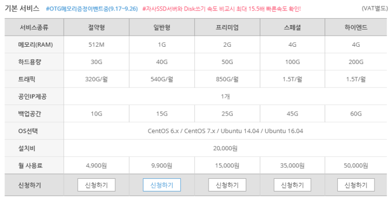
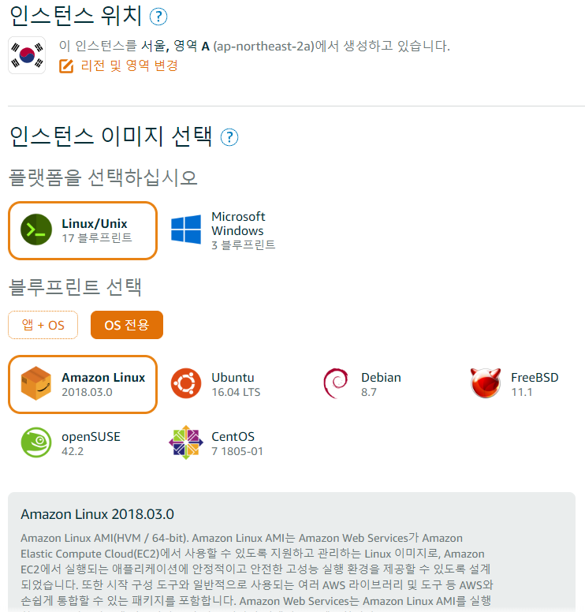
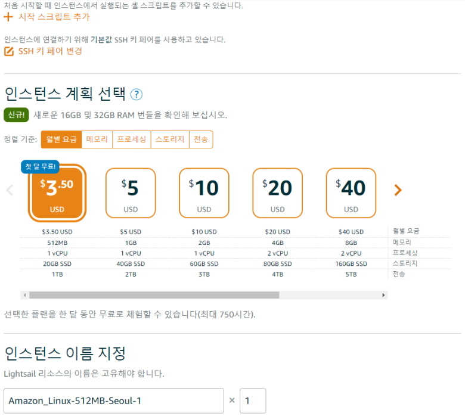

이전에 사용하던 스쿨호스팅 가상서버(vps) 입니다. 절약형으로 사용했고 워드프레스와 nodejs앱 몇가지 빠듣하게 돌렸습니다. 나름 고르고 골랐던 곳 이었습니다;;

이번에 아마존 aws에서 \*lightsail)가 저렴하게 서비스된다기에 사용해 보았습니다.

이 스크린샷이 일단 모든걸 알려주겠네요. 비슷한 성능만 내준다는 전제면 편의성, 가격 모든것이 훌륭합니다.. **첫달무료**라 부담없이 사용해보았습니다.

기존 서버와 동일하게 설정해서 돌려보았는데.. 진짜 훨씬 좋네요.. 전에 서버에서는 워드프레스가 겨우겨우 돌아갔는데.. (wp super cache등의 캐쉬떡칠)

여기선 엄청 빠릿하게 돌아가네요. 분명 ssd빼곤 동일한 스펙인데 이상하네요.. ssd의 차이가 이렇게 큰가싶은.. 같은 가격대로 마추면 램 1GB도 가능하니 진짜 비교할수 없을듯 싶어요
