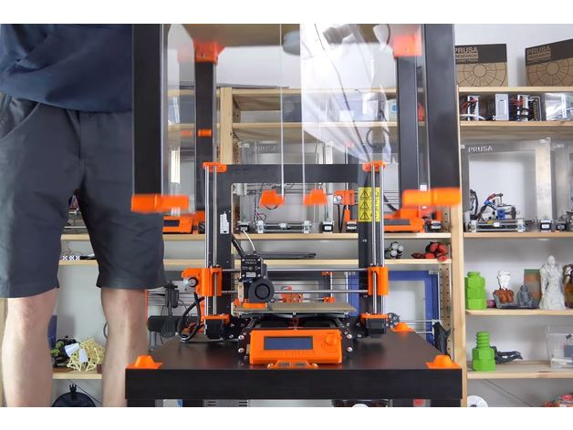
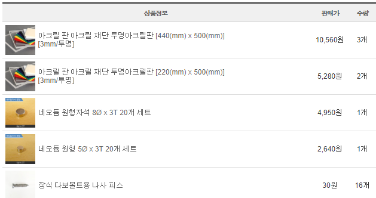
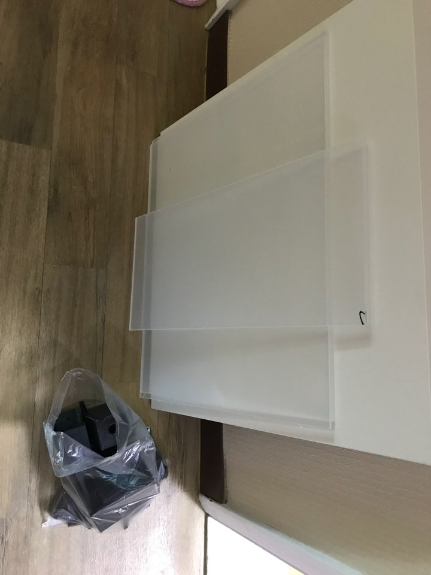
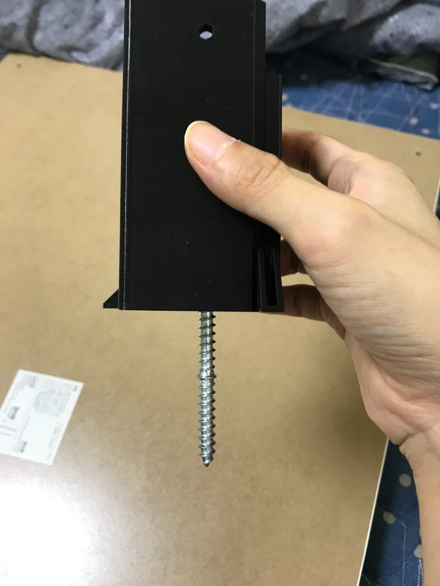
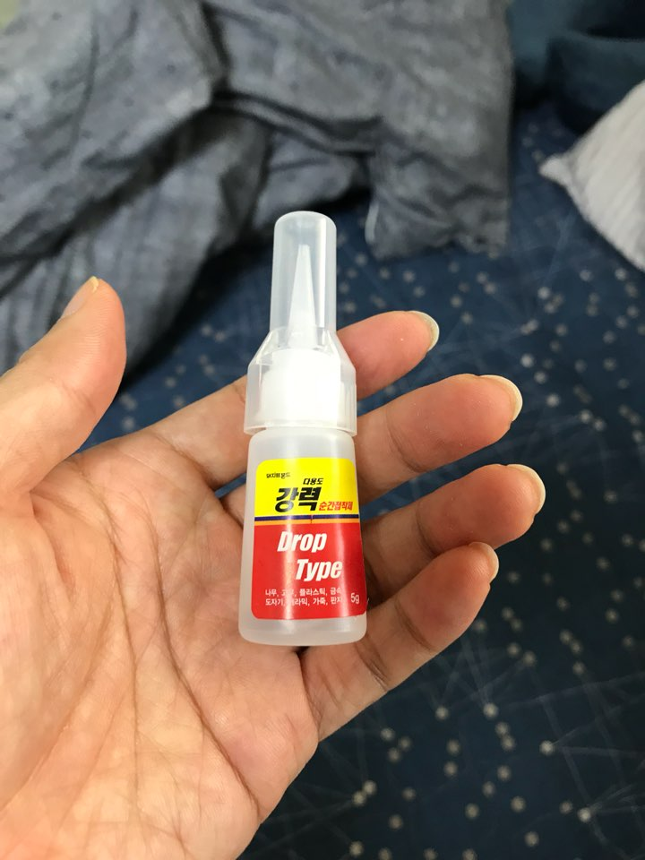
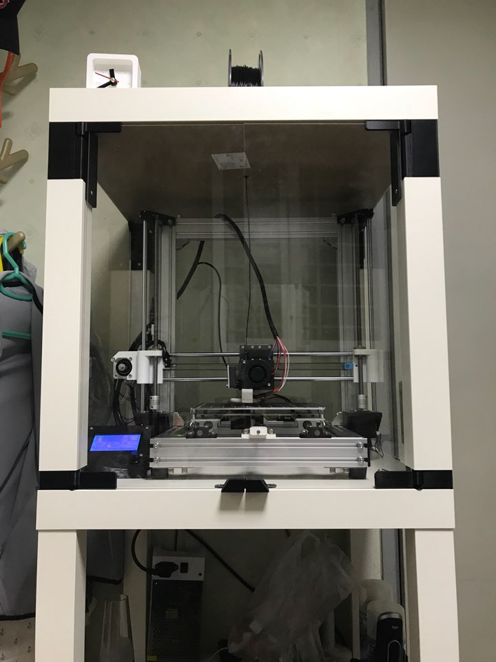

am8 챔버를 만들었다. 아무래도 챔버가 있어야 abs를 뽑기도 수월해지고 소음도 줄어들어서..

고민하고 있었는데 마침 좋은 제작방법이 있어서 만들어 보았다.

이케아 lack 테이블을 이용한 챔버이다.

2개가 필요하고 나는 너무 낮은거같아 3개로 만들었다.

이걸로 만든게 종종 있는거 같은데..

오리지날 프루사팀에서 올린게 상세하고 여러가지 응용작도 많아서 이걸 기본으로 하였다.

챔버임에도 완정 고정이 아니라 손쉽게 위아래가 분리된다. ㄷㄷ

 [https://www.thingiverse.com/thing:2864118](https://www.thingiverse.com/thing:2864118)

이게 기본이고.. am8은 오리지날 프루사보다 높이가 5센치가량 더 큰데..

넉넉하게 6센치 늘리기로 했다. 이러면 높이가 50센치로 딱떨어짐.

이것도 다른분이 친절하게 올려뒀다.

[https://www.thingiverse.com/thing:3091517](https://www.thingiverse.com/thing:3091517)

top bottom 둘다 있는데 top쪽을 늘리기로 했다.

일단 준비물은..

이케아 lack 테이블 3개 ([https://smartstore.naver.com/ikeaholic/products/3372510264](https://smartstore.naver.com/ikeaholic/products/3372510264))

12,000원 x 3개 = 36,000원

투명아크릴 2장+3장 (6센치up이므로 50센치), 네오듐자석(8파이), 나사못

(5파이 자석은 그냥 겸사겸사 삼)

약 50,000원

해서 대략 9만원돈 든거 같다.. 생각보다 비싸다 ㄷㄷ

6mm짜리 나사못은 안팔아서 철물점에서 살려고 스킵했다..

그리고 철물점에서 6mm같은 두꺼운건 취급 안한다고해서 못구했다... 혹여 만드실분들은 인터넷에서 구입하시길.

재료가 왔으면 뚝딱뚝딱 조립한다. 재료가 간촐해보이는데 이케아 lack 테이블 두개는 미리 조립해놨다.

출력물은 PLA로 채움 25% 외곽선 두껍게 출력했다.

이것도 생각보다 재료가 많이 든다. 한 500g정도 소비된 거 같다.

문제의 6mm나사못..

동네 철물점에 6mm짜리 나사못이 없어서.. 인터넷에서 주문해야했는데..

재료가 다있는데 이것때문에 또 기다리는게 너무 귀찮아 그냥 이케아에서 준 걸로 만들었다;;

이케아 기본 나사못은 사진처럼 헤드없이 양쪽다 스크류만 있다.

..엄청난 개삽끝에 만들었다.. 심지어 이것때문에 유격도 생김 ㅋㅋㅋ

나머지는 순접으로 어떻게 잘 때웠다.. 언젠가 나사못사다가 다시 조립해야겠다..싶다.

일단은 사용하는데 지장은 없으니..

그리고 완성된 모습. 프린터는 거의 딱 맞는다.

투명아크릴벽에는 위아래도 틈이 상당히 있는데.. 봐서 방풍지(?) 같은걸 붙여주면 될 거 같다.

어차피 내부 온도가 너무 올라도 문제이니. 일단 abs 출력시 내부 온도를 체크해보고 정하면 될 듯.

삽질하느라 중간과정을 못찍었는데 꽤 삽질을 했다. 6센치 늘려서 분명 50센치인데.. 미묘하게 다리가 짧아서 아크릴벽이 휘어졌다.

[https://www.thingiverse.com/thing:3101635](https://www.thingiverse.com/thing:3101635)

이 스페이서로 다리를 2mm정도 더 연장해서 해결했다.

필라멘트 spool도 필라멘트마다 사이즈가 달라서 가변이 가능한걸로 출력했는데

[https://www.thingiverse.com/thing:2867521](https://www.thingiverse.com/thing:2867521)

가장 줄여도 eSUN 필라멘트가 안들어간다.. ㄷㄷㄷ 그냥 기존거 씀.

밑판 고정용 모서리판도 분명 설명에는 나사로 고정하는데.. 나사구멍이 없다;;

구멍을 뚤어서 나사를 조이라는건가.. 싶은데 그냥 귀찮아서 양면테이프로 붙였다.

삽질끝에 만들었는데 일단 기본적으로 사용하는데에는 전혀 문제가 없을거 같다.

led는 필요없을거 같았는데.. 씌워놓고 보니 너무 어둡다.. 나중에 led는 달아줘야겠다.
