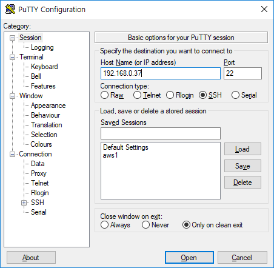

octoprint(raspberry pi) dht11 3핀 모듈

# 라즈베리파이 dht11 모듈 연결

[](http://note.heyo.me/wp-content/uploads/2018/10/KakaoTalk_20181002_151121900.jpg)

dht11 3핀 모듈이다. dht11 칩에 기본적으로 저항작업까지 된 모듈이다. 이걸로 사지 않으면 저항작업을 해야하서 피곤해진다.

[](http://note.heyo.me/wp-content/uploads/2018/10/raspberrypi.png)

빨간선 검정선 갈색선을 표시해둔 핀에 각각 연결한다.

[](http://note.heyo.me/wp-content/uploads/2018/10/KakaoTalk_20181002_151122549.jpg)

핀작업은 끝났고 이제 소프트웨어를 설치해야한다. 라즈베리파이에 ssh 접속해서 설치해야한다.

# 라즈베리파이 온도측정 라이브러리 설치

ssh클라이언트로 putty 를 이용하겠다.

putty는 무료프로그램이고 [https://putty.org/](https://putty.org/) 이곳에서 다운 받을 수 있다.

putty를 실행하고 octoprint의 ip로 접속한다.

[](http://note.heyo.me/wp-content/uploads/2018/10/putty1.png)

로그인창이 뜨는데 변경한적이 없다면 아이디는 pi 패스워드는 raspberry 이다.

[](http://note.heyo.me/wp-content/uploads/2018/10/putty2.png)

이제 온도측정관련 라이브러리들을 설치한다.

업데이트하고 python과 라이브러리를 설치한다.

```
sudo apt-get update
sudo apt-get install build-essential python-dev python-openssl git
```

온도 측정 프로그램을 설치한다.

```
git clone https://github.com/adafruit/Adafruit_Python_DHT.git && cd Adafruit_Python_DHT
sudo python setup.py install
```

온도 측정 예제를 실행한다.

```
cd examples
sudo ./AdafruitDHT.py 11 4
```

문제가 없다면 온도와 습도가 표시 될 것이다.

```
Temp=26.0*  Humidity=46.0%
```

# Octoprint 온도표시 플러그인 설치 (Octoprint-Enclosure)

이제 octoprint에 온도를 표시하기 위한 플러그인을 설치한다.

octoprint에 접속해서 설정에 plugin manager를 선택한다.

\[get more\] 를 클릭해서

[](http://note.heyo.me/wp-content/uploads/2018/10/chamber_temp1.png)

Enclosure 를 찾아서 \[install\] 한다.

재시작하겠냐고 물어보는데 재시작하고..

다시 설정으로 들어가서 맨아래 \[Enclosure Plugin\]을 선택한다.

[](http://note.heyo.me/wp-content/uploads/2018/10/chamber_temp2.png)

Add Input 을 선택해서 온도측정 정보를 입력해준다.

[](http://note.heyo.me/wp-content/uploads/2018/10/chamber_temp3.png)

이제 상단바와 탭에 온도가 표시된다.

[](http://note.heyo.me/wp-content/uploads/2018/10/chamber_temp5.png)

[](http://note.heyo.me/wp-content/uploads/2018/10/chamber_temp6.png)

# 표시 오류

혹시 0도 0%로 표시된다면..

octoprint log파일을 확인해보면 이렇게 뜨는경우

```
2018-10-02 06:45:41,884 - octoprint.plugins.enclosure - INFO - Failed to excecute python scripts, try disabling use SUDO on advanced section of the plugin.
2018-10-02 06:45:41,886 - octoprint.plugins.enclosure - WARNING - An exception of type ValueError occurred on log_error. Arguments:
('need more than 1 value to unpack',)
```

Enclosure Plugin 온도 설정에서 아래쪽에 \[Advanced Options\] 을 클릭하여

[](http://note.heyo.me/wp-content/uploads/2018/10/chamber_temp4-1.png)

Use SUDO 를 **체크해제** 해보자.

# 상단에 온도를 바로 표시

[http://note.heyo.me/octoprint-enclosure-상단에-온도-표시/](http://note.heyo.me/octoprint-enclosure-상단에-온도-표시/)
