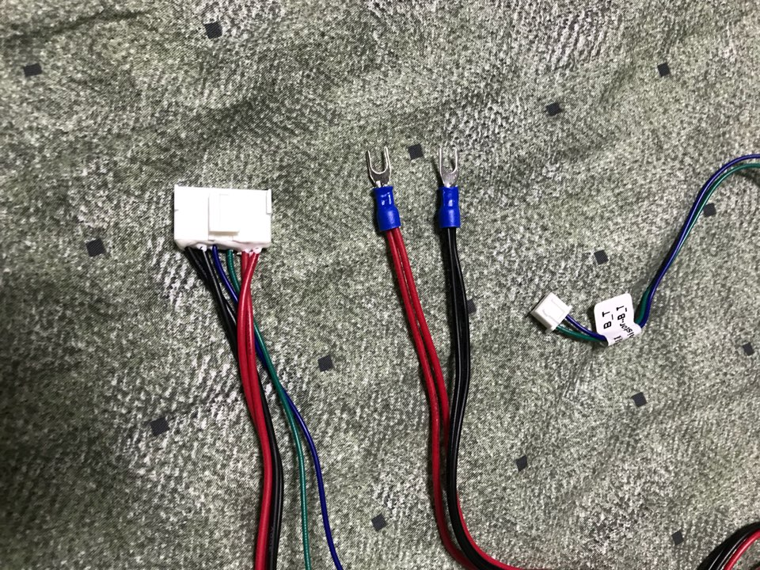
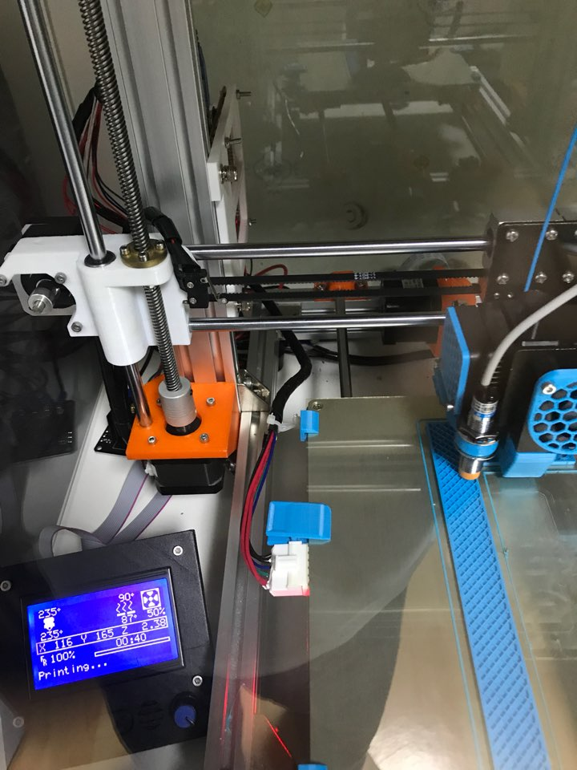
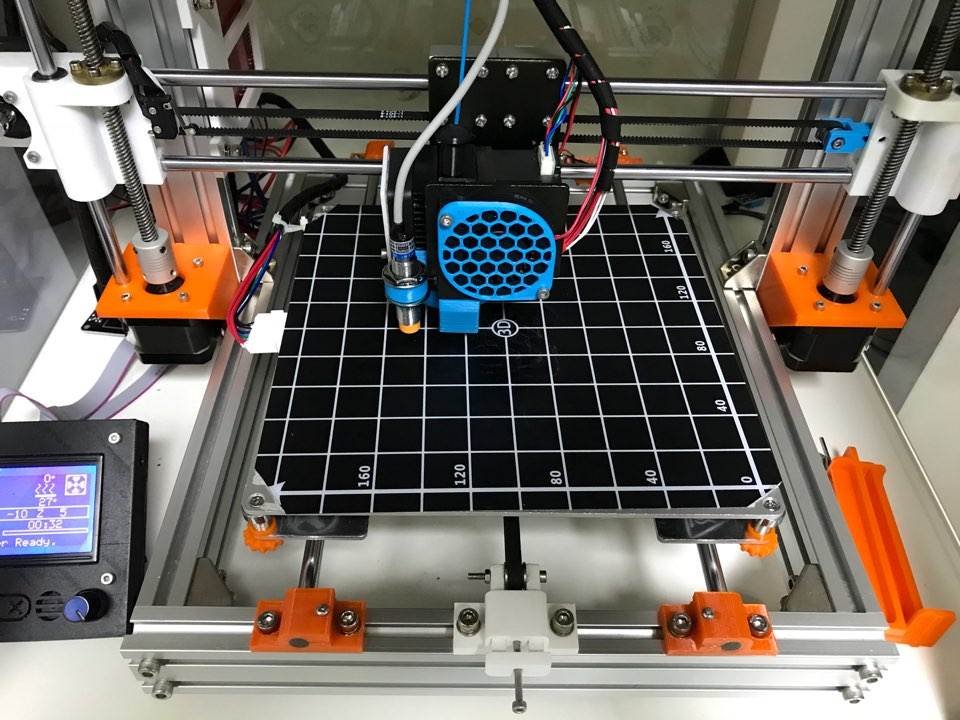
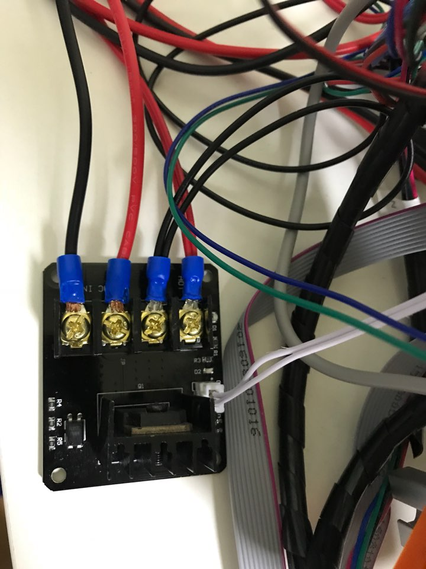
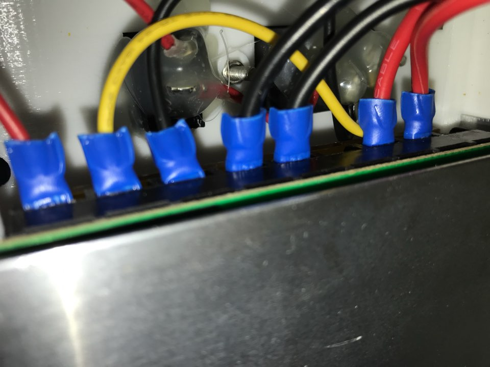
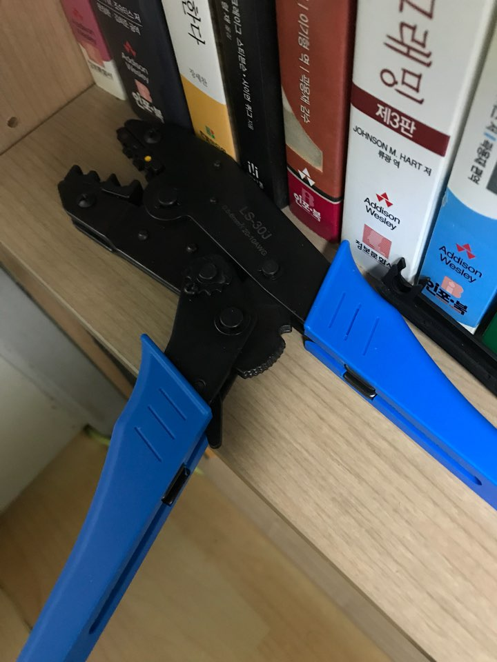
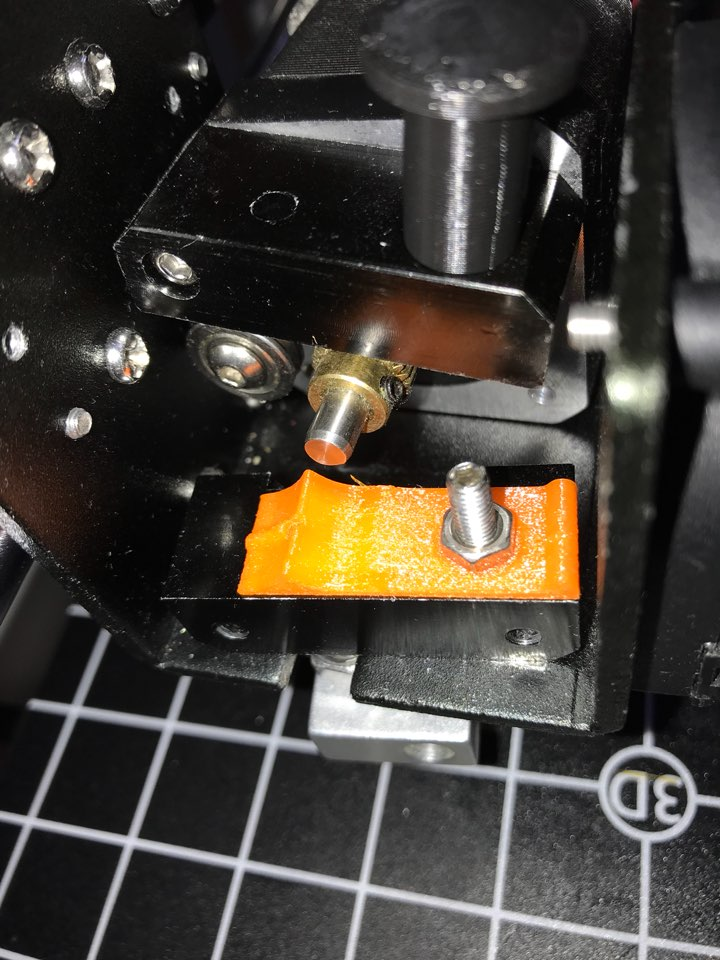
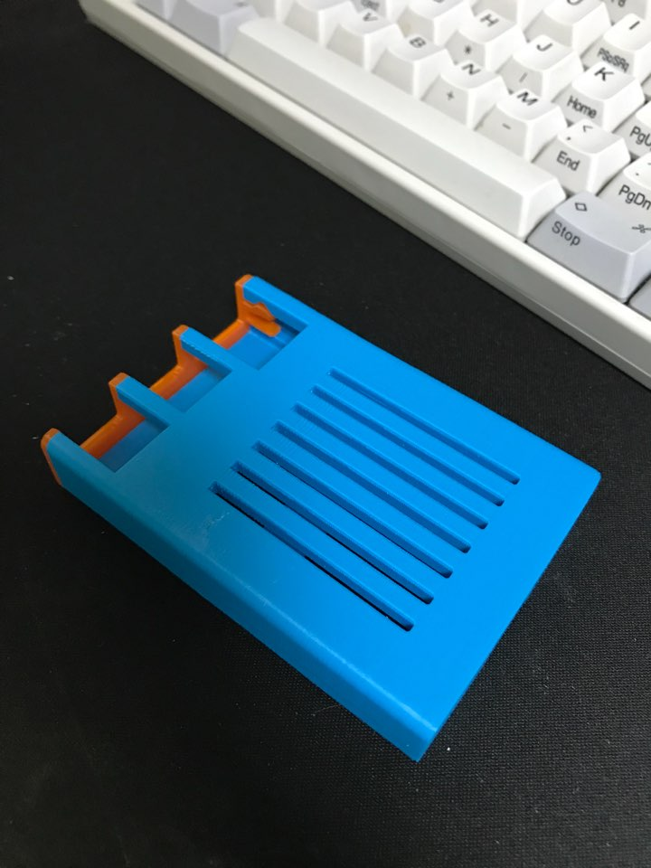

먼저 가장 우선적으로하는 히팅베드 커넥터를 변경하였다. 납땜을 하기도하는데 6선커넥터로 변경했다. 검색해보니 납땜보다 이 방식을 더 선호하는거 같다. 가열선이 하나씩 더늘어나서 부하를 반으로 줄일수있다. 견고하게 납땜하는게 생각보다 쉽지않은데다가 조정하거나 할때 선이 분리가 안되어 상당히 불편할듯하다. 교체하면서 커넥터 꼽는 방향도 왼쪽으로 변경했다. 기존의 뒤쪽방향은 커넥터부위의 전선에 무리가 많이 가서 쉽게 상하는거 같다. 커넥터부위 선이 움직이지 않게 고정하는것도 중요하다. 체인을 달까하다 케이블타이로 고정했다.

[https://www.thingiverse.com/thing:2657605](https://www.thingiverse.com/thing:2657605)

이제 챔버안에 있다보니 기존의 pla 파츠들이 변형될거같아 이번에 모두 petg로 변경했다. 새로 뽑으면서 원조 am8 대신 am8 reforced로 뽑았다. 더 튼튼한데데다가 가이드도 잘되어있어 딱들어맞게 장착하기 쉽다.

다음으로 모스펫을 추가했다. 익스트루터까지 모스펫을 다는 경우가 있는데 나는 일반적인 히팅베드 가열선만 달았다.

 

모스펫추가하면서 전선연결을 pg커넥터로 전부 달아줬다. 확실히 견고해진 느낌적인 느낌.

[https://www.thingiverse.com/thing:2366523](https://www.thingiverse.com/thing:2366523)

그외에 필라멘트 가이드도 추가해줬다. 필라멘트 끼우는데 확실히 도움이 된다. mk8 방식은 필라멘트 끼우는게 너무 힘들다. 노즐 주위 부품은 확실히 abs로 뽑아야된다. 사진은 petg인데 몇번 출력하니 변형되어 현재는 abs로 바꿨다. petg가 pla보다 열에 강하다고하는데 노즐근처 부품은 여지없이 말랑말랑해진다;;

abs 테스트로 라즈베리파이 케이스 출력해보았다.
