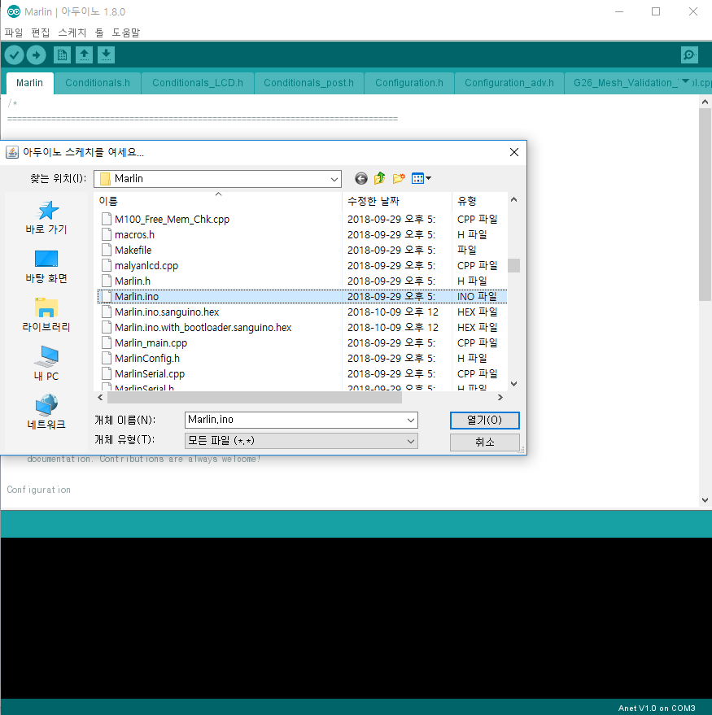
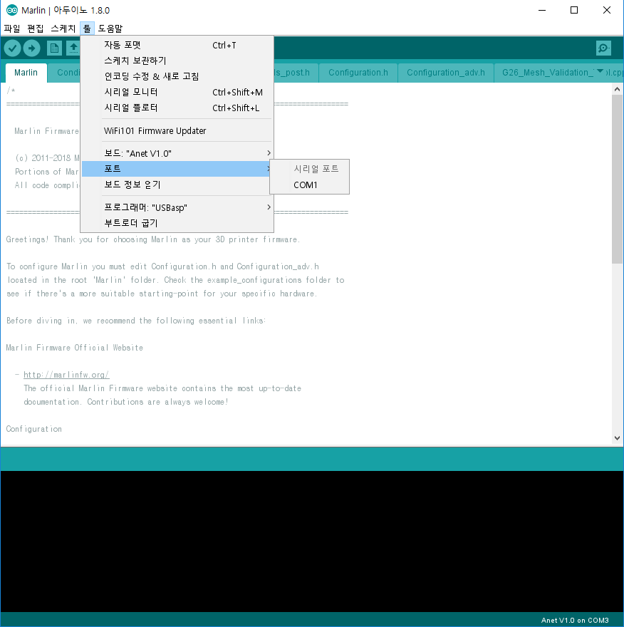
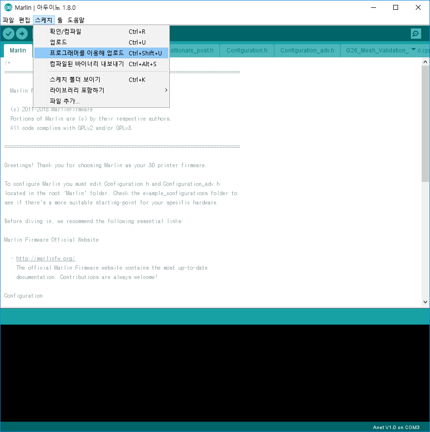

# arduino 1.8 다운로드

anet board 작업된 arduino 1.8 다운로드

[다운로드](https://drive.google.com/open?id=1oH9Ayw3J-aKeqCu6S3Sx4YQjACSP1lep)

arduino에 직접 추가하려면 여기 참고한다. [https://github.com/SkyNet3D/anet-board](https://github.com/SkyNet3D/anet-board)

# 마를린 marlin 소스 다운로드

1. 소스 다운로드 [https://github.com/MarlinFirmware/Marlin/releases](https://github.com/MarlinFirmware/Marlin/releases)

2. anet a8 설정파일 복사

압축풀면 아래의 경로에 Configuration.h Configuration_adv.h 파일을

```
Marlin/example_configurations/Anet/A8/
```

아래 경로로 복사해서 덮어씌운다.

```
Marlin/
```

# Configuration.h 파일 수정

1. 오토레벨링

**오토레벨링 활성**

```c
#define FIX_MOUNTED_PROBE
#define AUTO_BED_LEVELING_LINEAR
```

**앞쪽에 설치 센서 위치설정**

```c
#define X_PROBE_OFFSET_FROM_EXTRUDER -22  // X offset: -left  +right  [of the nozzle]
#define Y_PROBE_OFFSET_FROM_EXTRUDER -36  // Y offset: -front +behind [the nozzle]
#define Z_PROBE_OFFSET_FROM_EXTRUDER 0   // Z offset: -below +above  [the nozzle]
```

**뒤쪽에 설치 센서 위치설정**

```c
#define X_PROBE_OFFSET_FROM_EXTRUDER 18 // X offset: -left +right [of the nozzle]
#define Y_PROBE_OFFSET_FROM_EXTRUDER 58 // Y offset: -front +behind [the nozzle]
#define Z_PROBE_OFFSET_FROM_EXTRUDER 0 // Z offset: -below +above [the nozzle]
```

**오토레벨링 3번터치 영역**

```c
#define LEFT_PROBE_BED_POSITION 20
#define RIGHT_PROBE_BED_POSITION 180 // 195
#define FRONT_PROBE_BED_POSITION 20
#define BACK_PROBE_BED_POSITION 170
```

x축에 tension조절용 모듈이 있을경우 걸릴수 있으므로 좀더 안쪽으로 설정한다. (195->180)

**Z Home일때 항상 베드위에서.. (오토레벨링시 필수)**

```c
#define Z_SAFE_HOMING
```

2. LCD 설정

**2줄 기본 LCD**

```c
#define ZONESTAR_LCD
```

**Full Graphic LCD**

```c
#define ANET_FULL_GRAPHICS_LCD
```

혹시 full graphic 이 안나오면 (reprap discount 를 anet lcd 선연결로 변경했을경우)

pins_ANET_10.h 수정

```c
// 주석처리하고
//#define SERVO0_PIN       29   // free for BLTouch/3D-Touch
//#define BEEPER_PIN       17
//#define LCD_PINS_RS      27
//#define LCD_PINS_ENABLE  28
//#define LCD_PINS_D4      30

// For RepRap Discount (with Anet Adapter wiring)
#define SERVO0_PIN        27 // free for BLTouch/3D-Touch
#define BEEPER_PIN        28
#define LCD_PINS_RS       30
#define LCD_PINS_ENABLE   29
#define LCD_PINS_D4       17
```

# 소스 빌드

1. 다운받은 아두이노 1.8을 실행하고 Marlin/Marlin.ino 파일을 연다.

[](http://note.heyo.me/wp-content/uploads/2018/10/marlin1.png)

2. 보드와 프로그래머 포트를 확인한다.

[](http://note.heyo.me/wp-content/uploads/2018/10/marlin2.png)

3. 펌웨어를 올린다.

CH340 드라이버(usb를 com port로 매핑해주는 드라이버)가 설치되어있어야하며 anet a8가 usb로 연결되어있어야한다.

[](http://note.heyo.me/wp-content/uploads/2018/10/marlin3.png)

OctoPrint를 이용하면 좀더 편하게 펌웨어 업데이트가 가능하다. [https://note.heyo.me/octoprint-로-anet-a8-펌웨어-업데이트하기-marlin-skynet/](https://note.heyo.me/octoprint-로-anet-a8-펌웨어-업데이트하기-marlin-skynet/)
