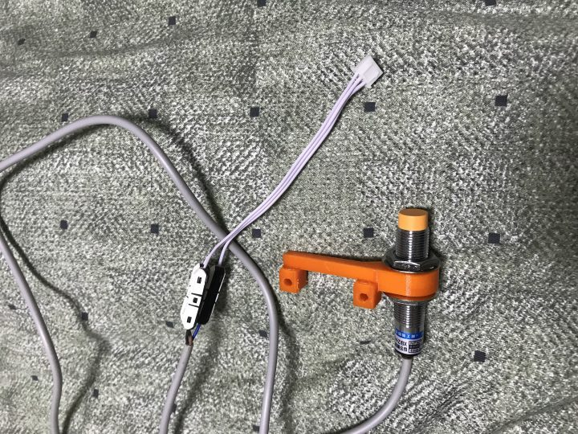
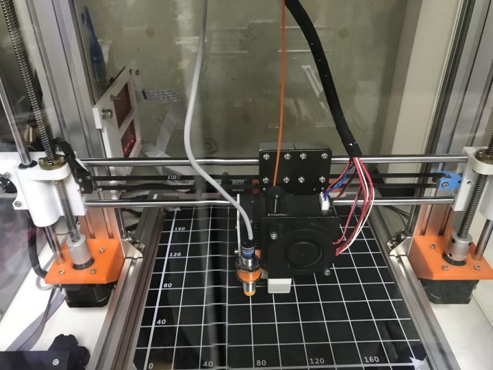
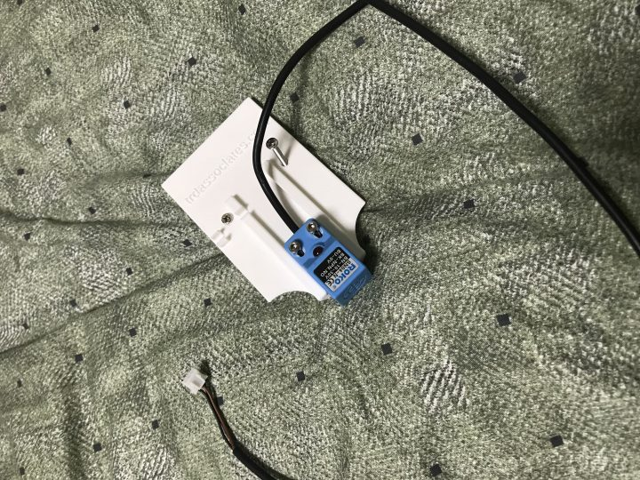

[](http://note.heyo.me/wp-content/uploads/2018/10/7A38DC4C-3184-42C7-96A2-4C04075D17E9-e1538983280458.jpeg)

anet a8 전용 사각 센서에서 LJ12A-4-Z/BX 원형 센서로 변경했다

가장 큰이유는 베드 레벨링 수치가 이상해서 센서를 의심한게 컸고

그것 외에도 전용 센서는 노즐 뒤쪽에 달게 되는게 이게 은근히 불편하다. 위치 조절하기도 쉽지않았고..

무엇보다 생긴게 이게 더 이쁘다.

마음같이서 bltouch를 달고싶었으나 가격이 ㄷㄷ해서.. 이건 나중에 싸지면 달아봐야겠다.

일단 가장 저렴한곳에서 구매하고.. 선작업은 남는 연결선하나 잘라서 납땜없이 연결해주는 I커넥터 3개로 연결했다.

사놓고 방치하다 첨써봤는데 굉장히 깔끔하고 튼튼하다. (내 납땜보다 믿을만할듯)

거치모델은 skynet2.3에 동봉되어있는 모델을 사용했다. 익스트루더 방열판 사이에 정확히 끼워지는 구조라 깔끔하다. [Sensor\_Bracket\_12mm\_Leo](http://note.heyo.me/wp-content/uploads/2018/10/Sensor_Bracket_12mm_Leo.zip)

센서 위치값

```
#define X_PROBE_OFFSET_FROM_EXTRUDER -22  // X offset: -left  +right  [of the nozzle]
#define Y_PROBE_OFFSET_FROM_EXTRUDER -36  // Y offset: -front +behind [the nozzle]
#define Z_PROBE_OFFSET_FROM_EXTRUDER 0   // Z offset: -below +above  [the nozzle]
```

펌웨어도 수정해주고..

[](http://note.heyo.me/wp-content/uploads/2018/10/F646E95A-33A3-446E-8040-1E4740630428-e1538983249177.jpeg)

연결하고 테스트.

기존의 센서보다 인식범위가 더 낮은거 같은거 같은 느낌;; 노즐에서 거의 2mm정도 빼면 적당한듯 싶다.

감지되면 빨간불 들어오는건 좋다.

바로 베드 레벨링 테스트.

와우 똑같음 ㄷㄷ

센서문제는 아니었던걸로... ㅋㅋㅋ

[](http://note.heyo.me/wp-content/uploads/2018/10/3002FDFC-D06B-481A-A3CD-331E43C07B1B-e1538983262571.jpeg)

누명 벗음.
