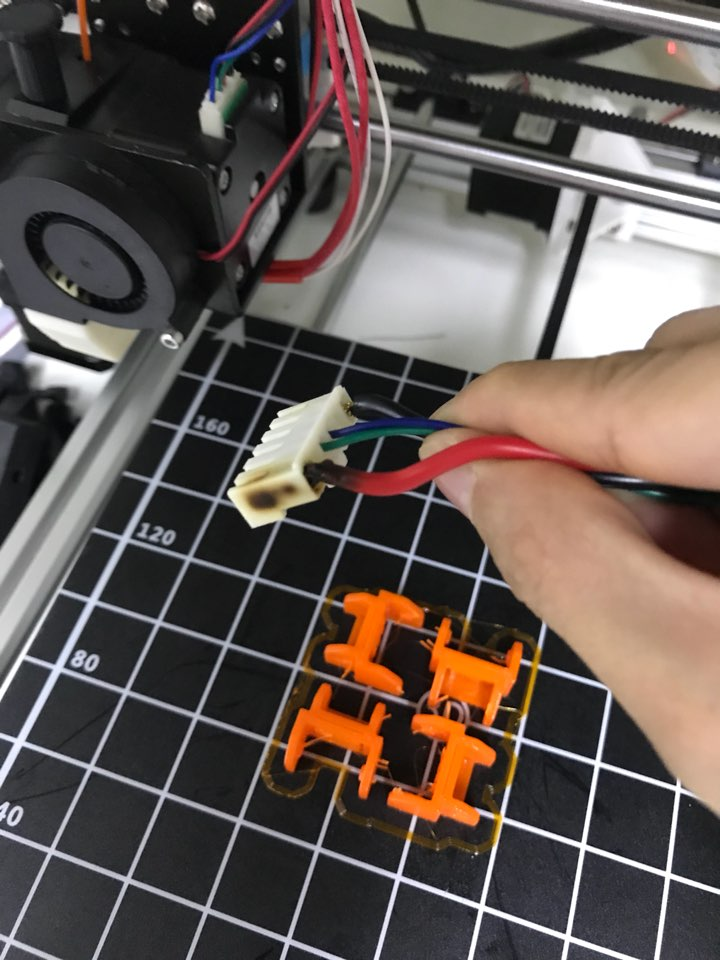
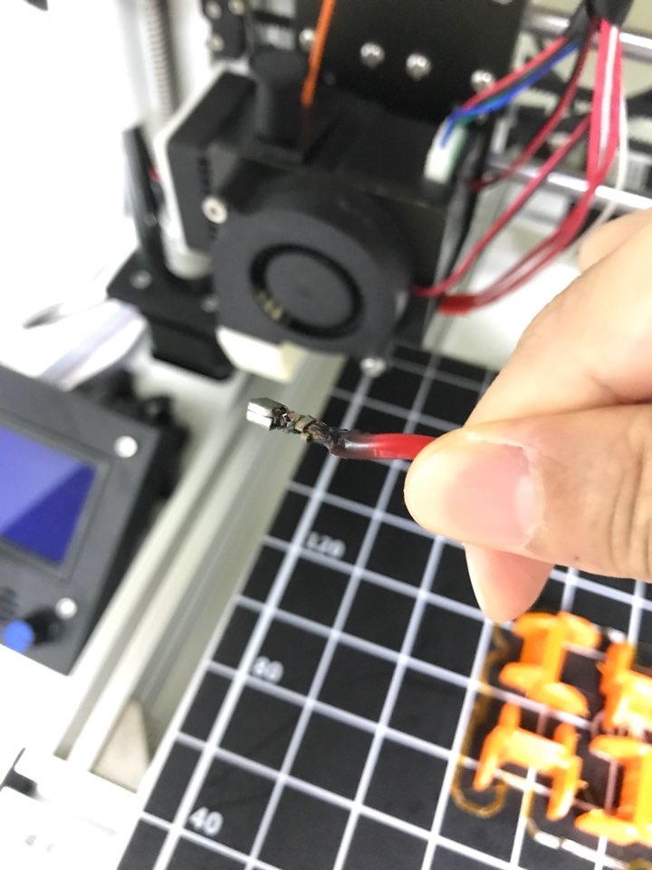
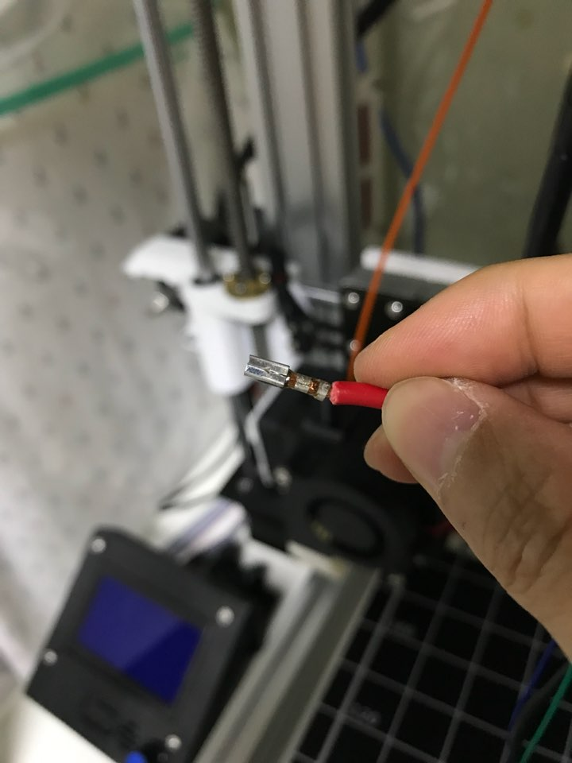
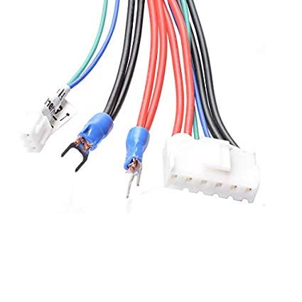

anet a8 히팅베드 케이블단자가 문제가 많다고 익히 들어 알고는 있어서 바꿔야지.. 생각만하고 있었는데..

어제 문득 보니깐 케이블단자가 검게 타있다 ㄷㄷㄷ (그을린것도 아니고 정말 탐;;)

마데인차이나 저가3D프린터는 역시 자나께나 불조심해야한다는걸 새삼 깨달았다;;

일단은.. 해당 핀만 살짝 뽑아서 상태를 확인.

케이블도 역시 탐.

일단 근본적으로 많은사람들이 지적하는 anet a8의 4선만쓰는 케이블 단자의 문제도 있는데 이건 애초에 커넥터가 허술하게 연결된거 같아보인다. 급한데로 잘라내고.. 다른 남는 커넥터를 다시 연결했다.

압착기가 없어서 뺀찌로 최대한 꽉꽉 연결함.

일단은 문제가 없겠지.. 싶은데 불안하긴하다.. (프린팅걸고 만져보니 안뜨겁긴함)

일단 근본적으로 해결하기위해 6선 케이블을 주문했다. 국내에서는 찾지못했고 아마존에서 찾았는데 직배로 2주걸린다고 한다 ㅠㅠ

 [https://www.amazon.com/gp/product/B079FWS9HW/ref=oh\_aui\_detailpage\_o00\_s00?ie=UTF8&psc=1](https://www.amazon.com/gp/product/B079FWS9HW/ref=oh_aui_detailpage_o00_s00?ie=UTF8&psc=1)

기본 케이블과 달리 +선 2개 -선 2개를 전부 연결해서 부하를 반으로 줄여준다. 가장 추천하는 방법이다.

그 외에 히팅베드에 직접 납땜을 하는 방법도 있는데.. 많은 사람들이 납땜을 추천하지 않아서 이 방법은 제외하였다.

> [왜 히팅베드에 납땜하면 안되나요?](http://printing.thorinair.net/post/168146290102/why-you-should-not-solder-to-the-hotbed)

**anet a8 쓰시는 분들은 히팅베드 케이블을 꼭 확인해 보시길..**
