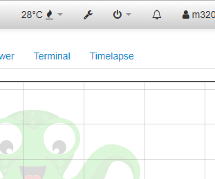

OctoPrint-Enclosure는 상단바에 버튼을 클릭해야만 내부 온도를 확인 할 수 있는데

바로 보여주면 더 편한거 같아서 수정해 보았다.

[](http://note.heyo.me/wp-content/uploads/2018/10/enclo.png)

깔끔하게 수정..하고 싶었으나 이래저래 머리아파서 스크립트를 직접 수정하는 방법으로 진행했다.

ssh(putty)로 octoprint에 접속한다.

octoprint 프로그램 경로로 이동한다.

```bash
cd ~/oprint/lib/python2.7/site-packages/octoprint/static/js/lib
```

자바스크립트 파일을 수정한다.

```bash
nano less.min.js
(혹은 vi less.min.js)
```

마지막줄에 아래 코드를 붙여넣는다.

```
;
var temp_install = setInterval(function () {
  if ($('#navbar_plugin_enclosure_2').length) {
    clearInterval(temp_install)
    $('#navbar_plugin_enclosure_2>a').prepend('<span id="temp_display"></span><span>°C</span>')
    var temp_timer = setInterval(function () {
      $('#temp_display').html(
        $('#navbar')
          .find('span[data-bind="text: temp_sensor_temp, attr: {title: temp_sensor_temp}"]')
          .html()
      )
    }, 3000)
  }
}, 3000)
```

저장하고 나온다.
