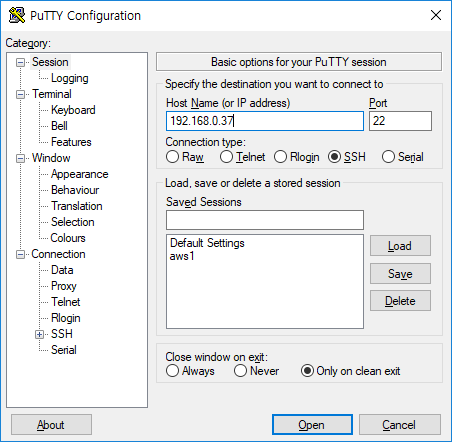
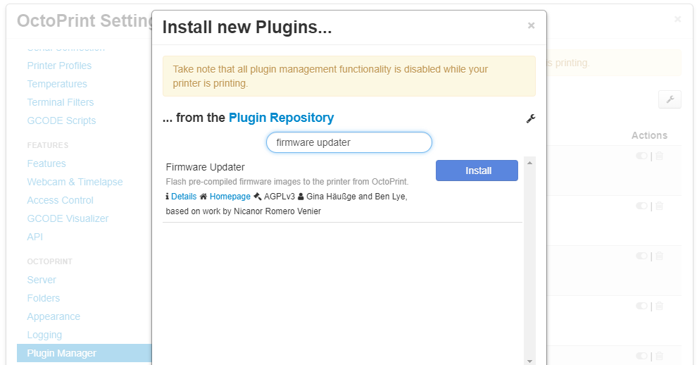
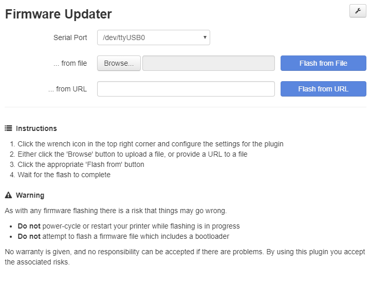
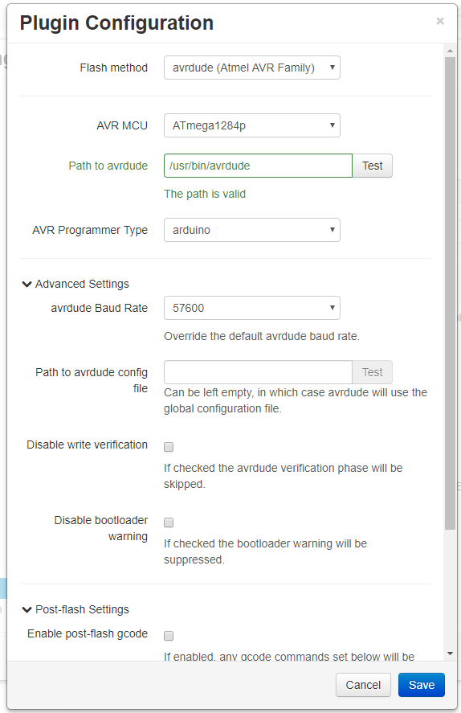
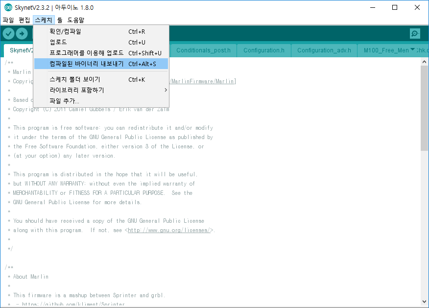
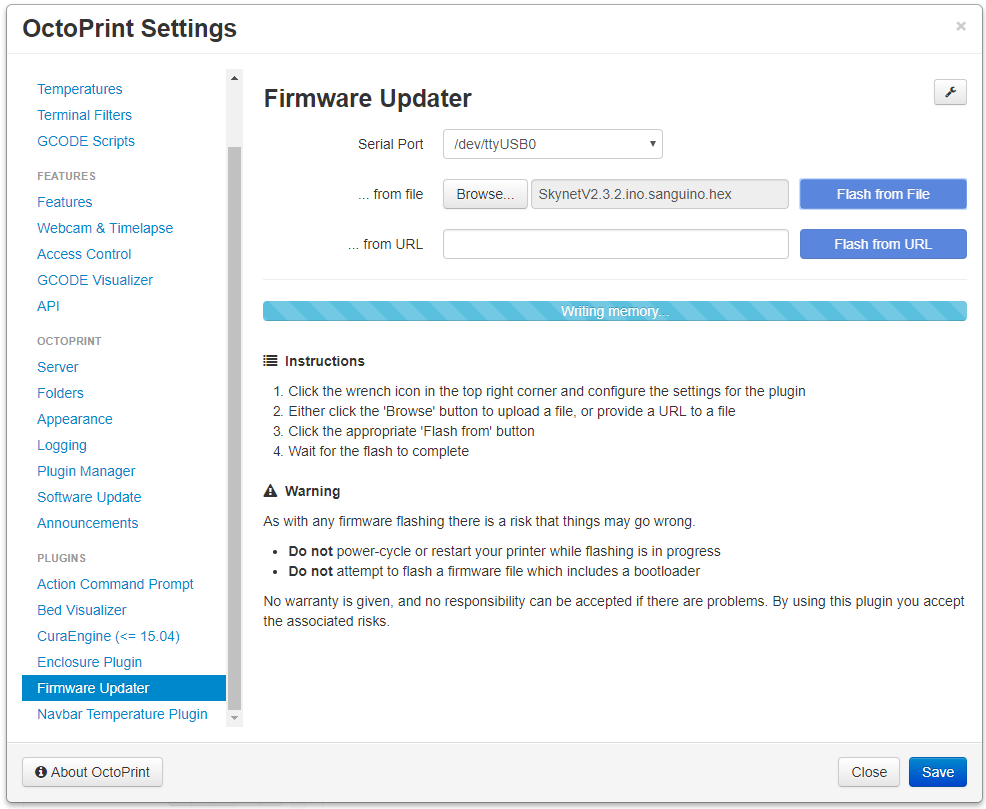

[https://github.com/OctoPrint/OctoPrint-FirmwareUpdater](https://github.com/OctoPrint/OctoPrint-FirmwareUpdater)

플러그인을 이용하여 OctoPrint에서 간편하게 펌웨어 업데이트를 할 수 있다. 펌웨어 올릴때마다 PC 연결하기 귀찮았는데 이걸로 엄청 편해졌다. (챔버에 넣으니 더욱..) marlin, skynet 둘 다 정상적으로 업데이트 되었다.

# OctoPrint(라즈베리파이)에 avrdude 설치

Octoprint에 ssh접속을 한다.

[](http://note.heyo.me/wp-content/uploads/2018/10/putty1.png)

repository를 업데이트하고 avrdude를 설치한다.

```
sudo apt-get update
sudo apt-get install avrdude
```

# OctoPrint 설정

1) OctoPrint 에서 FirmwareUpdater플러그인 설치

Plugin Manager에서 바로 검색하여 설치할 수 있다. [](http://note.heyo.me/wp-content/uploads/2018/10/firmware1.png)

2) FirmwareUpdater설정

FirmwareUpdater플러그인에 설정버튼을 클릭한다. [](http://note.heyo.me/wp-content/uploads/2018/10/firmware2.png)

아래와 같이 설정한다. [](http://note.heyo.me/wp-content/uploads/2018/10/firmware3.png)

연결할때는 band rate를 115200 으로 연결하는데 펌웨어 업데이트 할 때는 57600로 해야 되었다. (나만 그럴수도?) avrdude, ATmega1284p, arduino로 설정한다. (anet a8설정. 다른 프린터라면 해당프린터에 맞게 설정해야한다.)

# 펌웨어 바이너리 파일

아두이노 스케치에서 업로드말고 그 아래 **바이너리 내보내기**를 클릭한다.

[](http://note.heyo.me/wp-content/uploads/2018/10/firmware0.png)

컴파일이 완료되면 해당 ino파일 위치에 **hex파일**이 생성되어있다.

```
SkynetV2.3.2.ino.sanguino.hex
SkynetV2.3.2.ino.with_bootloader.sanguino.hex
```

SkynetV2.3.2.ino.sanguino.hex 파일을 업로드하면 된다.

[](http://note.heyo.me/wp-content/uploads/2018/10/firmware5.png)

먼저 OctoPrint에서 프린터가 Connect 되어있다면 Disconnect를 누르고 진행한다. FirmwareUpdater에서 ...from file 에 SkynetV2.3.2.ino.sanguino.hex 파일을 선택하고 **Flash from File**을 클릭한다.

업데이트가 진행되고 완료되면 프린터가 재시작한다.
