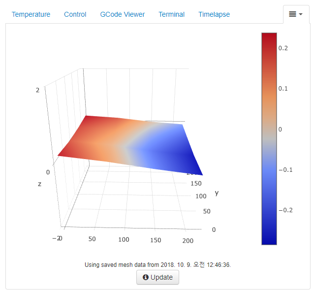
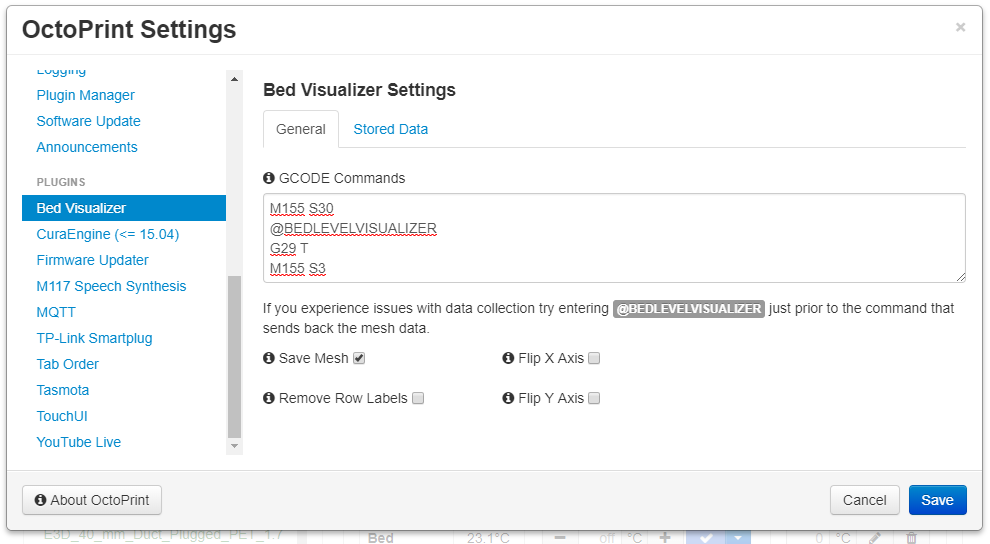
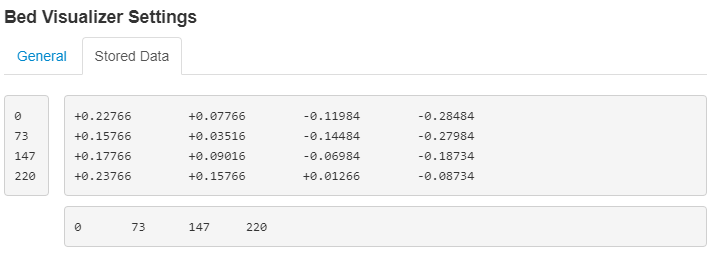

베드 레벨링 상태를 3차원 그래프로 표현해주는 Octoprint 플러그인이다. 오토레벨링이 제대로 동작하는지 점검할때도 좋은거 같다. 플러그인 매니저에서 검색 설치하면 된다.

[](http://note.heyo.me/wp-content/uploads/2018/10/bedvisualizer.png)

[](http://note.heyo.me/wp-content/uploads/2018/10/settings_general.png) 오토레벨링을 시작하는 gcode이다.

```
M155 S30
@BEDLEVELVISUALIZER
G29 T
M155 S3
```

[](http://note.heyo.me/wp-content/uploads/2018/10/bedvisualizer2.png) rawdata이다. 나의 경우 현재 4점 측정으로 4x4의 rawdata가 저장되어있다.

수치로는 헷갈릴수 있는데 3차원 그래프로 보면 직관적으로 볼 수 있다.

..근데 내 베드 상태는 왜저럼

저정도 까진 아닐텐데 좀 과장되서 보여주는거 같다.
