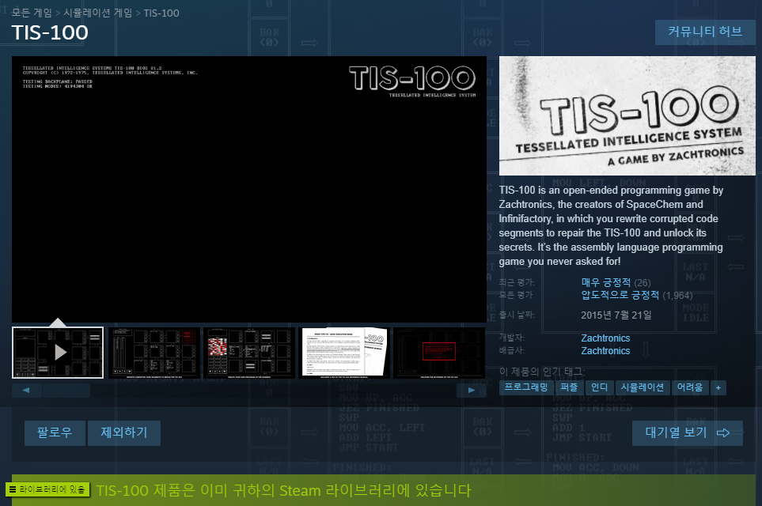
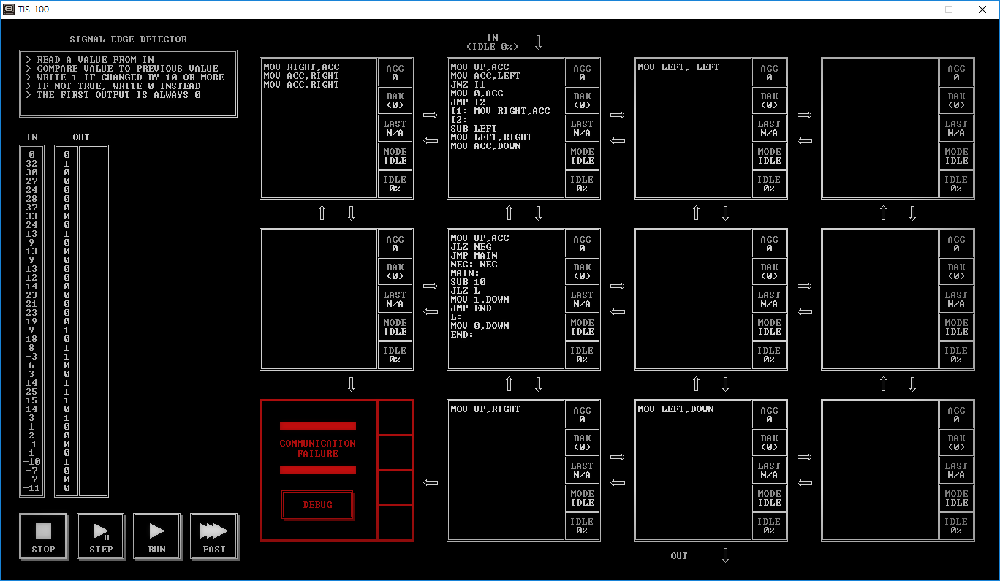

 [https://store.steampowered.com/app/370360](https://store.steampowered.com/app/370360)

간단한 어셈블리 코드로 퍼즐을 푸는게임이다. 프로그래밍하는 맛도나고 한정적인 코드 몇개로 구성하는거라 그렇게 복잡하지도 않다. 프로그래밍에 관심있는 일반인도 즐길수 있을거 같다.

한글화가 아니라는게 좀 아쉬운데 스토리적인 요소는 거의없으니 큰 문제는 없다. 스테이지 구성으로 입력값을 어셈 코드를 배치시켜서 원하는 출력으로 내보내면 클리어되는 구성이다.

그래픽 요소만 없을 뿐 전형적인 퍼즐게임이다.

스팀평가도 무려 "압도적 긍정적"이다. 아마도 애초에 이걸 산사람들이라면.. ㅋ

가격은 저렴하지만.. 출시된지는 꽤 되었으니 제값을 주고 사긴 그렇고 할인할 때를 노려보는게 좋을거 같다. 나도 할인할때삼.

스페이지는 이런식이다. 왼쪽 위에 퍼즐문제가 나온다. "입력값을 받아서 이전 입력값과 10이상 차이가 나면 1을 아니면 0을 출력하라"라는 문제이다. 왼쪽에 친절하게 나와야하는 출력값도 나와있다. 스테이지 초반이고 뒤도갈수록 더 기발하고 재밌는 문제가 많이 나온다.
