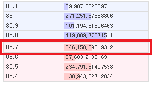

# 자동 손절 프로그램

업비트는 스탑로스을 지원하지 않는다. 프로그램으로 구현해보자.

## 업비트 웹소켓 API

[업비트 API문서](https://docs.upbit.com/docs/upbit-quotation-websocket) 추가적으로 웹소켓API 을 사용한다. 이것을 이용해서 실시간 체결 정보(현재가격)를 가져온다.

**auto_cut.js**

```js
const WebSocket = require('ws')
const Upbit = require('./upbit_lib')
const timeout = (ms) => new Promise((res) => setTimeout(res, ms))

const upbit = new Upbit('secret-key', 'access-key')

let trades = {}

let cutList = []
cutList.push({
  market: 'KRW-TRX',
  cut_price: 41.6,
  volume: 3.3,
})
cutList.push({
  market: 'KRW-STEEM',
  cut_price: 437,
  volume: 5,
})

function tradeServerConnect(codes) {
  var ws = new WebSocket('wss://api.upbit.com/websocket/v1')
  ws.on('open', () => {
    console.log('trade websocket is connected')
    ws.send('[{"ticket":"fiwjfoew"},{"type":"trade","codes":[' + codes + ']},{"format":"SIMPLE"}]')
  })
  ws.on('close', () => {
    console.log('trade websocket is closed')
    setTimeout(function () {
      console.log('trade 재접속')
      tradeServerConnect(codes)
    }, 1000)
  })
  ws.on('message', (data) => {
    try {
      var str = data.toString('utf-8')
      var json = JSON.parse(str)
      trades[json.cd] = json
    } catch (e) {
      console.log(e)
    }
  })
}

function searchLoop(market) {
  // 현황 (10초 반복)
  setInterval(async () => {
    if (!trades[market]) return
    if (!trades[market].tp) return
    let tradePrice = parseFloat(trades[market].tp)
    if (!tradePrice) return

    for (let item of cutList) {
      if (item.market == market) {
        console.log(
          '[',
          market,
          '손절가',
          item.cut_price,
          '현재가',
          tradePrice,
          '(' + (tradePrice - item.cut_price).toFixed(2) + ')',
          ']'
        )
      }
    }
  }, 10000)

  // 손절처리 (1초 반복)
  setInterval(async () => {
    if (!trades[market]) return
    if (!trades[market].tp) return
    let tradePrice = parseFloat(trades[market].tp)
    if (!tradePrice) return

    // cutList에서 손절대상 찾기
    let found = cutList.findIndex((el) => {
      return el.market == market && el.cut_price >= tradePrice
    })
    // 찾았으면..
    if (found != -1) {
      console.log('손절처리!')
      console.log('tradePrice:' + tradePrice)

      let json
      json = await upbit.trade_orderbook(cutList[found].market)
      if (!json.success) {
        console.log('upbit.trade_orderbook')
        console.log(json.message)
        return
      }

      let sellPrice = json.data[0].orderbook_units[0].bid_price
      console.log('sellPrice:' + sellPrice)

      console.log('--order_ask')
      json = await upbit.order_ask(cutList[found].market, cutList[found].volume, sellPrice)
      //json = {success:true}
      if (json.success) {
        cutList.splice(found, 1)
        console.log('처리완료!')
        console.log(cutList)
      } else {
        console.log(json.name)
        console.log(json.message)
      }
    }
  }, 1000)
}

async function start() {
  let { data: markets } = await upbit.market_all()

  console.log('마켓수:' + markets.length)

  let code_list = []
  for (let item of markets) {
    // KRW-ETH BTC-ETH ..
    let [currency, coin] = item.market.split('-')
    // 원화만
    if (currency != 'KRW') continue

    trades[item.market] = {}
    code_list.push('"' + item.market + '"')

    searchLoop(item.market)
  }
  console.log('원화마켓수:' + code_list.length)

  // 체결 서버 접속
  tradeServerConnect(code_list.join(','))
}

start()
```

`cutList`변수에 손절 정보를 설정해둔다.

```
market: 'KRW-TRX', -> 마켓코드 트론(TRX) 원화마켓
cut_price: 41.6,   -> 손절가격
volume: 3.3        -> 수량
```

현재가격이 41.6원보다 낮아지면 3.3개를 매도하도록 설정했다.

`tradeServerConnect`함수에서는 업비트 웹소켓서버에 접속하여 실시간으로 가격정보를 가져온다. 소켓 연결 종료시 자동으로 재접속한다. `trades`변수에 가상화폐별로 가격정보를 저장한다. `json.cd`에 마켓코드가 들어오고 `json.tp`에 현재가격이 들어온다. 자세한 정보는 업비트API 문서 참조. 웹소켓은 `ws` 모듈을 사용했다.

`searchLoop` 반복함수 설정. 가상화폐마다(`market`) 10초반복함수, 1초반복함수를 실행한다. 10초반복함수는 현황을 보여줄거고 1초반복함수는 가격비교와 매도작업을 한다. 실시간으로 저장되는 현재가격정보 `trades[market]` 으로 손절할 목록을 찾는다. 찾으면 손절처리를 하는데 이때 바로 판매하기 위해서 호가창 API `trade_orderbook` 를 이용해서 판매가격을 결정한다. (아직 API에서 시장가판매를 지원하지 않는다..)

[](http://note.heyo.me/wp-content/uploads/2019/06/orderbooks.png)

표시한 가격이 `data[0].orderbook_units[0].bid_price` 이다. 이 가격으로 매도 `order_ask` 한다. 지금은 단순하게 가격만 정했지만 실제로는 수량을 비교해서 수량이 충분한 가격으로 정해야한다. 호가창 그림에서 85.7원에 246,158개가 있는데 판매해야하는 수량이 250,000개라면 그 다음 가격인 85.6원으로 판매해야 수량이 확보된다. 호가의 수량은 `data[0].orderbook_units[0].bid_size`에 있다. 이를 이용해서 구해보면..

```
// 판매가격 찾기
let bid_index = 0
let sum_bid_size = 0
for (let unit of json.data[0].orderbook_units) {
    sum_bid_size += unit.bid_size
    if (sum_bid_size > cutList[found].volume) {
        break
    }
    bid_index++
}
// bid_index 번째에 있는 가격으로 팔아야 수량 확보
let sellPrice = data[0].orderbook_units[bid_index].bid_price
```

`start`함수 api market_all를 이용하여 마켓(가상화폐)목록을 가져와서 이 목록으로 tradeServerConnect, searchLoop 함수를 호출한다. KRW만 필터링해서 원화마켓 가상화폐만을 대상으로 한다.

**실행결과**

```bash
ubuntu@ip-x:~/app/upbit$ node auto_cut.js
마켓수:336
원화마켓수:86
trade websocket is connected
[ KRW-STEEM 손절가 437 현재가 452 (15.00) ]
[ KRW-TRX 손절가 41.6 현재가 42.3 (0.70) ]
[ KRW-STEEM 손절가 437 현재가 451 (14.00) ]
[ KRW-TRX 손절가 41.6 현재가 42.3 (0.70) ]
[ KRW-STEEM 손절가 437 현재가 451 (14.00) ]
[ KRW-TRX 손절가 41.6 현재가 42.3 (0.70) ]
[ KRW-STEEM 손절가 437 현재가 451 (14.00) ]
[ KRW-TRX 손절가 41.6 현재가 42.2 (0.60) ]
[ KRW-STEEM 손절가 437 현재가 451 (14.00) ]
...
```

다음에는 간단한 시세알림봇을 만들어보자.
