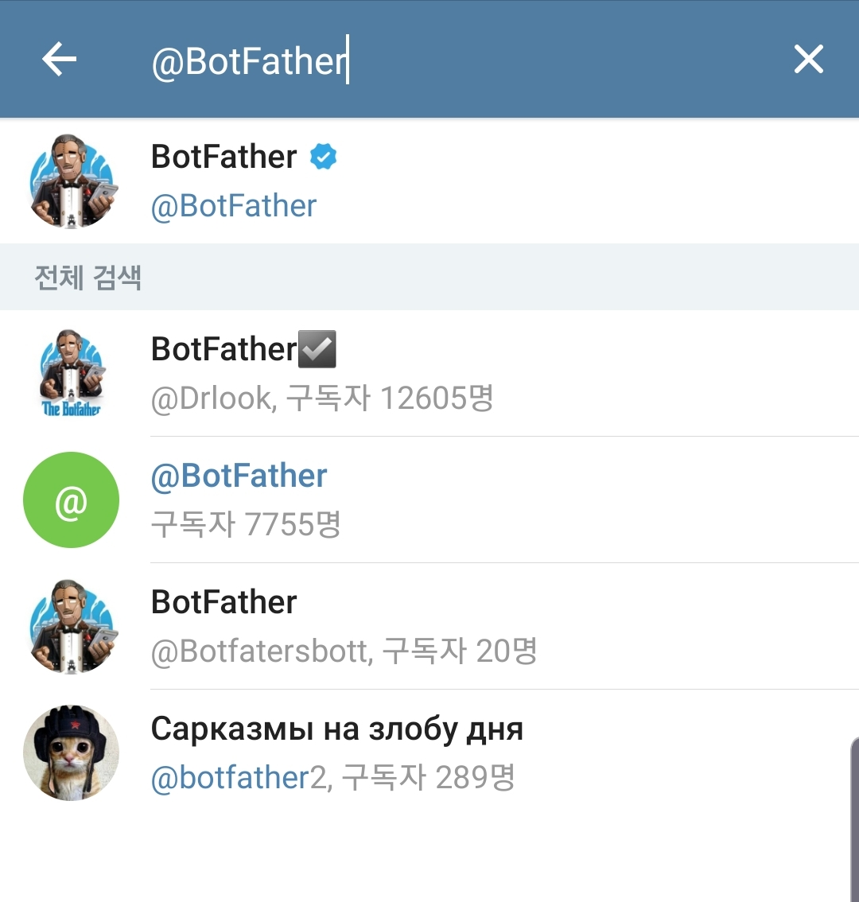
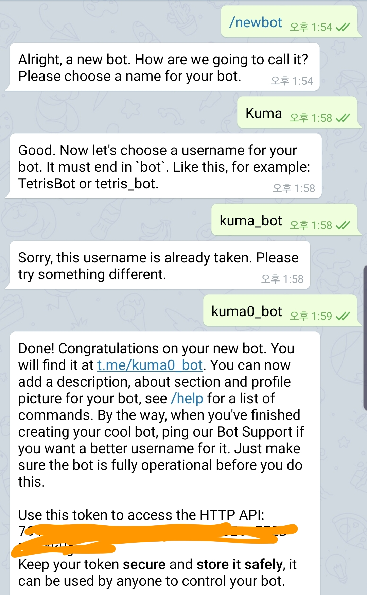
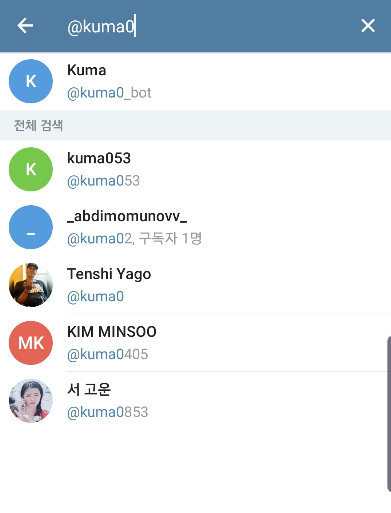
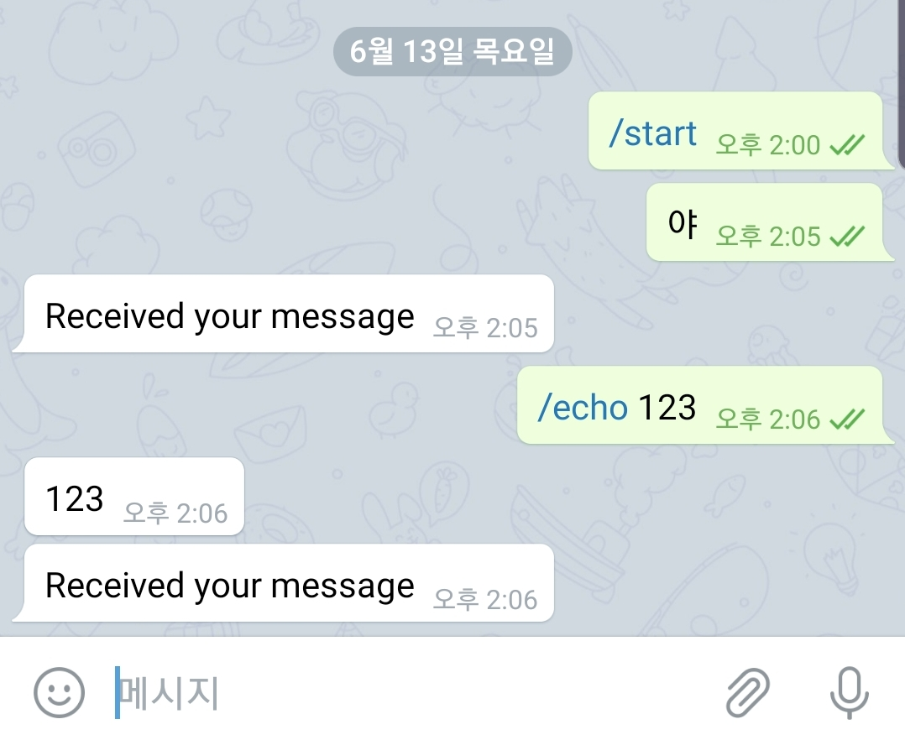
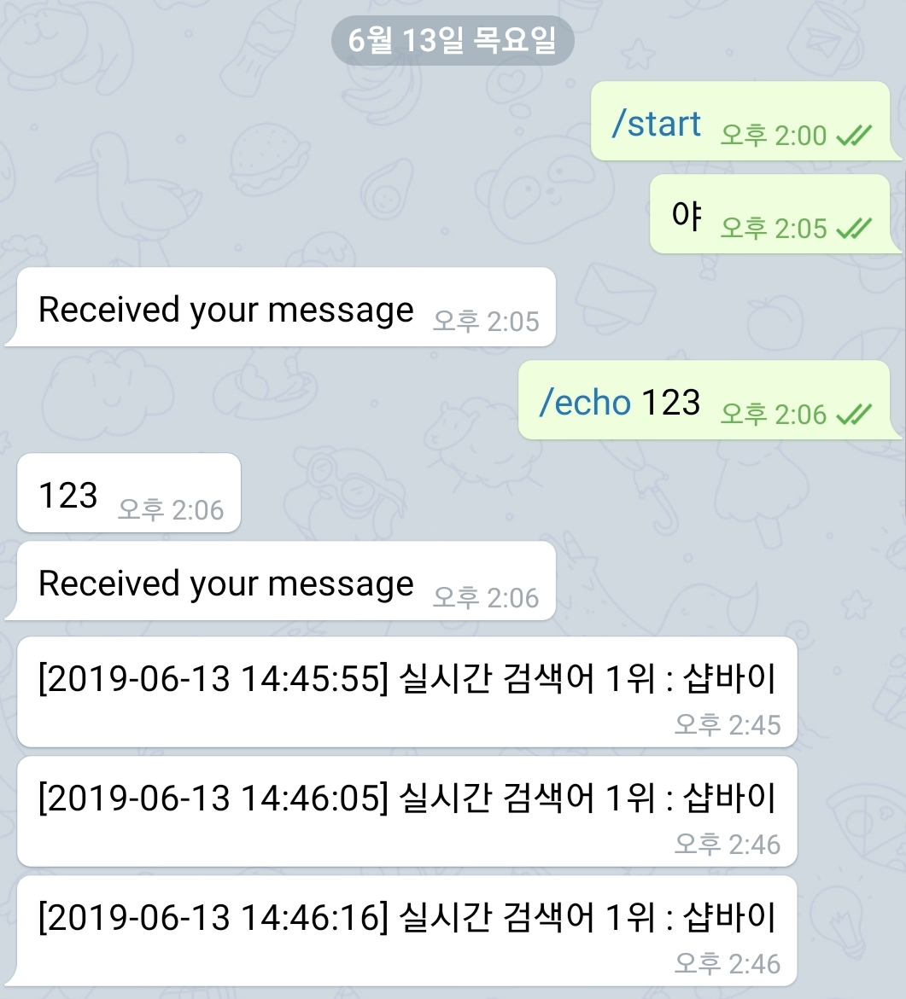

# 텔레그램(Telegram) 봇 만들기

보안 메세지로 유명한 **텔레그램(Telegram)**은 **공식적으로** 봇(bot)을 지원한다. 만드는 방법도 매우 간단하다. 다양한 용도로 사용할 수 있으며 스마트폰이나 PC에 알림메세지를 push하는 용도로만 사용해도 유용하다.

## 텔레그램에서 봇 만들기

먼저 **@BotFather**를 추가한다.

[](http://note.heyo.me/wp-content/uploads/2019/06/KakaoTalk_20190613_141154934.jpg)

`/newbot` 기능을 이용해서 봇을 등록한다. 이름과 아이디를 입력하면된다. 이때 생성되는 Token으로 api를 이용한다.

[](http://note.heyo.me/wp-content/uploads/2019/06/KakaoTalk_20190613_140247878.jpg)

생성한 봇을 추가한다. @아이디 여기서는 **kuma0\_bot** 으로 만들었다.

[](http://note.heyo.me/wp-content/uploads/2019/06/KakaoTalk_20190613_140248352.jpg)

## 테스트 프로그램

**node-telegram-bot-api** 모듈을 이용해서 테스트 프로그램을 만든다.

**test\_bot.js**

```
//process.env.NTBA_FIX_319 = 1

const TelegramBot = require('node-telegram-bot-api')
const timeout = ms => new Promise(res => setTimeout(res, ms))

const token = '[발급받은 token]'
const telebot = new TelegramBot(token, {polling: true})

// Matches "/echo [whatever]"
telebot.onText(/\/echo (.+)/, (msg, match) => {
    // 'msg' is the received Message from Telegram
    // 'match' is the result of executing the regexp above on the text content
    // of the message

    const chatId = msg.chat.id;
    const resp = match[1]; // the captured "whatever"

    // send back the matched "whatever" to the chat
    telebot.sendMessage(chatId, resp);
});

// Listen for any kind of message. There are different kinds of
// messages.
telebot.on('message', (msg) => {
    const chatId = msg.chat.id;

    console.log('chatId:'+chatId);
    // send a message to the chat acknowledging receipt of their message
    telebot.sendMessage(chatId, 'Received your message');
});
```

`onText`로 명령어를 입력받을때 사용한다. 기본적으로 모든 메세지는 `message 이벤트`로 입력받는다. 자세한 내용은 [node-telegram-bot-api](https://www.npmjs.com/package/telegram-bot-api) 참고

node test\_bot.js 실행

```
node-telegram-bot-api deprecated Automatic enabling of cancellation of promises is deprecated.
In the future, you will have to enable it yourself.
See https://github.com/yagop/node-telegram-bot-api/issues/319. module.js:653:30
```

버전에따라 promise관련 메세지가 뜨기도하는데 무시해도 큰상관은 없다. 보기싫으면 첫줄 주석을 푼다.

```
process.env.NTBA_FIX_319 = 1
```

프로그램을 실행했으면 텔레그램에서 bot에게 메세지를 입력해서 테스트해본다.

[](http://note.heyo.me/wp-content/uploads/2019/06/KakaoTalk_20190613_140717294.jpg)

실행결과

```
ubuntu@ip-x:~/app/test$ node test_tele.js
node-telegram-bot-api deprecated Automatic enabling of cancellation of promises is deprecated.
In the future, you will have to enable it yourself.
See https://github.com/yagop/node-telegram-bot-api/issues/319. module.js:653:30
chatId:756410385
chatId:756410385
```

여기서 출력한 chatId는 채팅방의 id이다. 여기에서는 개인채팅의 채팅방 id이지만 채널에서 메세지를 받는다면 채널방의 ID이다. 이것을 이용해서 채널에 메세지를 보낼수도 있다.

## 네이버 실검순위 알람

request와 cheerio를 이용해서 주기적으로 네이버 실검순위를 가져온다.

**trend\_alarm.js**

```
process.env.NTBA_FIX_319 = 1

const moment = require('moment')
const cheerio = require('cheerio')
const rp = require('request-promise')
const TelegramBot = require('node-telegram-bot-api')
const timeout = ms => new Promise(res => setTimeout(res, ms))

const token = '[발급받은 token]'
const telebot = new TelegramBot(token, {polling: true})

// Matches "/echo [whatever]"
telebot.onText(/\/echo (.+)/, (msg, match) => {
    // 'msg' is the received Message from Telegram
    // 'match' is the result of executing the regexp above on the text content
    // of the message

    const chatId = msg.chat.id;
    const resp = match[1]; // the captured "whatever"

    // send back the matched "whatever" to the chat
    telebot.sendMessage(chatId, resp);
});

// Listen for any kind of message. There are different kinds of
// messages.
telebot.on('message', (msg) => {
    const chatId = msg.chat.id;

    console.log('chatId:'+chatId);
    // send a message to the chat acknowledging receipt of their message
    telebot.sendMessage(chatId, 'Received your message');
});

async function trendAlarm() {
    // 네이버 실검 가져오기
    const $ = await rp({
        uri: 'https://www.naver.com',
        headers: {
            'Content-Type': 'text/html',
            'Connection': 'Keep-Alive',
        },
        transform: function (body) {
            return cheerio.load(body);
        }
    })

    let ah_item = $('div.PM_CL_realtimeKeyword_rolling_base .ah_item').first()
    let trend = ah_item.find('.ah_k').text()
    console.log(trend)

    let msg = '['+moment().format('YYYY-MM-DD HH:mm:ss')+'] 실시간 검색어 1위 : ' + trend
    telebot.sendMessage(756410385, msg);

    // 10초후에 재호출
    setTimeout(async () => {
        await trendAlarm()
    }, 10000)
}

(async () => {
    await trendAlarm()
})()
```

`trendAlarm`함수가 추가되었다. 네이버 실시간 검색어를 네이버 첫페이지에서 긁어온다.

받은메세지

[](http://note.heyo.me/wp-content/uploads/2019/06/KakaoTalk_20190613_144716577.jpg)
