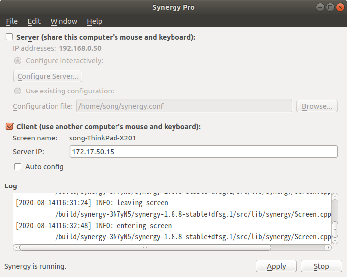
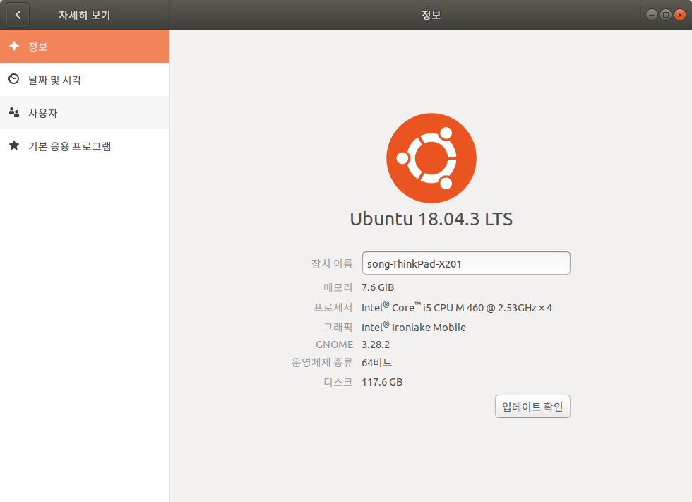
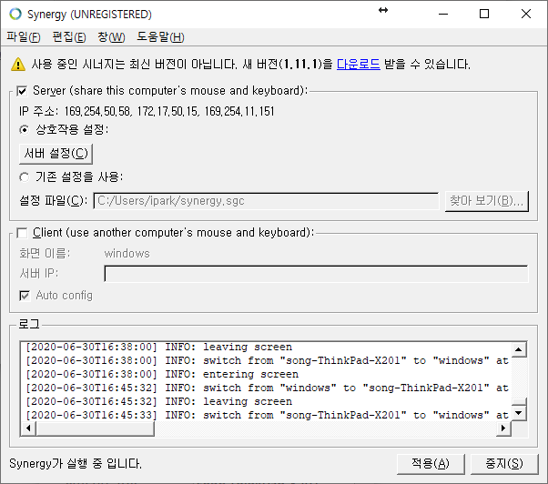
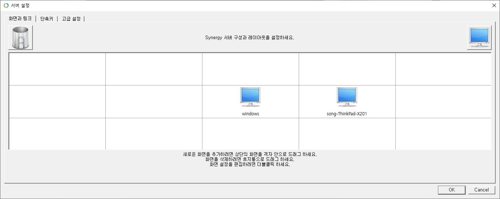

## 무료버전 다운로드

[https://sourceforge.net/projects/synergy-stable-builds/](https://sourceforge.net/projects/synergy-stable-builds/)

## 우분투 설정 (클라이언트)

1) 클라이언트 선택, 서버 IP 설정

2) 컴퓨터 이름 확인

## 윈도우 설정 (서버)

1) 서버 선택

2) 서버 설정, 클라이언트 위치를 조정한다.

3) 시작
