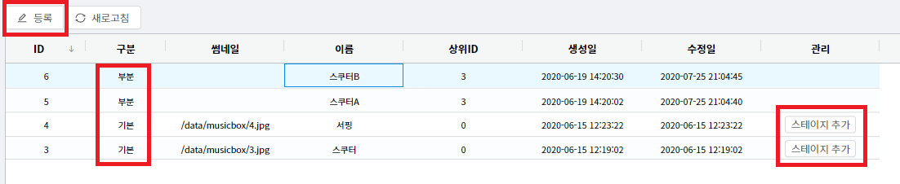
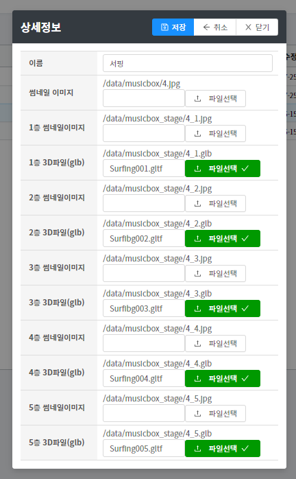
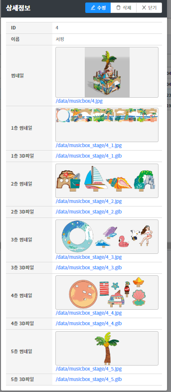
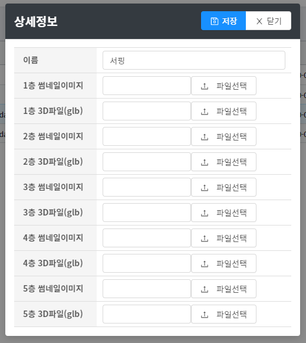
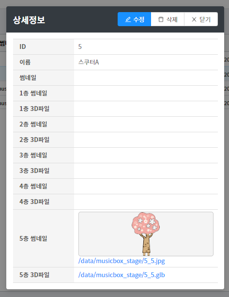

# 서비스 구성

1. 웹호스팅 환경 (cafe24)

php 7.3, mysql 5.3

2. 주요 프레임워크

**Slim Framework 3**, Eloquent ORM **React**, Ant-design, Material-UI

# 웹서버 폴더 구성

`/api` : API (Slim Framework 3, php 7.3) `/admin` : 관리자 (React) `/front` : 홈페이지 (React) `/data` : 파일 스토리지 (이미지,3D파일)

## .htaccess 라우트 설정

```apacheconf
<IfModule mod_headers.c>
    Header set Access-Control-Allow-Origin "*"
</IfModule>
<IfModule mod_rewrite.c>
RewriteEngine on
RewriteRule ^data/ - [L]
RewriteRule ^front/index\.html$ - [L]
RewriteRule ^$ front/index.html [L]
RewriteRule ^index.html$ front/index.html [NC,L]
# Don’t rewrite files or directories
RewriteCond %{REQUEST_FILENAME} -f [OR]
RewriteCond %{REQUEST_FILENAME} -d
RewriteRule ^ - [L]
# Rewrite everything else to index.html to allow html5 state links
RewriteRule ^ front/index.html [L]
</IfModule>
```

# 오르골(뮤직박스) 등록

## 리스트 화면 설명

[](http://note.heyo.me/wp-content/uploads/2020/10/1.png)

1. 구분 1) 기본 : 모든 부품이 있는 온전한 뮤직박스 세트 2) 부분 : 일부 부품만 등록된 뮤직박스 (위 목록에서는 나무만 추가로 등록된 상황)
2. 등록 새로운 뮤직박스를 등록할경우 사용한다. (기본으로 등록됨)
3. 스테이지 추가 부분 부품을 추가 등록할경우에 사용한다. (부분으로 등록됨)

## 뮤직박스 등록 (기본)

등록 버튼을 눌러서 등록창을 연다.

[](http://note.heyo.me/wp-content/uploads/2020/10/2.png)

1. 이름 고유 명칭이다. 조합코드에 이용된다. (예시 "서핑-서핑-서핑-서핑-서핑")
2. 썸네일이미지 완성된 뮤직박스의 썸네일이미지
3. 각층 썸네일이미지 부품을 선택할때 쓰이는 이미지
4. 각층 3D파일 부품의 3D파일 (glb, gltf)

모든 항목을 선택하고 저장한다.

[](http://note.heyo.me/wp-content/uploads/2020/10/4.png)

모든 항목이 저장된 모습이다.

## 뮤직박스 등록 (부분)

스테이지 추가 버튼을 눌러서 등록창을 연다.

[](http://note.heyo.me/wp-content/uploads/2020/10/5.png)

추가할 부품만 선택해서 저정한다.

[](http://note.heyo.me/wp-content/uploads/2020/10/3.png)

5층만 추가로 등록한 모습이다.
