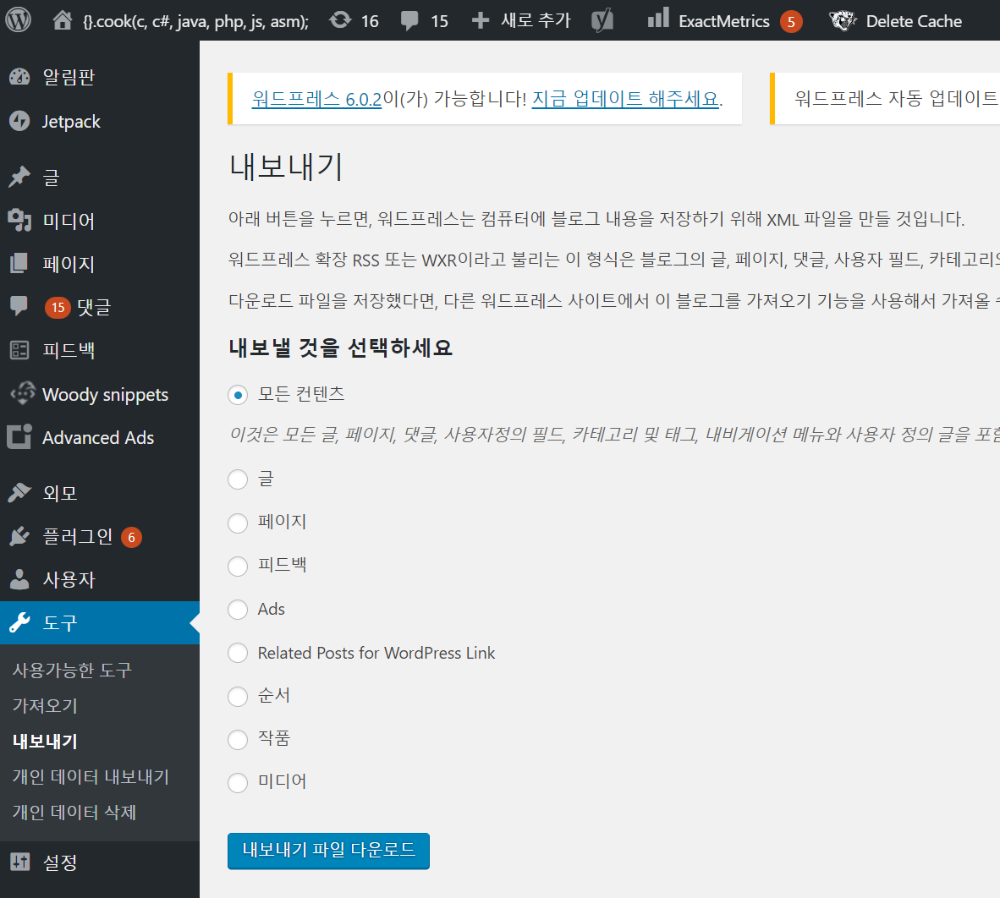
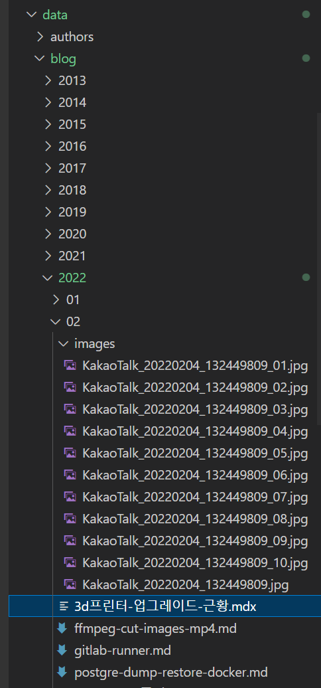

트렌드에 맞춰 github 을 이용한 블로그를 만들어 보자.\
cms는 github를 이용하고 블로그 서비스는 next.js를 사용한다.\
적당한 next.js blog starter를 수정해서 만들어본다(많다;)\
그리고 기존의 wordpress 블로그도 이전해본다

## 장단점

- 장점

1. github를 headless cms처럼 이용하고 서비스는 vercel를 이용하므로 지금처럼 별도로 서버호스팅(웹호스팅)을 할 필요가 없다.
2. ssg로 서비스되는 만큼 wordpress 대비 훨씬 빠르다.

- 단점

1. wordpress의 다양한 플러그인을 못씀.
2. 관리자 웹페이지에서 글을 뚝딱뚝딱 못씀.

- 장점2

1. md,mdx(markdown)형식의 파일 vscode에서 편집하기 너무 편하다.
   작성중에도 code format, syntax highlight등이 지원되고
   프리뷰 split해서 띄워놓으면 프리뷰도 실시간으로 볼 수 있다.

## 순서

1. 기존 wordpress 데이터 내려받기
2. next.js 블로그 만들기
3. 새로운 블로그에 데이터 이관
4. 블로그 프로그램 수정

## 1. 기존 wordpress 데이터 내려받기

wordpress 관리자 도구에서 export 한다.



\*export 한 xml 으로 데이터를 끌어온다.

[wordpress-export-to-markdown](https://github.com/lonekorean/wordpress-export-to-markdown) 을 이용했는데.. wordpress에서도 md를 사용해서 그런건지 큰문제없이 끌어왔다.

받아서 실행한다.

```bash
git clone https://github.com/lonekorean/wordpress-export-to-markdown
cd wordpress-export-to-markdown
yarn
node index.js
```

데이터 구조는 기존에 wordpress 구조대로 만들었다. 이미지는 글이 있는 month 아래에 images 밑에 생성되도록 했다.

```
[year]
  [month]
    [post].md
    images
      [image].jpg

2020
  01
    nextjs-github-blog-만들기.md
    images
      이미지1.jpg
      이미지2.jpg
```

## 2. next.js 블로그 만들기

[tailwind-nextjs-starter-blog](https://github.com/timlrx/tailwind-nextjs-starter-blog) 을 이용하기로 했다.
이름그대로 next.js와 tailwind css를 이용해서 만들어졌다. markdown, code highlighting 을 지원한다.

/data/blog 밑에 모든 md, mdx 파일을 glob해서 /blog/[제목] 으로 생성하고 있다.

받아서 설치해본다.

```bash
git clone https://github.com/timlrx/tailwind-nextjs-starter-blog
cd tailwind-nextjs-starter-blog
yarn install
yarn dev
```

data/siteMetadata.js 를 간단하게 수정해보자

```js
const siteMetadata = {
  title: '{}.cook(...)',
  author: 'MKSong',
  headerTitle: '{}.cook(...)',
  description: '정리, 공부, 연습, 즐겨찾기',
  language: 'ko-kr',
  theme: 'system', // system, dark or light
  siteUrl: 'https://note.heyo.me',
  siteRepo: 'https://github.com/m320ng/blog-app',
  siteLogo: '/static/images/logo.png',
  image: '/static/images/avatar.png',
  ...
}
```

.env.example {'->'} .env 복사한다.

.env 나중에 giscus를 이용하려면 여기에 입력하면 된다.

```properties
NEXT_PUBLIC_GISCUS_REPO=[repo]
NEXT_PUBLIC_GISCUS_REPOSITORY_ID=[repo id]
NEXT_PUBLIC_GISCUS_CATEGORY=[category]
NEXT_PUBLIC_GISCUS_CATEGORY_ID=[category id]
NEXT_PUBLIC_UTTERANCES_REPO=
NEXT_PUBLIC_DISQUS_SHORTNAME=

MAILCHIMP_API_KEY=
MAILCHIMP_API_SERVER=
MAILCHIMP_AUDIENCE_ID=

BUTTONDOWN_API_URL=https://api.buttondown.email/v1/
BUTTONDOWN_API_KEY=

CONVERTKIT_API_URL=https://api.convertkit.com/v3/
CONVERTKIT_API_KEY=
// curl https://api.convertkit.com/v3/forms?api_key=<your_public_api_key> to get your form ID
CONVERTKIT_FORM_ID=

KLAVIYO_API_KEY=
KLAVIYO_LIST_ID=

REVUE_API_URL=https://www.getrevue.co/api/v2/
REVUE_API_KEY=

EMAILOCTOPUS_API_URL=https://emailoctopus.com/api/1.6/
EMAILOCTOPUS_API_KEY=
EMAILOCTOPUS_LIST_ID=
```

연습삼아 /data/blog 밑에 md(mdx)파일을 만들거나 수정해본다;

이제 github에 public repository를 만들어서 push 해보자.

# 3. 새로운 블로그에 데이터 이관

wordpress-export-to-markdown 에서 내려받은 데이터를 data/blog 밑에 복사한다.



새로고침하면 복사한 md들이 바로 보인다.

추가한 md 데이터에 tags가 없는경우 에러가 나는데 에러나는 페이지마다 tags?로 수정해준다.

```js
frontMatter.tags.join(' ')
//-> 수정
frontMatter.tags?.join(' ')
```

이미지들은 안보이는데 md 파일들은 html 파일로 생성되었지만 이미지는 생성되지 않는다.
이미지는 public에 복사해야 서비스된다.
github md 파일을 관리할때도 이미지를 볼 수 있도록 md파일 디렉토리 밑에 images를 가지는 구조는 그대로 유지하도록 한다.

https://note.heyo.me/blog/2020/09/images/copy_data.png
이렇게 서비스를 하려면
/public/blog/2020/09/images/copy_data.png 에 이미지가 있어야한다.

이미지들을 public에 복사하는 스크립트를 만든다.

_scripts/copyimage.mjs_ 생성한다.

```js
import fs from 'fs'
import fsExtra from 'fs-extra'
import glob from 'glob'

const source = './data/blog'
const destination = './public/blog'

fsExtra.emptyDirSync(destination)

try {
  // 다복사
  fsExtra.copySync(source, destination, { overwrite: true })

  // md 삭제
  glob(`${destination}/**/*.@(md|mdx)`, function (er, files) {
    //console.log('files', files)
    for (const file of files) {
      fs.unlinkSync(file)
    }
  })
} catch (err) {
  console.error(err)
}
```

/public/blog 밑에 모든 데이터를 복사하고 md,mdx만 삭제해서 이미지만 남기게한다.

package.json 를 수정해서 copyimage 를 추가한다.

```json
{
  "name": "tailwind-nextjs-starter-blog",
  "version": "1.5.6",
  "private": true,
  "scripts": {
    "start": "cross-env SOCKET=true node ./scripts/next-remote-watch.js ./data",
    "dev": "next dev",
    "build": "node ./scripts/copyimage.mjs && next build && node ./scripts/generate-sitemap",
    "serve": "next start",
    "analyze": "cross-env ANALYZE=true next build",
    "lint": "next lint --fix --dir pages --dir components --dir lib --dir layouts --dir scripts",
    "prepare": "husky install",
    "copyimage": "node ./scripts/copyimage.mjs"
  },
  ...
}
```

yarn copyimage 을 하거나 yarn build 를 할때 실행되게한다.
yarn copyimage을 하고 새로고침을 하면 이제 이미지들도 보일것이다.

```bash
yarn copyimage
```

이제 이관한 데이터와 수정파일 전부 commit해서 push한다.

vercel에서 github repository를 연결하면 웹서비스로 바로 볼 수 있다.

https://note.heyo.me/blog/2022/02/3d프린터-업그레이드-근황
https://github.com/m320ng/blog-app/blob/master/data/blog/2022/02/3d프린터-업그레이드-근황.mdx

## 4. 블로그 프로그램 수정

기존에 wordpress 에 맞게 몇가지 수정한다. 안해도 상관없을듯;

1. wordpress는 카테고리가 있었는데 여긴 없다. 추가해준다.
2. 카테고리 memo는 전체 목록, 최근 목록에서 제외한다.
3. 카테고리 메뉴를 추가한다.

[수정한 github](https://github.com/m320ng/blog-app)
